# A股个股长波段价格提醒系统

## 需求规格、流程设计与开发规格（MVP 完整版）

| 项目 | 内容 |
|---|---|
| 文档版本 | V3.2 项目实施基线 |
| 文档状态 | 当前唯一生效的需求、流程、状态机、数据模型和开发边界基线 |
| 编制日期 | 2026-07-21 |
| 适用阶段 | 需求确认、数据库设计、接口开发、前后端联调、MVP 验收 |
| 目标用户 | 单个管理员用户 |
| 后端 | Python、FastAPI、PostgreSQL、Redis、RQ |
| 前端 | React、TypeScript、Vite、shadcn/ui、Tailwind CSS |
| 数据源 | 东方财富主源；新浪仅作为实时行情备用源 |
| 核心日线时点 | A股交易日 17:00 |

### V3.2 修订说明

V3.2 完整继承 V3.1，仅修改已经确认的策略预测与回测边界：

1. 回测改为用户手工选择训练期和测试期的固定目标样本外模式。
2. 策略只读取训练期数据并计算一次四档目标；测试期数据不得进入策略沙箱。
3. 测试期冻结目标并允许重复低买高卖；除权除息时只调整目标价格口径，不重新运行策略。
4. 阶段 4 交付策略发布所需的单股样本外回测，阶段 6 再扩展监控列表和全市场回测。
5. 共享目标预测能力供正式目标计算和回测调用，两者分别保存结果，回测不得进入生产信号和通知链。

> 本系统只提供行情数据、策略目标计算、价格区间判断、通知和历史回测，不连接券商，不自动下单，不构成投资建议。

---

## 目录

1. 文档目标与当前范围
2. 已确认业务需求
3. 总体架构
4. 公共技术规范
5. 用户、Session 与安全
6. 交易日历与调度
7. 股票主数据与数据源
8. 行情与日线数据
9. 监控分组、订阅与持仓
10. Python 策略管理
11. 目标价格管理
12. 信号状态机
13. 通知中间层
14. 回测中心
15. 任务、Worker 与异步可靠性
16. 系统告警与仪表盘
17. 前端设计
18. 核心数据模型
19. API 设计概要
20. 开发环境最小运行方式
21. MVP 实施顺序
22. MVP 验收标准
23. 关键默认值
24. 最终设计结论
25. 逐模块开发级详细规格

---

## 图表覆盖索引

本文共包含 50 幅 Mermaid 图，图不是装饰性摘要，而是与相邻文字、状态枚举、事务规则和异常分支共同构成开发约束。

| 领域 | 图表覆盖 |
|---|---|
| 总体 | 总体运行架构、核心业务闭环 |
| 核心数据模型 | 用户/监控/持仓 ER、行情/目标/信号 ER、策略/回测 ER、任务/通知/告警 ER |
| 认证 | 登录时序、Session 生命周期、CSRF 写请求时序 |
| 任务系统 | 逻辑任务状态机、Outbox 可靠分发、心跳失联与围栏恢复 |
| Provider | 熔断状态机、实时主备路由、报价冲突复核 |
| 行情与日线 | 盘中批次屏障、17:00 日线链路、前复权原子切换、数据修订级联 |
| 监控与持仓 | 明确时间调度、变为持仓后的高位复核 |
| 策略 | 发布生命周期、编辑版本冲突、强沙箱边界、发布时序 |
| 目标 | 计算门槛、目标状态机、激活与立即重评时序 |
| 信号 | 五区间滞回状态机、通知资格、原子判断与乱序淘汰 |
| 通知 | 事件/投递/尝试分层、投递状态机、发送前资格复核 |
| 回测 | 训练/测试隔离时序、D/D+1 成交线、父任务与每股项目并发 |
| 配置与前端 | 配置传播与任务快照、前端依赖层、共享 SSE 与轮询降级 |
| 告警与日历 | 告警生命周期、聚合通知、日历调度时序、日历版本修改 |
| 历史回填 | 每股隔离回填流程、暂停/继续/取消/重试状态机 |

---

## 1. 文档目标与当前范围

本文档合并初版设计、V3.0 完整规格和后续逐模块确认结果，是 MVP 的当前正式需求与技术基线。若本文档与 V3.0 或更早版本冲突，以本文档为准。

本阶段目标是先把系统完整跑起来并完成核心闭环：

```text
股票主数据和交易日历
→ 全市场日线与监控股前复权数据
→ 策略或手工目标
→ 定时批量获取监控股实时行情
→ 信号状态机
→ 企业微信/邮箱通知
→ 单股、监控列表和全市场回测
```

### 1.1 本阶段明确包含

- 单管理员、公网网页强制登录。
- A股上海、深圳、北京市场股票，排除 ETF、可转债和 B 股。
- 约 20 只股票的盘中监控。
- 用户配置明确的盘中检查时间列表。
- 东方财富直连，新浪实时行情备用。
- 全市场不复权日线长期保存。
- 监控股票前复权日线保存。
- 网页编辑 Python 策略，服务器隔离执行。
- 手工目标和策略目标。
- 手工持仓标记及独立持仓历史。
- 五区间信号状态机和滞回机制。
- 企业微信机器人、邮箱及统一通知中间层。
- 单股、监控列表、全市场独立个股回测。
- 任务、告警、审计、日志轮转、数据质量和人工复核。

### 1.2 本阶段明确不包含

- 自动下单、券商接口和资金账户。
- 持仓数量、成本、真实成交和实际盈亏。
- 组合回测、组合资金分配和组合净值。
- 分钟线、逐笔行情的长期存储。
- Tushare、AKShare 或任何付费数据服务依赖。
- 动态安装策略依赖、多文件策略项目、网页终端。
- 多用户、角色权限、注册、邮件找回密码、TOTP。
- 生产部署方案、Caddy/TLS 细节、服务器选型、高可用、备份和容灾。

本阶段仅保留开发环境和单机启动所需的最小运行说明。

---

## 2. 已确认业务需求

### 2.1 用户与访问

- 现阶段单人使用，但页面最终可从任意公网 IP 访问。
- 所有业务页面强制登录。
- 用户名和密码保存在 PostgreSQL，密码使用 Argon2id 哈希。
- 使用服务端 Opaque Session，不使用 JWT。
- 无用户操作 30 天过期；即使持续使用，Session 最长 90 天。
- 不限制同时登录设备和 Session 数量。
- Session 有效期间所有操作均不重新要求密码。
- 忘记密码只能通过服务器命令行重置。
- 策略版本、配置、目标等高风险操作仍需确认并记录审计。

### 2.2 监控范围

- 正常规模约 20 只股票。
- 支持上海 A 股、深圳 A 股、北京 A 股。
- 排除 ETF、可转债、B 股、基金、指数、港美股。
- ST、`*ST`、停牌股票可以存在于股票主数据和监控列表中。
- 用户配置具体检查时间，例如 10:15、11:00、13:30；不是固定 30 分钟或 1 小时间隔。
- 单个调度计划最多 20 个时间，精确到分钟。

### 2.3 数据源

- 不接受付费数据源。
- 第一版直接实现东方财富 Provider，不依赖 AKShare。
- 新浪只作为实时行情备用源。
- 数据源封装为统一能力接口，支持优先级、自动切换、限速、超时和熔断。
- 日线和历史前复权若东方财富失败，当前版本不自动切换其他来源。
- 允许数据短时中断，但必须可见、可重试、不能卡死系统。

### 2.4 持仓与通知

- 持仓由用户手工标记。
- 只有当前持仓股票才发送高位相关通知。
- 未持仓时仍计算并保存高位信号，只抑制对外通知。
- 持仓状态历史使用独立表并永久保存。
- 标记持仓时，如果股票当前仍处于高位，应立即复核并提醒。
- 标记未持仓时，应取消尚未发送的高位通知。
- 通知渠道支持配置为企业微信、邮箱、两个渠道或仅网页记录。

### 2.5 目标与信号

- 支持四档目标：强低位、低位观察、高位观察、强高位。
- 支持手工目标和 Python 策略目标。
- 目标正式变化后立即重新判断信号，不等待下一次计划时间。
- 所有真实区间状态变化都产生信号事件。
- 高位相关通知仍受持仓和通知策略限制。
- 监控暂停或数据缺失时，不得用旧实时价格伪造新信号。

### 2.6 回测

- 支持单股、监控列表和全市场回测。
- 每只股票独立模拟，不考虑组合。
- 忽略 T+1、100 股整数手、涨跌停无法成交、停牌成交限制、佣金、最低佣金、印花税、滑点和分红现金流。
- 使用前复权日线。
- D 日收盘后计算目标并产生决策，D+1 有效开盘价模拟成交。
- 低位或强低位时全仓买入，高位或强高位时全部卖出。
- 允许小数股。
- 期末不强制平仓，同时输出已实现收益和按最后收盘价计算的市值收益。
- 全市场回测前复权数据按股票获取、使用后释放，不永久缓存。

---

## 3. 总体架构

### 3.1 架构风格

采用“模块化单体 + 进程级任务隔离”：

- 业务代码位于一个后端代码库，按领域模块划分。
- API、调度器、任务分发器、看门狗和 Worker 使用不同进程角色。
- PostgreSQL 是业务和任务状态的唯一真实来源。
- Redis/RQ 只承担队列、临时锁、限速和事件提示。
- 耗时工作全部异步化，API 不同步等待行情批次、策略执行、回测或通知投递。
- 不引入微服务注册中心、Kafka、Celery、Kubernetes 等重型基础设施。

#### 3.1.1 总体运行架构

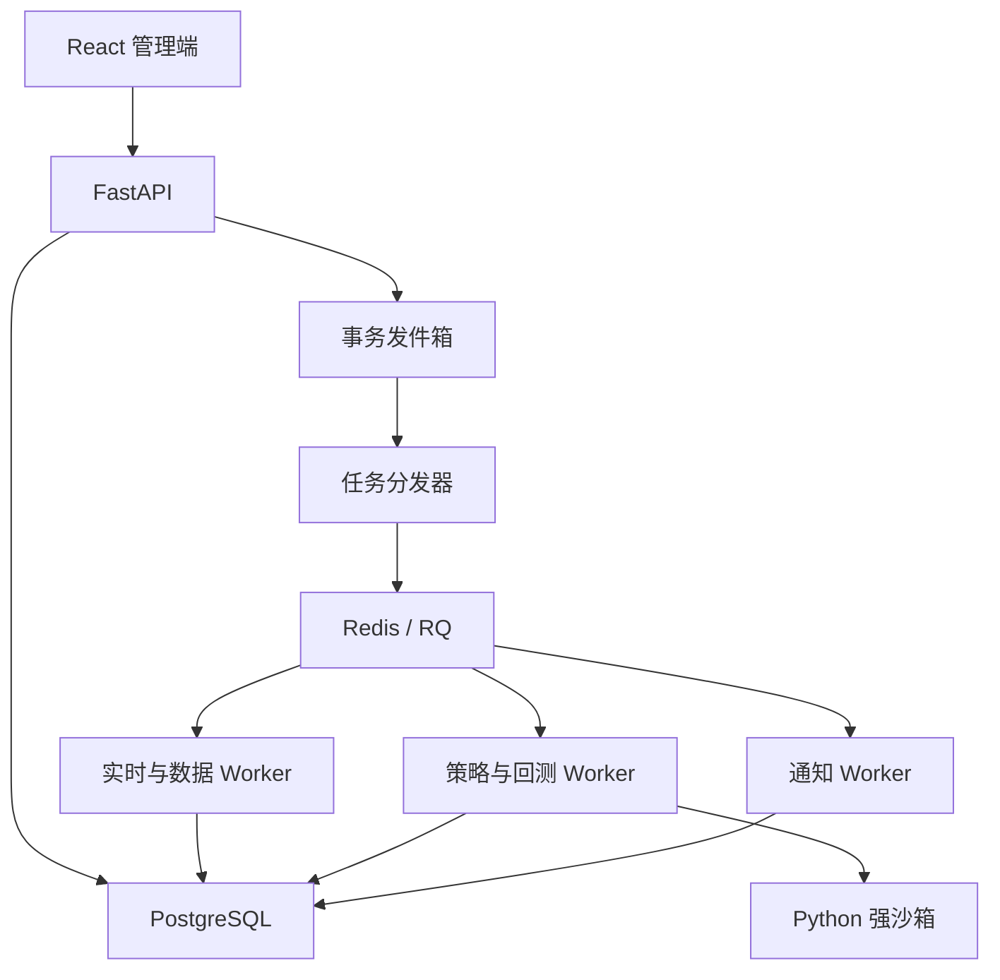
```mermaid
flowchart TD
    UI["React 管理端"] --> API["FastAPI"]
    API --> DB["PostgreSQL"]
    API --> OUTBOX["事务发件箱"]
    OUTBOX --> DISPATCHER["任务分发器"]
    DISPATCHER --> REDIS["Redis / RQ"]
    REDIS --> RT["实时与数据 Worker"]
    REDIS --> STRATEGY["策略与回测 Worker"]
    REDIS --> NOTIFY["通知 Worker"]
    RT --> DB
    STRATEGY --> SANDBOX["Python 强沙箱"]
    STRATEGY --> DB
    NOTIFY --> DB
```

关键约束：API 不执行耗时工作；PostgreSQL 保存正式状态；Redis 消息丢失后可以根据数据库重新分发；Python 策略只能由专用 Worker 送入沙箱。

#### 3.1.2 核心业务闭环

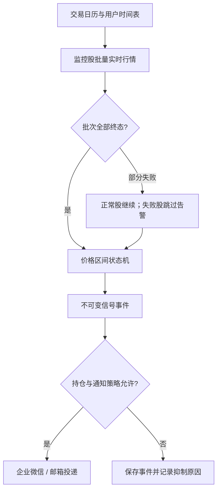
```mermaid
flowchart TD
    CAL["交易日历与用户时间表"] --> QUOTE["监控股批量实时行情"]
    QUOTE --> BARRIER{"批次全部终态?"}
    BARRIER -->|是| SIGNAL["价格区间状态机"]
    BARRIER -->|部分失败| PARTIAL["正常股继续；失败股跳过告警"]
    PARTIAL --> SIGNAL
    SIGNAL --> EVENT["不可变信号事件"]
    EVENT --> ELIGIBLE{"持仓与通知策略允许?"}
    ELIGIBLE -->|是| DELIVERY["企业微信 / 邮箱投递"]
    ELIGIBLE -->|否| SUPPRESS["保存事件并记录抑制原因"]
```

### 3.2 技术栈

| 层次 | 选型 |
|---|---|
| API | Python、FastAPI、Pydantic |
| ORM/迁移 | SQLAlchemy 2、Alembic |
| 数据库 | PostgreSQL |
| 缓存/队列 | Redis、RQ |
| HTTP | HTTPX |
| 重试 | Tenacity |
| 密码 | Argon2id |
| 策略数据 | pandas、NumPy |
| 前端 | React、Vite、TypeScript |
| UI | shadcn/ui、Tailwind CSS |
| 路由 | React Router Data Mode |
| 服务端状态 | TanStack Query |
| 表单 | React Hook Form、Zod |
| API 类型 | OpenAPI TypeScript、openapi-fetch |
| Python 编辑器 | CodeMirror 6 |
| 图表 | Apache ECharts |
| 后端测试 | pytest |
| 前端测试 | Vitest、Testing Library、MSW、Playwright |

### 3.3 后端模块边界

```text
auth                 用户、Session、CSRF
securities           股票主数据
calendar             交易日历
scheduling           明确时间列表和执行记录
providers            东方财富/新浪适配、路由、熔断
market_data          实时批次、日线、前复权、数据质量
watchlists           分组和监控订阅
positions            当前持仓和持仓历史
strategies           草稿、版本、验证、发布、沙箱
targets              目标计算、复核、激活
signals              区间判断、状态机、信号事件
notifications        渠道策略、模板、投递、重试
backtests            回测编排、交易模拟、指标
jobs                 任务、运行尝试、批量子项
alerts               系统告警和处理状态
settings             动态配置和密钥引用
audit                审计
health               健康检查和运行指标
```

业务模块之间通过公开 Service 接口、数据库事务发件箱和内部事件交互，禁止跨模块直接修改对方核心表。

---

## 4. 公共技术规范

### 4.1 标准响应

成功响应：

```json
{
  "success": true,
  "code": "OK",
  "message": "操作成功",
  "data": {},
  "request_id": "req_01...",
  "server_time": "2026-07-14T02:15:03.456Z"
}
```

失败响应：

```json
{
  "success": false,
  "code": "TARGET_ORDER_INVALID",
  "message": "四档目标价格顺序不正确",
  "data": null,
  "details": {
    "fields": {
      "low_watch": "必须大于强低位目标"
    }
  },
  "request_id": "req_01...",
  "server_time": "2026-07-14T02:15:03.456Z"
}
```

规则：

- 用户消息使用中文，错误码使用稳定英文值。
- 长任务返回 `202 Accepted`、`JOB_ACCEPTED` 和 `job_id`。
- 删除成功返回 200 标准响应，不使用无响应体的 204。
- 使用正确的 400、401、403、404、409、422、429、503 等状态码。
- 每个响应包含 `request_id`，任务、日志、告警和审计继续关联该 ID。

### 4.2 异常处理

- 业务层抛出统一 `AppError`，由 FastAPI 全局异常处理器转换。
- 已知业务错误不向前端返回 Python 堆栈。
- 未知异常只返回通用消息和 `request_id`，完整堆栈仅进入短期服务器日志。
- Worker 返回标准 `JobResult`，不把异常对象直接序列化到任务结果。
- 单只股票失败不得让整批正常股票回滚。

### 4.3 HTTP 超时、重试和熔断

- 每个进程复用 HTTPX Client 和连接池。
- 必须设置连接、读取、写入、连接池等待和总截止时间。
- 单次数据源操作最多 3 次 HTTP 请求，包括首次请求。
- 只重试网络故障、超时、429、502、503、504 等临时问题。
- POST 或结果未知的外部写操作不能盲目重试。
- 连续失败 3 次后熔断。
- 熔断冷却阶梯为 60 秒、180 秒、300 秒，第三次及以后保持 300 秒。
- 熔断按“Provider + 能力”隔离，例如东方财富历史失败不阻断东方财富实时行情。
- 禁止自动重定向、校验 TLS、限制响应体大小、校验内容类型和 Schema。

### 4.4 配置层级

配置优先级：

```text
代码安全默认值
→ 环境变量/启动配置
→ 数据库动态配置
→ 订阅或任务冻结快照
```

可在网页动态修改的配置必须：

- 有明确 Schema、类型、范围和默认值。
- 使用乐观锁和不可变历史版本。
- 写入审计。
- 只影响新任务；已运行任务使用冻结快照。

数据库、Redis地址、主密钥、策略沙箱、安全模式和调试开关不允许网页任意修改。

### 4.5 密钥

- 企业微信 Webhook 和 SMTP 密码加密保存。
- 主加密密钥只存在服务器启动环境。
- 密钥字段只写不读，页面仅显示掩码和目标指纹。
- 配置导出不得包含密钥。
- 密钥不能进入日志、审计差异、任务参数或队列消息。

### 4.6 日志与审计

- 应用、访问、Worker、Provider、安全日志使用单行 JSON。
- 原始日志保留 1～7 天，默认 7 天，并设置容量上限。
- 日志不得包含密码、Session、CSRF、Webhook、SMTP 密码、完整策略源码和完整第三方响应。
- 审计与业务历史不属于原始日志，按业务规则永久保存。
- 高风险业务修改与审计记录在同一数据库事务中完成。
- 审计表只追加，普通应用角色不得更新或删除。
- 网页不直接读取原始容器日志，只展示整理后的任务、告警和错误摘要。

### 4.7 健康检查

- `/health/live`：只检查 API 进程能否响应。
- `/health/ready`：PostgreSQL 必须可用；Redis 故障视为降级但可继续接受待分发任务。
- Provider 不属于 API 就绪条件。
- `/api/v1/system/health`：登录后查看数据库、Redis、Worker、队列、Provider、通知、磁盘、日历和时钟详情。

---

## 5. 用户、Session 与安全

### 5.1 登录模型

- 第一版只有一个管理员账号，不开放注册。
- 密码使用 Argon2id。
- 登录失败统一提示“用户名或密码错误”。
- 不存在用户也执行等价虚假哈希验证，减少账号枚举。
- 公网登录按 IP、用户名和全局失败速率联合限速，但不永久锁死账号。

### 5.2 Session

- 使用至少 256 位随机 Opaque Token。
- Cookie 名称建议为 `__Host-session`。
- 正式环境属性：`Secure`、`HttpOnly`、`SameSite=Strict`、`Path=/`、无 Domain。
- 数据库只保存令牌摘要，不保存原始 Cookie。
- 无操作 30 天过期，创建后 90 天绝对过期。
- SSE、自动轮询、后台刷新不更新“用户操作时间”。
- 前端检测真实键盘、鼠标、触摸或导航后，限频调用 `/auth/activity`。
- 不限制并发 Session；用户可以查看、撤销指定 Session 或撤销其他全部 Session。

### 5.3 CSRF

- 所有写请求携带绑定 Session 的 `X-CSRF-Token`。
- 后端同时校验 `Origin` 或 `Referer`。
- CSRF Token 只保存在前端内存。
- 不开放通用跨域 CORS，前后端按同源设计。

### 5.4 密码重置

- 忘记密码不通过邮件或短信重置。
- 只允许服务器命令行重置。
- 密码不能出现在 CLI 参数和 Shell 历史中。
- CLI 重置默认撤销全部 Session。
- 已登录用户可修改密码；只要求有效 Session，不再次验证旧密码，但必须确认和审计。

---

## 6. 交易日历与调度

### 6.1 交易日历

- PostgreSQL 中的交易日历是运行时正式依据。
- 所有交易业务按 `Asia/Shanghai` 解释，数据库时间存 UTC。
- 不能只用周一到周五或法定工作日判断 A 股交易日。
- 日历状态为 `CONFIRMED`、`PROVISIONAL`、`OVERRIDDEN` 或 `MISSING`。
- 只有确认或人工覆盖的交易日允许正式自动任务。
- 日历至少覆盖未来 60 天；覆盖不足应告警。
- 默认连续交易时段为 09:30～11:30、13:00～15:00。

### 6.2 调度计划

- 用户配置明确的 `HH:mm` 时间列表，不提供固定间隔或 Cron 输入。
- 单个计划最多 20 个时间，时间不能重复。
- 自动执行时间必须在 A 股连续交易时段内。
- 调度器每 10 秒扫描一次到期计划。
- 执行宽限期 60 秒，超过后标记 `MISSED`，停机恢复后不补跑盘中任务。
- 调度定义和日历均使用不可变版本；已创建批次使用冻结版本。
- 交易日 17:00 创建全市场日线任务。

### 6.3 时钟保护

- 调度以数据库时间为主要依据。
- 应用时间与数据库时间偏差超过 5 秒告警。
- 偏差超过 30 秒暂停新正式自动调度，避免错误时间产生信号。

---

## 7. 股票主数据与数据源

### 7.1 股票主数据

内部代码统一为：

```text
600000.SH
000001.SZ
430047.BJ
```

至少保存：代码、名称、市场、证券类型、上市/退市日期、上市状态、ST 状态、停牌状态、Provider 代码映射和更新时间。

任务启动时冻结股票范围快照。全市场回测使用任务启动时的当前 A 股范围，并在结果中提示可能存在幸存者偏差。

### 7.2 Provider 能力

统一能力包括：

```text
SECURITY_MASTER
REALTIME_QUOTE_BATCH
DAILY_BAR_UNADJUSTED
HISTORICAL_DAILY_UNADJUSTED
HISTORICAL_DAILY_QFQ
```

能力矩阵：

| Provider | 股票主数据 | 实时行情 | 不复权日线 | 前复权历史 |
|---|---:|---:|---:|---:|
| 东方财富 | 主源 | 主源 | 主源 | 主源 |
| 新浪 | 不使用 | 备用 | 不使用 | 不使用 |

网页只能修改启停、能力优先级、安全范围内的并发、速率、超时和自动切换，不能输入任意 URL、代理、Header 或解析脚本。

### 7.3 自动切换与冲突

- 实时行情优先东方财富，整批或部分缺失时对失败股票尝试新浪。
- 一条标准行情不能混用两个来源字段。
- 如果同一股票两个可比较报价差异超过 `max(0.02 元, 0.2%)`，标记 `CONFLICT` 并等待人工复核。
- 冲突时不自动选择结果、不产生正式信号。
- 人工复核只能选择已有来源结果或判定本次无有效行情，第一版不允许网页手工输入行情价格。

---

## 8. 行情与日线数据

### 8.1 数据保留

| 数据 | 范围 | 保留策略 |
|---|---|---|
| 实时行情批次和条目 | 约 20 只监控股 | 90 天 |
| 全市场不复权日线 | A 股全市场 | 永久 |
| 监控股前复权日线 | 当前监控股 | 保存当前有效完整数据集 |
| 全市场回测前复权 | 按股票临时获取 | 项目完成后释放 |
| 日线暂存区 | 批次临时数据 | 最多 7 天 |
| 失败原始响应样本 | 诊断使用 | 最多 7 天 |
| 信号事件价格快照 | 发生信号的价格 | 永久 |

### 8.2 实时行情批次屏障

每个计划时间创建一个 `quote_cycle`，冻结预期监控股票列表。

执行顺序：

1. 批量请求东方财富。
2. 对失败或缺失股票尝试新浪。
3. 校验全部预期股票的结果。
4. 等待所有股票成功、失败或批次超时。
5. 将批次确定为 `READY`、`PARTIAL` 或 `FAILED`。
6. 批次最终确定后，才为有效股票创建信号判断任务。

不能在第一只股票返回后立即判断。

如果 20 只中 19 只有效、1 只缺失：

- 批次为 `PARTIAL`。
- 19 只正常比较。
- 缺失 1 只跳过并告警。
- 不使用上一批次价格替代。

实时批次默认硬超时 30 秒，可配置范围 10～60 秒。迟到响应不得重新打开已完成批次或补造信号。

### 8.3 实时行情有效性

正式行情必须：

- 股票代码匹配。
- 当前价为正数。
- 行情时间存在且不明显晚于服务器时间。
- 新鲜度不超过 3 分钟。
- OHLC、成交量、成交额通过基本校验。
- 未处于报价冲突状态。

停牌股票不得伪造最新价格；非交易日手工测试只生成诊断结果。

### 8.4 全市场不复权日线

- 交易日 17:00 更新全市场当日日线。
- PostgreSQL 按交易年份分区。
- 唯一键为 `(security_id, trade_date)`。
- 批次先写暂存区，校验后将有效股票提交正式表。
- 合理停牌、尚未上市、已经退市必须有明确依据，不能因 Provider 没返回就直接推断。
- 存在无法解释缺失时批次为 `PARTIAL`，但有效股票仍可提交。
- 当天失败后不无限自动循环；允许手工重试，第二个交易日继续提醒并补齐。

### 8.5 监控股前复权

- 只对当前监控股票长期保存前复权数据。
- 获取完整策略窗口后写入临时数据集。
- 日期、行数、重复和 OHLC 校验全部成功后原子替换当前有效集。
- 新数据失败时继续使用旧前复权数据并标记过期。
- 每只股票只有取得当日日线并成功刷新前复权后，才能运行当日目标策略。
- 20 只监控股中 19 只成功时，19 只继续计算目标，失败 1 只保留旧目标并告警。

### 8.6 数据修正

- 已存在日线发生变化时保存旧值、新值和字段差异。
- 更新当前正式日线并创建修订记录。
- 监控股修正后刷新前复权并重新计算目标。
- 不修改过去已经产生的信号、通知和回测事实。

---

## 9. 监控分组、订阅与持仓

### 9.1 监控分组

- 分组只用于组织和筛选。
- 同一股票可以属于多个分组。
- 同一股票全系统只有一条有效监控订阅，避免重复抓取、判断和通知。
- 从一个分组移除不影响其他分组。
- 从最后一个分组移除时提示是否同时暂停监控，默认建议暂停。
- 删除采用归档，历史不物理删除。

### 9.2 监控订阅

订阅至少包含：

- 股票。
- 是否启用。
- 调度计划及版本。
- 目标模式 `MANUAL` 或 `STRATEGY`。
- 明确的策略版本和参数快照。
- 当前正式目标版本。
- 滞回比例和最小值。
- 通知策略模式。
- 配置版本。

新增股票可以先处于待配置状态。目标缺失时允许展示行情，但不进行正式信号判断。

暂停监控立即生效：已经取得的行情可以保存，但信号提交前必须重新检查订阅启用状态；暂停后不产生新信号和新通知。

### 9.3 手工检查

- “立即检查”：交易时段内获取最新行情并可能产生正式信号。
- “测试行情”：只测试数据源和解析，不修改信号状态、不发送业务通知。
- 非交易时段的普通立即检查只展示诊断结果，不产生普通业务信号。

### 9.4 持仓

状态只有：

```text
HOLDING
NOT_HOLDING
```

- `user_position` 保存当前状态。
- `user_position_history` 保存不可变历史。
- 不记录数量、成本、成交或盈亏。
- 未建立记录时默认 `NOT_HOLDING`。
- 重复设置相同状态幂等，不新增历史。
- 标记 `HOLDING` 后立即进行高位复核。
- 标记 `NOT_HOLDING` 后取消 `PENDING`、`RETRY_WAIT` 的高位投递。
- 持仓可以独立于监控订阅存在。

---

## 10. Python 策略管理

### 10.1 策略能力边界

策略只计算四档目标：

```text
low_strong
low_watch
high_watch
high_strong
```

策略不能直接产生通知、修改持仓、访问数据库、Redis、网络、文件系统、任务系统和系统配置。

### 10.2 标准接口

```python
STRATEGY_API_VERSION = "1.0"

STRATEGY_META = {
    "name": "示例策略",
    "data_requirements": {
        "adjustment": "qfq",
        "min_bars": 250,
        "max_bars": 1000,
    },
    "parameter_schema": {
        "type": "object",
        "properties": {},
        "additionalProperties": False,
    },
}


def calculate_targets(history, params, context):
    return {
        "low_strong": 8.50,
        "low_watch": 9.20,
        "high_watch": 12.80,
        "high_strong": 13.60,
        "diagnostics": {},
    }
```

`history` 是按交易日期升序的前复权 pandas DataFrame，固定包含 `trade_date/open/high/low/close/volume/amount`。策略只能获得目标日期及之前的数据。

输出必须满足：

```text
0 < low_strong < low_watch < high_watch < high_strong
```

四档一次完整校验，任意一档无效则整次计算失败。

### 10.3 草稿、版本和发布

- 每个策略一个 Python 文件，默认最大 256 KB。
- 当前草稿每 30 秒防抖自动保存到服务器。
- 手工保存产生不可变草稿修订版。
- 发布版本不可修改、不可删除。
- 发布新版本不会自动升级已有订阅。
- 回滚通过将订阅重新绑定到历史发布版本完成，不重写历史。
- 草稿历史保存在数据库；正式发布版本同时写入独立策略 Git 仓库。
- 正式运行使用数据库不可变源码快照并校验 SHA-256；Git 用于审计和恢复。

### 10.4 发布门槛

发布前必须完成：

1. Python 语法和接口校验。
2. JSON Schema 和元数据校验。
3. 导入白名单和危险调用静态检查。
4. 固定样本沙箱执行。
5. 用户选择股票的策略测试。
6. 当前源码哈希对应的一次完整单股回测。

源码、元数据或参数 Schema 变化后，旧验证结果立即失效。完整回测不要求有交易或盈利，只要求流程完整成功。

### 10.5 策略沙箱

每次执行使用受限的一次性环境：

```text
无网络
无数据库和 Redis
无密钥和 Docker Socket
无宿主目录挂载
只读根文件系统
非 root
删除所有 Capabilities
no-new-privileges
CPU 1 核
内存 512 MB
进程数 32
tmpfs 64 MB
```

允许库第一版固定为 pandas、NumPy 及少量安全标准库。用户不能从网页安装包。目标计算默认硬超时 10 秒；超时、超内存或崩溃只影响当前执行。

---

## 11. 目标价格管理

### 11.1 目标模式

- `MANUAL`：用户手工输入，日线更新不自动重算。
- `STRATEGY`：由明确绑定的已发布策略版本和参数计算。

从策略模式手工修改目标时，必须明确提示并切换到手工模式，不能形成隐蔽临时覆盖。

### 11.2 数据结构

建议拆分：

- `target_revision`：有效且不可变的四档目标内容。
- `subscription_target_binding`：订阅当前目标指针。
- `target_calculation_run`：每次计算过程和失败。
- `target_review`：大幅变化的人工复核。

来源包括 `MANUAL`、`STRATEGY`、`RESTORED`、`DATA_CORRECTION`、`STRATEGY_CHANGE`、`PARAMETER_CHANGE`。

当前状态包括 `READY`、`STALE`、`CALCULATING`、`REVIEW_REQUIRED`、`ACTIVATING`、`FAILED`、`MISSING`。

### 11.3 大幅变化复核

- 策略、数据修正或参数变化导致任意一档相对当前目标变化超过 30% 时，候选目标进入 `REVIEW_REQUIRED`。
- 阈值可配置范围为 10%～100%。
- 等待复核期间旧目标继续生效。
- 用户可通过、驳回或重新计算。
- 复核期间目标、策略或数据版本已经变化时，旧候选不能直接通过。
- 手工目标变化超过阈值只做强警告和二次确认，确认后可以直接激活。

### 11.4 激活与立即重评

目标激活事务包括：

1. 锁定当前目标绑定。
2. 校验候选版本仍有效。
3. 更新当前目标指针。
4. 写审计和事务发件箱。
5. 提交后创建信号重评任务。

交易时段优先使用不超过 3 分钟的新鲜行情；没有时立即获取。非交易时段使用最近有效收盘价。目标变化是允许在非交易时段产生正式信号的明确例外，通知必须标注价格日期和触发原因。

17:00 目标成功后立即生效，不等待第二个交易日。

计算失败时：

- 已有旧目标：继续使用并标记 `STALE`。
- 从未有目标：标记 `FAILED` 或 `MISSING`，跳过信号判断。
- 失败当天提醒，第二个交易日仍未恢复时继续提醒。

恢复历史目标会复制数值生成新版本，不修改旧版本；建议同时切换为手工模式。

---

## 12. 信号状态机

### 12.1 区间定义

设四档目标为 `LS/LW/HW/HS`：

| 价格条件 | 区间 |
|---|---|
| `price <= LS` | `STRONG_LOW` |
| `LS < price <= LW` | `LOW` |
| `LW < price < HW` | `NORMAL` |
| `HW <= price < HS` | `HIGH` |
| `price >= HS` | `STRONG_HIGH` |

另有初始状态 `UNKNOWN`。所有比较使用 Decimal。

### 12.2 初始判断

- `UNKNOWN → NORMAL`：静默建立基线，只保存判断记录。
- `UNKNOWN → 非 NORMAL`：创建正式信号事件，并按资格决定通知。

### 12.3 滞回

默认：

```text
hysteresis_ratio = 2%
hysteresis_min = 0.02 元
buffer = max(target × ratio, min)
```

进入低位或高位按正式目标线，离开当前区间必须跨过滞回带。例如 `low_watch=10.00`，缓冲为 0.20，则进入 LOW 为 `<=10.00`，离开 LOW 回到 NORMAL 必须 `>10.20`。

目标版本变化不是价格噪声，因此目标激活重评不沿用旧状态的退出滞回，而是按新目标直接计算基础区间。后续普通行情继续使用滞回。

### 12.4 信号事件

- 所有真实区间转换永久保存。
- 价格一次跨越多个区间只创建一个最终转换事件，不补造中间状态。
- 同一区间内重复比较只保存 `signal_evaluation`，不创建 `signal_event`，不重复通知。
- 高位信号未持仓时仍更新状态和保存事件，只标记通知受抑制。
- 目标过期但仍有有效旧目标时继续判断，事件标记 `target_stale=true`。

### 12.5 事务和乱序

正式判断在同一事务中完成：

```text
检查订阅和目标版本
→ 锁定 signal_state
→ 读取持仓版本
→ 写 signal_evaluation
→ 必要时写 signal_event
→ 更新 signal_state
→ 写通知发件箱
```

普通行情幂等键至少包含订阅、行情条目、目标版本和判断原因。迟到旧行情、旧目标和旧订阅任务只能保存为 `SUPERSEDED`，不能覆盖新状态。

### 12.6 手工重置

- 只能重置为 `UNKNOWN`，不能直接指定某个区间。
- 必须填写原因、确认并审计。
- 重置后立即重评。
- 历史信号事件不删除。

---

## 13. 通知中间层

### 13.1 分层

```text
业务事件
→ notification_event
→ 每渠道 notification_delivery
→ notification_delivery_attempt
```

信号或告警事务只写通知事件和发件箱，不同步调用企业微信或 SMTP。

### 13.2 通知策略

股票信号渠道按以下优先级计算：

```text
单只股票 CUSTOM 配置
→ 信号类型配置
→ 全局默认配置
```

每层可选择：

```text
仅企业微信
仅邮箱
两个渠道
不发送外部通知，仅网页记录
```

系统初始化不强制默认两个渠道，首次使用由用户明确选择。

系统告警使用独立策略，可分别配置 WARNING、ERROR、CRITICAL、恢复通知和每日未恢复提醒的渠道。

配置修改只影响之后创建的新通知事件；已经创建的投递按原渠道继续，用户可以取消尚未发送的投递。

### 13.3 高位资格

- 高位类和高位解除类只有当前持仓时发送。
- 通知 Worker 真正发送前再次读取当前持仓和订阅状态。
- 已清仓则标记 `SKIPPED_INELIGIBLE`。
- 低位历史事件不因后续价格变化而取消。

### 13.4 渠道隔离

- 企业微信和邮箱使用独立队列、Worker、限流和熔断器。
- 一个渠道失败不影响另一个渠道。
- 一个成功、一个失败时通知事件为 `PARTIAL`。
- 失败渠道单独重试，不重复发送已经成功的渠道。

### 13.5 重试和未知结果

- 首次投递后最多 5 次重试，总请求次数最多 6 次。
- 间隔：立即、5 秒、30 秒、2 分钟、10 分钟、30 分钟。
- 网络、超时、429、5xx、SMTP 临时 4xx 可重试。
- 配置、鉴权、模板、永久 SMTP 错误不盲目重试。
- 如果请求可能已经送达但未得到确认，状态为 `OUTCOME_UNKNOWN`，自动补偿最多一次。
- 邮件使用确定性 `Message-ID`；企业微信正文包含事件 ID。接受极少量重复以降低漏发风险。

### 13.6 模板

- 模板由应用 Git 维护，并同步为数据库不可变版本。
- 网页可以预览、测试、切换和恢复模板版本。
- 第一版不允许网页自由编辑 Jinja 或任意模板代码。
- 测试消息必须明确标记“测试消息”，不能与真实信号混淆。

通知事件、投递和尝试历史永久保存；脱敏的第三方失败响应最多保留 7 天。

---

## 14. 回测中心

### 14.1 模式

- `SINGLE`：单只股票，保存每日权益、目标、状态和交易明细。
- `WATCHLIST`：冻结监控列表，对每只股票独立回测。
- `MARKET`：冻结全市场股票范围，对每只股票独立回测。

监控列表和全市场模式不生成组合净值，也不保存所有股票的每日权益曲线，只保存每股指标和交易轮次。

### 14.2 回测快照

用户手工选择训练开始、训练结束、测试开始和测试结束日期。训练期必须早于测试期且不得重叠。任务创建时冻结：股票范围、四个日期、初始资金、策略源码和哈希、策略参数、环境版本、滞回配置、回测规则版本和数据来源。

允许选择已发布策略版本或当前草稿快照。草稿之后继续编辑不影响已启动任务。

### 14.3 预测与逐日规则

1. 只向策略提供用户选择的训练期数据。
2. 策略执行一次，计算并冻结四档目标；测试期数据不能进入策略。
3. 在测试期交易日 D 使用冻结目标、D 日收盘价和正式信号规则判断区间。
4. 收盘后生成待执行订单。
5. 在 D+1 的下一个有效开盘价成交。
6. 测试期间允许同一组目标产生多轮买卖，但不得重新运行策略。
7. 公司行动发生时只按当时已公开的复权信息调整目标价格口径，并保存调整记录。

空仓进入 LOW 或 STRONG_LOW 时全仓买入；持仓进入 HIGH 或 STRONG_HIGH 时全部卖出。同一低位持续期间不重复买入。

如果下一日没有有效开盘价，订单延后到下一个有效开盘；回测结束仍无法成交则标记 `UNFILLED_AT_END`。

### 14.4 收益和指标

默认初始资金 100000 元，允许配置正数；每只股票独立获得相同初始资金。

至少输出：

- 期末权益、总收益、已实现收益、年化收益。
- 最大回撤、波动率、Sharpe（无风险利率默认 0）。
- 完整交易次数、胜率、平均收益、最大盈利和亏损。
- 平均和最长持有交易日、资金暴露比例。
- 期末是否持仓、未成交订单数量。

没有交易仍然算成功；收益为 0，胜率显示无数据。

### 14.5 并发和数据

- 全市场同一时间只运行一个父任务。
- 默认并发 4，可配置 1～8。
- 每只股票独立获取前复权历史、执行、保存、释放。
- 训练数据、测试数据、预测目标和目标调整分别冻结并保存哈希。
- 一个股票失败不影响其他股票。
- 支持暂停、继续、取消、仅重试失败项。
- 回测不会修改生产信号、持仓、目标或发送业务通知。

---

## 15. 任务、Worker 与异步可靠性

### 15.1 状态真实来源

PostgreSQL 是任务状态真实来源。创建业务任务、`job` 和分发发件箱必须在同一事务中。

Redis 不可用时任务保持 `PENDING_DISPATCH`，API 仍可返回 202；Redis 恢复后由分发器继续推送。PostgreSQL 不可用时不得只把任务写入 Redis。

### 15.2 三层模型

- `job`：逻辑任务。
- `job_run`：每次具体运行尝试。
- `job_item`：全市场或批量任务的独立股票项目。

重试创建新的 `job_run`，不覆盖旧失败记录。

### 15.3 队列隔离

建议逻辑队列：

```text
realtime-quotes
daily-market-data
qfq-refresh
strategy
target-calculation
notify-wecom
notify-email
backtest-single
bulk-backtest
bulk-history
exports
maintenance
```

实时、通知、数据、策略和批量任务使用不同 Worker 角色。全市场回测和历史回填不能占用实时行情 Worker。

### 15.4 超时、心跳和取消

- 每个任务有软超时和硬超时。
- RQ 工作子进程达到硬超时后被终止，Worker 父进程继续服务。
- Worker 和运行任务定期写心跳；看门狗识别失联和卡住任务。
- 每个运行尝试使用围栏令牌，迟到 Worker 不能覆盖新结果。
- 批量暂停停止领取新股票，当前项目在安全点结束。
- 取消运行任务先协作取消，超过宽限期再终止子进程。
- 已完成的批量子项保留，不因取消父任务回滚。

### 15.5 自动重试边界

- 实时行情只在批次总截止时间内重试，过期不补跑。
- 通知使用通知模块自身重试，不叠加任务级重复重试。
- 目标只对沙箱基础设施等临时故障做受控重试，策略代码错误不反复运行。
- 日线当天不无限创建新业务批次。
- 回测和历史回填默认手工重试失败股票。

任务元数据和运行尝试保留 180 天，普通批量 `job_item` 保留 30 天；对应业务结果仍按业务规则永久保存。

---

## 16. 系统告警与仪表盘

### 16.1 告警与信号分离

- 股票价格区间变化属于业务信号。
- 行情缺失、日线不完整、Worker 超时、熔断、通知失败属于系统告警。
- 报价冲突和目标大幅变化属于人工复核。
- 系统告警不能改变股票信号状态。

### 16.2 告警状态

```text
OPEN
ACKNOWLEDGED
RESOLVED
```

确认已知不等于问题解决，也不停止第二个交易日的必要提醒。能够客观验证恢复的告警自动解决；报价冲突、目标异常等需要判断的问题人工解决。

告警按稳定唯一键聚合，保存首次、最近发生时间、次数、关联任务和对象，避免同一根因大量重复通知。严重程度升级立即重新通知。

### 16.3 仪表盘

首页显示：

- 系统总状态。
- 今日行情批次和错过次数。
- 监控股票正常、缺失、目标异常数量。
- 当前持仓和高位持仓。
- 今日信号。
- 全市场日线和前复权状态。
- 后台任务和队列。
- 通知渠道和 Provider 状态。
- 磁盘、Worker、时钟、日历覆盖。
- 未解决告警。

仪表盘只读取数据库和内部状态，不同步访问外部数据源。各区域独立超时，一个区域失败时返回部分成功。

---

## 17. 前端设计

### 17.1 工程结构

```text
src/
  app/                 路由、Provider、布局、错误边界
  shared/              API、认证、错误、表单、表格、状态、时间、图表、编辑器
  features/            各业务模块
  pages/               页面组合
  tests/
```

`shared` 不引用具体业务模块；页面只组合能力，不实现行情、目标和信号业务规则。

### 17.2 状态分层

- 服务端数据：TanStack Query。
- 分页、筛选、排序：URL 查询参数。
- 临时交互：React 组件状态。
- 登录用户：内存 Auth Context。
- 主题、表格密度等无敏感偏好：localStorage。

Session、CSRF、密码、密钥、Python 策略源码不得写入浏览器长期存储。

### 17.3 API 客户端

- FastAPI OpenAPI 自动生成 TypeScript 类型。
- CI 检查前后端类型同步，未同步时构建失败。
- 页面不得直接使用裸 `fetch`。
- 查询请求默认 15 秒超时，只对网络和 5xx 最多重试 1 次。
- 写请求不自动重试。
- 组件卸载和路由切换时使用 AbortController 取消请求。
- 401 并发发生时只执行一次退出流程。

### 17.4 SSE

- 全站只建立一条共享 SSE 连接。
- 推送任务、信号、告警、Provider 和配置变化的“失效通知”。
- 详细数据仍通过 API 重新查询。
- 支持事件序号、断线重连和轮询降级。
- SSE 心跳不延长 Session 用户活动时间。

### 17.5 页面状态

所有页面必须处理：加载、空数据、正常、部分成功、过期、计算中、超时、网络断开、后端不可用、Session 失效和 409 版本冲突。

禁止只显示永久旋转图标。错误页面显示中文信息、错误码、`request_id`、重试和复制诊断信息，不显示服务器堆栈。

### 17.6 一级页面

```text
仪表盘
监控列表
持仓管理
策略管理
目标管理
信号中心
行情数据
回测中心
通知中心
任务中心
数据源
系统告警
交易日历
审计日志
系统设置
```

前端桌面优先；手机支持仪表盘、信号、告警、监控列表、持仓切换和任务查看。Python 编辑、大型表格和全市场回测分析提示使用桌面端。

---

## 18. 核心数据模型

下表为逻辑实体，具体字段由 Alembic 迁移落实。所有正式时间使用 `timestamptz`，价格和金额使用 Decimal/Numeric。

| 领域 | 核心表 |
|---|---|
| 用户 | `app_user`、`user_session` |
| 股票 | `security`、`security_revision` |
| 日历 | `trading_calendar_day`、`trading_session` |
| 调度 | `monitor_schedule`、`monitor_schedule_revision`、`schedule_occurrence` |
| 分组/订阅 | `watchlist`、`watchlist_item`、`monitor_subscription`、`monitor_subscription_revision` |
| 持仓 | `user_position`、`user_position_history` |
| 实时行情 | `quote_cycle`、`quote_cycle_item` |
| 日线 | `daily_bar_unadjusted`、`daily_bar_revision`、`daily_data_batch` |
| 前复权 | `qfq_dataset`、`qfq_refresh_run` |
| 数据质量 | `data_quality_issue`、`provider_run` |
| 策略 | `strategy`、`strategy_draft`、`strategy_draft_revision`、`strategy_version`、`strategy_run` |
| 目标 | `target_revision`、`subscription_target_binding`、`target_calculation_run`、`target_review` |
| 信号 | `signal_state`、`signal_evaluation`、`signal_event` |
| 通知 | `notification_policy`、`notification_event`、`notification_delivery`、`notification_delivery_attempt` |
| 回测 | `backtest_task`、`backtest_item`、`backtest_order`、`backtest_trade`、`backtest_metric`、`backtest_daily_result` |
| 任务 | `job`、`job_run`、`job_item`、`event_outbox` |
| 告警 | `system_alert`、`system_alert_occurrence`、`system_alert_action` |
| 配置 | `system_setting`、`system_setting_history`、`secret_value` |
| 审计 | `audit_event` |

关键约束：

- 一只股票最多一条未归档监控订阅。
- 一个分组不能重复包含同一股票。
- 四档目标版本不可变。
- 发布策略版本不可变。
- 持仓历史、信号事件、目标版本、通知投递和回测交易不物理删除。
- 日线唯一键为股票和交易日期。
- 同一调度定义和计划时间只能创建一条执行记录。
- 同一通知事件和渠道初始投递只能有一条。
- 所有外部副作用通过事务发件箱衔接。

### 18.1 用户、监控、调度与持仓关系

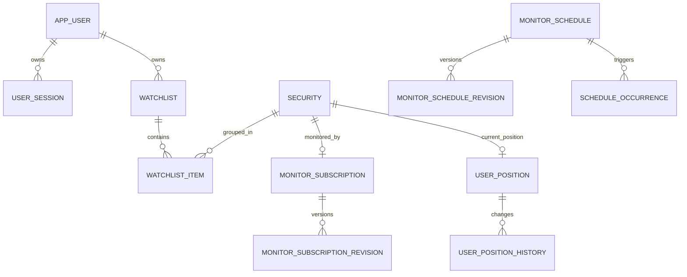
```mermaid
erDiagram
    APP_USER ||--o{ USER_SESSION : owns
    APP_USER ||--o{ WATCHLIST : owns
    WATCHLIST ||--o{ WATCHLIST_ITEM : contains
    SECURITY ||--o{ WATCHLIST_ITEM : grouped_in
    SECURITY ||--o| MONITOR_SUBSCRIPTION : monitored_by
    MONITOR_SUBSCRIPTION ||--o{ MONITOR_SUBSCRIPTION_REVISION : versions
    MONITOR_SCHEDULE ||--o{ MONITOR_SCHEDULE_REVISION : versions
    MONITOR_SCHEDULE ||--o{ SCHEDULE_OCCURRENCE : triggers
    SECURITY ||--o| USER_POSITION : current_position
    USER_POSITION ||--o{ USER_POSITION_HISTORY : changes
```

分组成员关系与监控订阅刻意分离：股票可在多个分组中，但正式监控订阅只有一条；持仓是用户对股票的独立事实，不依附于订阅生命周期。

### 18.2 行情、日线、目标与信号关系

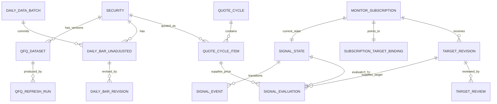
```mermaid
erDiagram
    QUOTE_CYCLE ||--o{ QUOTE_CYCLE_ITEM : contains
    SECURITY ||--o{ QUOTE_CYCLE_ITEM : quoted_as
    DAILY_DATA_BATCH ||--o{ DAILY_BAR_UNADJUSTED : commits
    SECURITY ||--o{ DAILY_BAR_UNADJUSTED : has
    DAILY_BAR_UNADJUSTED ||--o{ DAILY_BAR_REVISION : revised_by
    SECURITY ||--o{ QFQ_DATASET : has_versions
    QFQ_DATASET ||--o{ QFQ_REFRESH_RUN : produced_by
    MONITOR_SUBSCRIPTION ||--o{ TARGET_REVISION : receives
    MONITOR_SUBSCRIPTION ||--|| SUBSCRIPTION_TARGET_BINDING : points_to
    TARGET_REVISION ||--o{ TARGET_REVIEW : reviewed_by
    MONITOR_SUBSCRIPTION ||--|| SIGNAL_STATE : current_state
    SIGNAL_STATE ||--o{ SIGNAL_EVALUATION : evaluated_by
    SIGNAL_STATE ||--o{ SIGNAL_EVENT : transitions
    QUOTE_CYCLE_ITEM ||--o{ SIGNAL_EVALUATION : supplies_price
    TARGET_REVISION ||--o{ SIGNAL_EVALUATION : supplies_target
```

`signal_evaluation` 是完整判断事实，`signal_event` 只记录状态转换，`signal_state` 是当前投影。三者分开后，状态未变、输入跳过、乱序淘汰和真实转换都能被准确追踪。

### 18.3 策略与回测关系

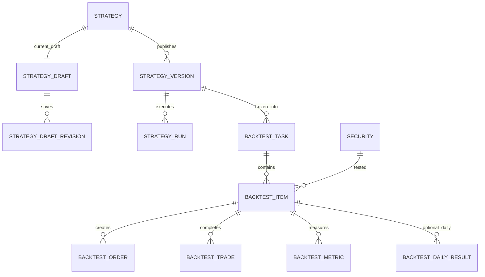
```mermaid
erDiagram
    STRATEGY ||--|| STRATEGY_DRAFT : current_draft
    STRATEGY_DRAFT ||--o{ STRATEGY_DRAFT_REVISION : saves
    STRATEGY ||--o{ STRATEGY_VERSION : publishes
    STRATEGY_VERSION ||--o{ STRATEGY_RUN : executes
    STRATEGY_VERSION ||--o{ BACKTEST_TASK : frozen_into
    BACKTEST_TASK ||--o{ BACKTEST_ITEM : contains
    BACKTEST_ITEM ||--o{ BACKTEST_ORDER : creates
    BACKTEST_ITEM ||--o{ BACKTEST_TRADE : completes
    BACKTEST_ITEM ||--o{ BACKTEST_METRIC : measures
    BACKTEST_ITEM ||--o{ BACKTEST_DAILY_RESULT : optional_daily
    SECURITY ||--o{ BACKTEST_ITEM : tested
```

回测任务引用的是冻结的源码、哈希、参数和规则快照，不引用会继续变化的草稿。MARKET/WATCHLIST 的每只股票都是独立 item，不形成投资组合。

### 18.4 任务、通知、告警、配置与审计关系

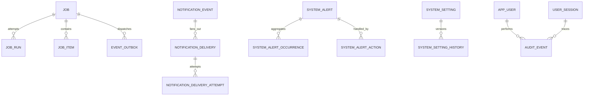
```mermaid
erDiagram
    JOB ||--o{ JOB_RUN : attempts
    JOB ||--o{ JOB_ITEM : contains
    JOB ||--o{ EVENT_OUTBOX : dispatches
    NOTIFICATION_EVENT ||--o{ NOTIFICATION_DELIVERY : fans_out
    NOTIFICATION_DELIVERY ||--o{ NOTIFICATION_DELIVERY_ATTEMPT : attempts
    SYSTEM_ALERT ||--o{ SYSTEM_ALERT_OCCURRENCE : aggregates
    SYSTEM_ALERT ||--o{ SYSTEM_ALERT_ACTION : handled_by
    SYSTEM_SETTING ||--o{ SYSTEM_SETTING_HISTORY : versions
    APP_USER ||--o{ AUDIT_EVENT : performs
    USER_SESSION ||--o{ AUDIT_EVENT : traces
```

`event_outbox` 负责业务事务与异步分发的可靠边界；`audit_event` 记录人的操作事实，不能由短期原始日志替代。

---

## 19. API 设计概要

统一前缀：

```text
/api/v1
```

### 19.1 认证

```text
POST /auth/login
POST /auth/logout
GET  /auth/me
GET  /auth/csrf
POST /auth/activity
GET  /auth/sessions
POST /auth/sessions/{id}/revoke
POST /auth/change-password
```

### 19.2 监控、持仓和调度

```text
GET/POST              /watchlists
POST/DELETE           /watchlists/{id}/items
GET/POST/PATCH        /monitor-subscriptions
POST                  /monitor-subscriptions/{id}/enable
POST                  /monitor-subscriptions/{id}/disable
POST                  /monitor-subscriptions/{id}/check-now
POST                  /monitor-subscriptions/{id}/diagnose
GET/POST/PATCH        /monitor-schedules
GET/POST              /positions
GET                   /positions/{symbol}/history
POST                  /positions/{symbol}/hold
POST                  /positions/{symbol}/clear
```

### 19.3 策略和目标

```text
GET/POST              /strategies
GET/PUT               /strategies/{id}/draft
POST                  /strategies/{id}/validate
POST                  /strategies/{id}/test
POST                  /strategies/{id}/publish
GET                   /strategies/{id}/versions
POST                  /strategies/{id}/versions/{version_id}/apply
GET                   /targets
GET                   /targets/{subscription_id}/history
POST                  /targets/{subscription_id}/manual
POST                  /targets/{subscription_id}/calculate
POST                  /targets/{subscription_id}/restore
GET                   /target-reviews
POST                  /target-reviews/{id}/approve
POST                  /target-reviews/{id}/reject
```

### 19.4 信号、通知和告警

```text
GET                   /signals/states
GET                   /signal-events
GET                   /signal-evaluations
POST                  /signals/states/{subscription_id}/reset
GET                   /notification-events
GET                   /notification-deliveries
POST                  /notification-deliveries/{id}/retry
GET/PATCH             /notification-policies
GET/PATCH             /notification-channels/{channel}
POST                  /notification-channels/{channel}/test
GET                   /alerts
POST                  /alerts/{id}/acknowledge
POST                  /alerts/{id}/resolve
POST                  /alerts/{id}/retry
```

### 19.5 行情、Provider 和回测

```text
GET                   /securities
GET                   /quote-cycles
POST                  /quote-cycles/manual
GET                   /daily-data/batches
POST                  /daily-data/batches/{id}/retry
GET                   /daily-bars/{symbol}
GET                   /qfq-data/{symbol}
POST                  /qfq-data/{symbol}/refresh
GET                   /data-quality/issues
POST                  /data-quality/issues/{id}/select-source
GET                   /providers
POST                  /providers/{provider}/probe
POST                  /providers/circuits/{id}/reset
POST                  /backtests
GET                   /backtests
GET                   /backtests/{id}
POST                  /backtests/{id}/pause
POST                  /backtests/{id}/resume
POST                  /backtests/{id}/cancel
POST                  /backtests/{id}/retry-failed
```

### 19.6 任务和系统

```text
GET                   /jobs
GET                   /jobs/{id}
GET                   /jobs/{id}/runs
GET                   /jobs/{id}/items
POST                  /jobs/{id}/cancel
POST                  /jobs/{id}/pause
POST                  /jobs/{id}/resume
POST                  /jobs/{id}/retry
GET                   /dashboard/summary
GET                   /trading-calendar
GET                   /audit-events
GET                   /system/health
GET                   /events/stream
```

任务中心不提供通用 `POST /jobs`，所有任务必须由具体业务接口创建。

---

## 20. 开发环境最小运行方式

本节只描述“先跑起来”的最小开发环境，不属于正式生产部署方案。

开发和当前部署统一使用 Linux + Docker Compose。PostgreSQL、Redis、API 和各进程角色使用项目独立的容器、网络和数据卷；PostgreSQL 与 Redis 不直接暴露到公网。API 开发端口只绑定回环地址，正式公网入口、TLS、备份和高可用另行设计。

### 20.1 必需进程

```text
PostgreSQL
Redis
FastAPI API
调度器
任务分发器
任务看门狗
实时/数据 Worker
策略 Worker
企业微信 Worker
邮箱 Worker
批量回测 Worker
React Vite 开发服务器
策略沙箱监督器
```

早期开发可以使用同一个 Python 镜像或虚拟环境，以不同命令启动角色；但实时、通知、策略和批量任务仍应使用独立进程，便于验证隔离和超时。

### 20.2 本地启动顺序

1. 启动 PostgreSQL 和 Redis。
2. 执行 Alembic 迁移。
3. 通过 CLI 创建管理员。
4. 导入初始交易日历和股票主数据。
5. 启动分发器、看门狗和调度器。
6. 启动各类 Worker。
7. 启动 FastAPI。
8. 启动 React 开发服务器。
9. 配置企业微信、邮箱和通知策略。
10. 创建第一个策略或手工目标，添加一只股票进行端到端验证。

本地 HTTP 开发环境可通过显式开发配置关闭 Secure Cookie，但该开关只能用于 localhost；默认安全配置必须保持开启。

### 20.3 初始化 CLI

至少提供：

```text
python -m app.cli user create-admin
python -m app.cli user reset-password
python -m app.cli calendar import
python -m app.cli db check
python -m app.cli jobs reconcile
```

---

## 21. MVP 实施顺序

### 阶段 1A：公共底座与通用配置

- FastAPI、SQLAlchemy、Alembic、PostgreSQL、Redis、RQ。
- 标准响应、错误处理、完整请求上下文和配置框架。
- 任务、运行尝试、批量项目、事务发件箱和可靠分发骨架。

### 阶段 1B：横切能力与前端基础

- 结构化日志、访问日志、审计、健康检查和内部指标框架。
- 通知事件、渠道投递、投递尝试三层公共模型，渠道接口和独立 Worker 骨架。
- React、Vite、shadcn/ui、OpenAPI 类型生成和前端基础组件。
- Session、CSRF、CLI 管理员。

阶段 1A 和 1B 通过验收后才能启动业务子模块并行施工。每批最多并行三个互不依赖的模块；共享入口、公共契约、Compose、依赖锁文件和迁移主链由主流程串行维护。

### 阶段 2：股票和行情

- 股票主数据和交易日历。
- EastmoneyProvider 和 SinaRealtimeProvider。
- Provider 超时、重试、限流、熔断和契约测试。
- 实时行情批次屏障。
- 全市场不复权日线、监控股前复权和数据质量。

### 阶段 3：监控业务

- 分组、监控订阅和明确时间列表。
- 持仓当前表和独立历史表。
- 手工四档目标。
- 信号状态机、滞回、幂等和立即重评。

### 阶段 4：策略

- 网页 Python 编辑器、草稿自动保存和版本历史。
- 策略契约、静态检查、沙箱和测试。
- 策略目标计算、大幅变化复核、发布和回滚。
- 策略发布门槛所需的单股固定目标样本外回测。

### 阶段 5：通知业务接入与完整验收

- 将目标、信号和系统告警接入阶段 1B 的通知公共能力。
- 完成企业微信和邮箱独立 Worker 的真实渠道适配。
- 三级股票信号渠道配置和独立系统告警策略。
- 重试、熔断、未知结果和发送前资格检查。

### 阶段 6：回测和管理页面

- 扩展单股回测管理、比较和导出页面。
- 将阶段 4 的单股引擎扩展到监控列表回测。
- 全市场回测、暂停、继续和失败重试。
- 仪表盘、任务中心、告警中心、审计和健康页面。

---

## 22. MVP 验收标准

### 22.1 登录与安全

- 未登录无法访问任何业务接口和页面。
- Session 无操作 30 天和绝对 90 天规则可测试。
- 多 Session 可共存和撤销。
- 所有写请求有 CSRF。
- CLI 可以创建管理员和重置密码。

### 22.2 行情和数据

- 能同步支持范围内的 A 股股票主数据。
- 17:00 全市场日线可幂等写入，重复执行无重复数据。
- 日线部分失败时正常股票仍提交，失败股票可重试。
- 监控股前复权刷新失败时保留旧数据。
- 20 只行情中 19 只成功、1 只失败时，19 只正常比较，1 只跳过并告警。
- 报价冲突进入人工复核，不产生正式信号。

### 22.3 监控、目标和信号

- 可以配置多个具体检查时间，不依赖固定间隔。
- 同一股票在多个分组中只监控一次。
- 可以手工标记持仓并查看独立历史。
- 手工和策略目标均支持不可变版本。
- 系统目标变化超过 30% 进入复核。
- 目标变化立即触发信号重评。
- 同一区间不重复通知；离开后重新进入可再次通知。
- 价格在边界附近波动时滞回有效。

### 22.4 策略

- 网页可编辑一个 Python 文件并自动保存草稿。
- 草稿版本可比较和恢复。
- 危险导入、无限循环、超内存和网络访问被阻止或终止。
- 策略返回无效目标时不能激活。
- 发布前必须通过固定样本和完整单股回测。
- 发布版本不可修改；旧订阅不会自动升级。

### 22.5 通知

- 企业微信和邮箱可以单独测试。
- 股票信号渠道可按全局、类型和单股配置。
- 未持仓高位信号保存但不发送。
- 清仓后尚未发送的高位投递被取消。
- 一个渠道失败不影响另一个渠道。
- 投递历史、尝试和错误码可查询。

### 22.6 回测

- 单股回测按 D 日收盘决策、D+1 开盘成交。
- 低位全仓买入、高位全部卖出。
- 期末持仓不强制卖出。
- 输出完整交易轮次和核心指标。
- 全市场每股独立并发，单股失败不终止整体。
- 暂停、继续、取消和仅重试失败项有效。

### 22.7 稳定性

- Redis 中断时新任务进入 `PENDING_DISPATCH`，恢复后继续。
- 卡死策略或任务达到硬超时后退出，不影响 Worker 后续任务。
- 迟到 Worker 结果不能覆盖新运行结果。
- 原始日志按 1～7 天轮转，敏感信息不落日志。
- 重要业务修改均可在审计中追踪。
- 页面能正确展示部分成功、超时、过期和版本冲突。

---

## 23. 关键默认值

| 配置 | 默认值 | 可配置范围/说明 |
|---|---:|---|
| Session 无操作期限 | 30 天 | 固定业务规则 |
| Session 绝对期限 | 90 天 | 固定业务规则 |
| 调度扫描周期 | 10 秒 | 部署/启动配置 |
| 盘中计划宽限期 | 60 秒 | 固定默认 |
| 单计划最大时间点 | 20 | 固定上限 |
| 实时行情新鲜度 | 3 分钟 | 安全范围内配置 |
| 实时行情批次硬超时 | 30 秒 | 10～60 秒 |
| HTTP 总请求次数 | 3 | 包括首次请求 |
| 熔断连续失败数 | 3 | 固定默认 |
| 熔断冷却 | 60/180/300 秒 | 第三次后保持 300 |
| 报价冲突阈值 | max(0.02 元, 0.2%) | 动态配置 |
| 信号滞回比例 | 2% | 订阅可配置 |
| 信号最小滞回 | 0.02 元 | 订阅可配置 |
| 目标大幅变化阈值 | 30% | 10%～100% |
| 通知请求总次数 | 最多 6 次 | 首次 + 5 次重试 |
| 全市场回测并发 | 4 | 1～8 |
| 回测初始资金 | 100000 元 | 正数、安全范围内 |
| 策略目标计算超时 | 10 秒 | 部署级安全配置 |
| 策略内存 | 512 MB | 固定安全上限 |
| 实时行情记录保留 | 90 天 | 业务配置 |
| job/job_run 保留 | 180 天 | 运维元数据 |
| 普通 job_item 保留 | 30 天 | 业务结果除外 |
| 原始日志保留 | 7 天 | 可配置 1～7 天 |

---

## 24. 最终设计结论

1. 系统只做行情、目标、信号、通知和回测，不自动交易。
2. 后端采用轻量模块化单体，API、调度、通知、实时和批量任务进程隔离。
3. PostgreSQL 是业务与任务状态真实来源，Redis/RQ 只承担传输和临时协调。
4. 东方财富为直接主数据源，不依赖 AKShare 和付费数据；新浪只备用实时行情。
5. 全市场不复权日线永久保存，监控股前复权保存，全市场回测前复权按股票临时获取。
6. 盘中监控必须先完成整个预期股票批次，再统一判断；部分失败不能阻止正常股票。
7. 网页可以编辑 Python，但代码只在服务器强隔离沙箱执行。
8. 策略只计算四档目标，信号、持仓和通知规则由标准系统模块处理。
9. 目标、策略、订阅、持仓和配置均版本化或保留不可变历史。
10. 目标变化立即触发信号重评；17:00 成功目标立即生效。
11. 信号使用五区间、明确边界和滞回机制，所有真实转换永久保存。
12. 高位通知受手工持仓控制；未持仓高位信号仍正常计算和保存。
13. 通知渠道不是固定两个渠道，而是按全局、信号类型、单股三级配置。
14. 单股、监控列表和全市场回测都按股票独立模拟，不构造组合。
15. 所有外部调用和任务都有超时、有限重试、熔断、幂等、取消和失败隔离。
16. 审计和业务历史永久保存；原始日志最长保留 7 天。
17. 本版本暂不设计正式生产部署、高可用、备份和容灾，优先完成可运行 MVP。

---

## 25. 逐模块开发级详细规格

本部分是各模块的正式开发级展开，用于数据库、Service、Worker、API 和前端页面的实际实现。前文用于建立整体认知；如果前文摘要与本部分的具体规则存在表达差异，以本部分为准。

### 25.1 标准响应、错误码与请求上下文

#### 25.1.1 职责

该公共模块统一 API、Worker 和 SSE 的错误表达，避免各业务模块自行设计返回结构。它负责响应包装、请求 ID、字段校验错误、业务异常转换和未知异常隔离，不负责解释具体业务规则。

#### 25.1.2 HTTP 响应契约

所有 JSON API 使用：

```json
{
  "success": true,
  "code": "OK",
  "message": "操作成功",
  "data": {},
  "request_id": "req_01...",
  "server_time": "2026-07-14T02:15:03.456Z"
}
```

失败时 `success=false`，`data=null`，可以附带 `details.fields`、`details.current_version`、`details.allowed_actions` 等安全结构化信息。禁止返回数据库 SQL、Python 堆栈、服务器路径、第三方完整响应和任何密钥。

HTTP 规则：

- 查询、创建、修改和删除成功均返回标准包络。
- 删除成功返回 200，不返回无响应体的 204。
- 接受后台任务返回 202、`JOB_ACCEPTED` 和 `job_id`。
- 参数格式错误使用 400；未登录使用 401；业务禁止使用 403；不存在使用 404；乐观锁或状态冲突使用 409；字段校验使用 422；限流使用 429；依赖基础设施不可用使用 503。
- 业务失败不能为了“前端好处理”全部返回 HTTP 200。

#### 25.1.3 请求上下文

中间件为每个请求创建：

```text
request_id
user_id
session_id
client_ip
route_template
start_time
idempotency_key
```

客户端提交的 `X-Request-ID` 只有在长度和字符集合法时才复用，否则服务器重新生成。响应 Header 和响应体都返回最终请求 ID。创建任务、信号、通知、告警和审计时继续传递该 ID。

#### 25.1.4 异常类型

```text
AppError                 已知业务错误
ValidationError          请求字段错误
VersionConflictError     乐观锁冲突
DependencyError          DB/Redis/Provider 等依赖错误
UnexpectedError          未知系统错误
```

业务 Service 只能抛出稳定业务异常，不直接构造 FastAPI Response。全局异常处理器负责映射 HTTP 状态。未知异常在服务器日志保留堆栈，用户只看到通用信息和请求 ID。

#### 25.1.5 Worker 结果

Worker 使用统一结果：

```json
{
  "success": false,
  "code": "PROVIDER_TIMEOUT",
  "message": "行情数据源响应超时",
  "retryable": true,
  "data": null,
  "warnings": [],
  "metrics": {"duration_ms": 12000}
}
```

Worker 不能把异常对象、堆栈或原始响应直接保存到 `job.result`。批量任务父结果必须包含成功、失败、跳过、取消数量，逐项错误写 `job_item`。

#### 25.1.6 边界与验收

- 一个仪表盘子查询失败时，整体返回成功包络，各 section 自带错误状态。
- 多字段校验失败一次性返回全部字段错误。
- 相同幂等键但不同请求内容返回 409。
- 数据库不可用时认证接口返回 503，而不是 401。
- 未知异常响应中不得出现模块路径、SQL 或堆栈。
- 前端必须能凭 `code` 处理错误，不能依赖中文 message 做逻辑判断。

---

### 25.2 用户、Session、CSRF 与命令行账号管理

#### 25.2.1 数据表

`app_user`：

```text
id
username unique
password_hash
password_version
status ACTIVE/DISABLED
created_at
password_changed_at
last_login_at
last_login_ip
```

`user_session`：

```text
id
user_id
token_digest unique
csrf_secret_digest
password_version
created_at
last_request_at
last_user_activity_at
idle_expires_at
absolute_expires_at
last_ip
user_agent_summary
status
revoked_at
revoked_reason
```

数据库只保存 Session Token 摘要。默认没有 Session 记录就不能访问业务 API。

#### 25.2.2 登录

登录流程：

1. 校验 Origin、请求体大小和用户名/密码长度。
2. 执行 IP、用户名、全局三个维度的登录限速。
3. 查找用户；不存在时执行固定虚假 Argon2id 验证。
4. 验证密码和用户状态。
5. 创建全新随机 Session，禁止复用登录前 Cookie。
6. 生成绑定 Session 的 CSRF 信息。
7. 设置 HttpOnly Cookie。
8. 写登录成功审计并返回过期时间。

登录失败统一返回 `AUTH_INVALID_CREDENTIALS`。不能告诉调用者用户名不存在、用户已禁用还是密码错误。内部安全日志可以区分原因，但最长保留 7 天。

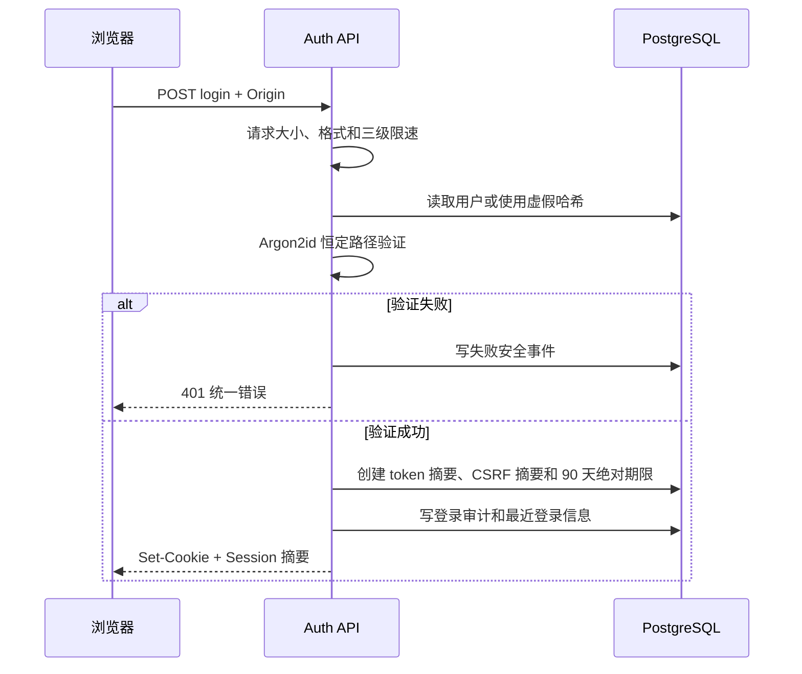
```mermaid
sequenceDiagram
    participant B as 浏览器
    participant A as Auth API
    participant DB as PostgreSQL
    B->>A: POST login + Origin
    A->>A: 请求大小、格式和三级限速
    A->>DB: 读取用户或使用虚假哈希
    A->>A: Argon2id 恒定路径验证
    alt 验证失败
        A->>DB: 写失败安全事件
        A-->>B: 401 统一错误
    else 验证成功
        A->>DB: 创建 token 摘要、CSRF 摘要和 90 天绝对期限
        A->>DB: 写登录审计和最近登录信息
        A-->>B: Set-Cookie + Session 摘要
    end
```

#### 25.2.3 Session 有效期

- 无用户操作 30 天后 `EXPIRED_IDLE`。
- 创建 90 天后无条件 `EXPIRED_ABSOLUTE`。
- 90 天不因任何访问、SSE、写操作或改配置延长。
- 自动轮询和 SSE 心跳不更新 `last_user_activity_at`。
- 前端只在检测到键盘、鼠标、触摸或主动导航后，最多每小时调用一次 `/auth/activity`。
- 普通写请求自动计为用户操作。

Session 状态：

```text
ACTIVE
EXPIRED_IDLE
EXPIRED_ABSOLUTE
REVOKED
PASSWORD_CHANGED
USER_DISABLED
```

Session 生命周期：

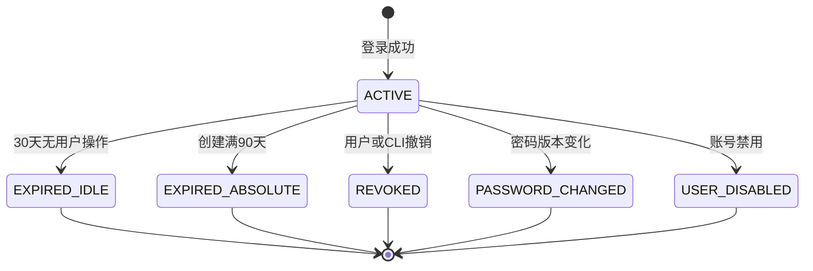
```mermaid
stateDiagram-v2
    [*] --> ACTIVE: 登录成功
    ACTIVE --> EXPIRED_IDLE: 30天无用户操作
    ACTIVE --> EXPIRED_ABSOLUTE: 创建满90天
    ACTIVE --> REVOKED: 用户或CLI撤销
    ACTIVE --> PASSWORD_CHANGED: 密码版本变化
    ACTIVE --> USER_DISABLED: 账号禁用
    EXPIRED_IDLE --> [*]
    EXPIRED_ABSOLUTE --> [*]
    REVOKED --> [*]
    PASSWORD_CHANGED --> [*]
    USER_DISABLED --> [*]
```

后台轮询和 SSE 只更新最近请求时间，不触发 30 天延期；只有真实用户活动更新无操作截止时间。

#### 25.2.4 Cookie 与 CSRF

正式 Cookie 采用 `__Host-session`、`Secure`、`HttpOnly`、`SameSite=Strict`、`Path=/` 且不设置 Domain。前端永远不能读取 Session Cookie。

CSRF Token 通过 `/auth/csrf` 获取并只存在内存。所有 POST、PUT、PATCH、DELETE 请求携带 `X-CSRF-Token`，后端还需验证 Origin/Referer 同源。CSRF 失败不清除有效 Session，前端可以重新获取 Token。

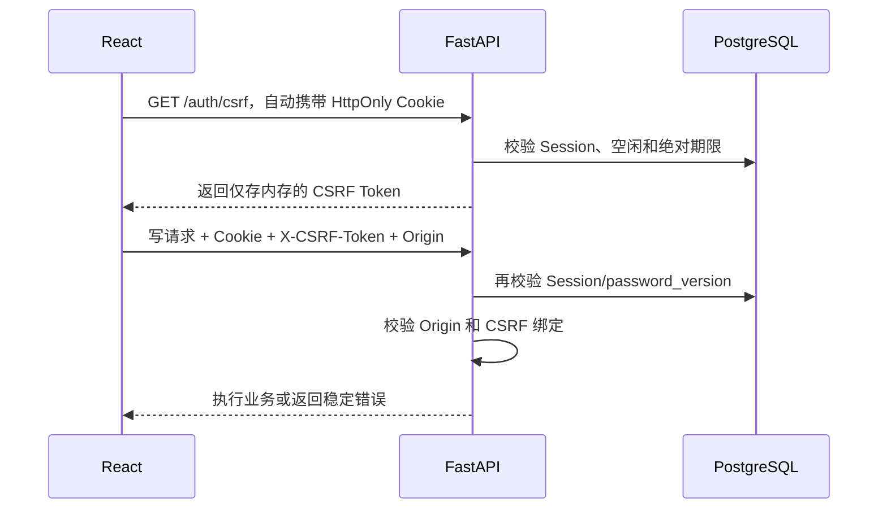
```mermaid
sequenceDiagram
    participant UI as React
    participant API as FastAPI
    participant DB as PostgreSQL
    UI->>API: GET /auth/csrf，自动携带 HttpOnly Cookie
    API->>DB: 校验 Session、空闲和绝对期限
    API-->>UI: 返回仅存内存的 CSRF Token
    UI->>API: 写请求 + Cookie + X-CSRF-Token + Origin
    API->>DB: 再校验 Session/password_version
    API->>API: 校验 Origin 和 CSRF 绑定
    API-->>UI: 执行业务或返回稳定错误
```

#### 25.2.5 并发 Session 与撤销

- 不限制并发 Session 数量。
- 新登录不踢掉旧登录。
- 用户可查询当前和其他 Session 的创建时间、最近活动、IP 摘要、浏览器摘要和绝对到期时间。
- 可撤销指定 Session、其他全部 Session 或全部 Session。
- 撤销操作只要求当前 Session 有效，不重新验证密码，但需要确认、CSRF、幂等和审计。
- SSE 建立和存续期间都要校验 Session；撤销或到期后服务端关闭连接。

#### 25.2.6 密码管理

- 推荐密码长度 12～128 字符，不强制复杂字符组合。
- 已登录改密只要求有效 Session，输入两次新密码并确认。
- 修改成功后增加 `password_version`，撤销其他 Session，轮换当前 Session 和 CSRF。
- 忘记密码不提供网页、邮件、短信或安全问题流程。
- CLI 使用隐藏交互输入，不允许密码作为命令参数。
- CLI 重置默认撤销全部 Session。

建议命令：

```text
python -m app.cli user create-admin
python -m app.cli user reset-password
python -m app.cli user revoke-sessions
python -m app.cli user disable
python -m app.cli user enable
```

#### 25.2.7 API

```text
POST /api/v1/auth/login
POST /api/v1/auth/logout
GET  /api/v1/auth/me
GET  /api/v1/auth/csrf
POST /api/v1/auth/activity
GET  /api/v1/auth/sessions
POST /api/v1/auth/sessions/{session_id}/revoke
POST /api/v1/auth/sessions/revoke-others
POST /api/v1/auth/sessions/revoke-all
POST /api/v1/auth/change-password
```

不提供注册、公开用户列表、邮件重置、验证码和网页初始化管理员接口。

#### 25.2.8 边界

- PostgreSQL 不可用返回 `AUTH_BACKEND_UNAVAILABLE` 和 503。
- Redis 不可用时登录限速降级为进程内保守模式，不能取消限速。
- IP 变化不自动退出，满足任意 IP 使用要求，但记录审计。
- 多个请求同时 401 时前端只执行一次清缓存和跳转。
- 修改密码时并发旧请求以 `password_version` 判定失效。
- 用户被禁用后所有 Session 立即失效。

---

### 25.3 任务、队列、Worker、超时与恢复

#### 25.3.1 数据模型

`job` 保存逻辑任务：类型、业务对象、队列、优先级、状态、配置快照、幂等键、创建者、进度、结果摘要和当前运行尝试。

`job_run` 保存每次运行尝试：尝试序号、Worker、领取/围栏令牌、开始结束时间、心跳、软硬超时、退出方式和安全错误摘要。

`job_item` 保存批量股票项目：父任务、股票、状态、尝试、结果引用、错误码和时间。

`event_outbox` 保存尚未可靠投递到 Redis 的内部事件或任务消息。

#### 25.3.2 状态

逻辑任务：

```text
PENDING_DISPATCH
QUEUED
RUNNING
WAITING_RETRY
PAUSING
PAUSED
CANCEL_REQUESTED
SUCCEEDED
PARTIAL
FAILED
TIMED_OUT
LOST
CANCELED
BLOCKED
REJECTED
```

运行尝试：

```text
CLAIMED
STARTING
RUNNING
SUCCEEDED
FAILED
TIMED_OUT
CANCELED
LOST
SUPERSEDED
```

逻辑任务状态机：

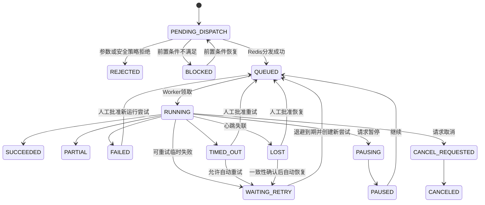
```mermaid
stateDiagram-v2
    [*] --> PENDING_DISPATCH
    PENDING_DISPATCH --> REJECTED: 参数或安全策略拒绝
    PENDING_DISPATCH --> BLOCKED: 前置条件不满足
    BLOCKED --> PENDING_DISPATCH: 前置条件恢复
    PENDING_DISPATCH --> QUEUED: Redis分发成功
    QUEUED --> RUNNING: Worker领取
    RUNNING --> SUCCEEDED
    RUNNING --> PARTIAL
    RUNNING --> FAILED
    RUNNING --> TIMED_OUT
    RUNNING --> LOST: 心跳失联
    RUNNING --> PAUSING: 请求暂停
    PAUSING --> PAUSED
    PAUSED --> QUEUED: 继续
    RUNNING --> CANCEL_REQUESTED: 请求取消
    CANCEL_REQUESTED --> CANCELED
    RUNNING --> WAITING_RETRY: 可重试临时失败
    WAITING_RETRY --> QUEUED: 退避到期并创建新尝试
    FAILED --> QUEUED: 人工批准新运行尝试
    TIMED_OUT --> WAITING_RETRY: 允许自动重试
    TIMED_OUT --> QUEUED: 人工批准重试
    LOST --> WAITING_RETRY: 一致性确认后自动恢复
    LOST --> QUEUED: 人工批准恢复
```

每次重试或恢复都创建新的 `job_run`，原失败、超时和失联记录保留。

批量项目使用 `PENDING/FETCHING/VALIDATING/RUNNING/SAVING/SUCCEEDED/FAILED/SKIPPED/CANCELED`，具体任务可以细化阶段，但最终状态含义必须统一。

#### 25.3.3 可靠提交

业务接口必须在一个 PostgreSQL 事务中完成：业务记录、`job`、发件箱、审计。事务提交后分发器将消息推到 RQ。

Redis 不可用时任务保持 `PENDING_DISPATCH`，恢复后继续。PostgreSQL 不可用时不得只向 Redis 写消息。

RQ Job ID 不是业务任务 ID；所有业务查询使用数据库 `job.id`。

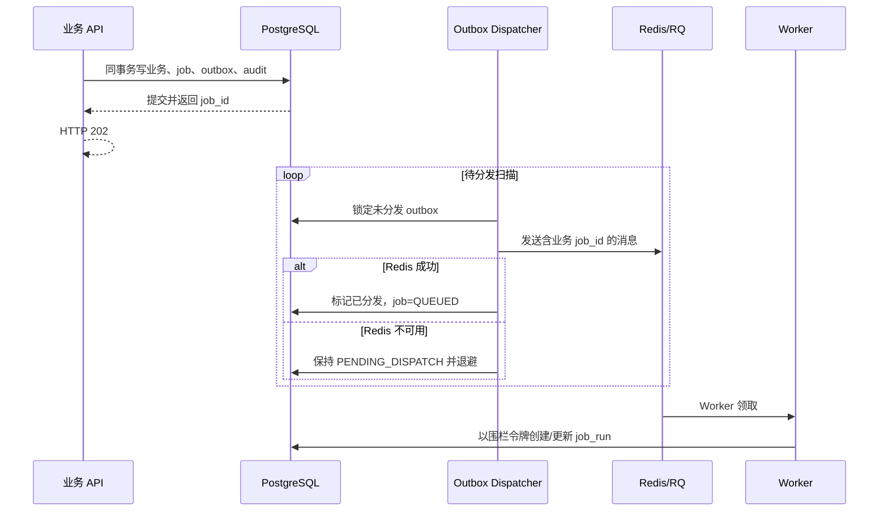
```mermaid
sequenceDiagram
    participant API as 业务 API
    participant DB as PostgreSQL
    participant D as Outbox Dispatcher
    participant R as Redis/RQ
    participant W as Worker
    API->>DB: 同事务写业务、job、outbox、audit
    DB-->>API: 提交并返回 job_id
    API-->>API: HTTP 202
    loop 待分发扫描
        D->>DB: 锁定未分发 outbox
        D->>R: 发送含业务 job_id 的消息
        alt Redis 成功
            D->>DB: 标记已分发，job=QUEUED
        else Redis 不可用
            D->>DB: 保持 PENDING_DISPATCH 并退避
        end
    end
    R->>W: Worker 领取
    W->>DB: 以围栏令牌创建/更新 job_run
```

#### 25.3.4 队列

```text
realtime-quotes
daily-market-data
qfq-refresh
strategy
target-calculation
notify-wecom
notify-email
backtest-single
bulk-backtest
bulk-history
exports
maintenance
```

实时、通知、数据、策略和批量任务不得共用一个串行 Worker。全市场回测和历史回填不能占用实时报价容量。物理 Worker 数量属于启动配置，网页只调整有界的逻辑并发。

#### 25.3.5 心跳和围栏令牌

- Worker 和运行任务建议每 15 秒写心跳。
- 超过 60 秒无心跳进入疑似失联并由看门狗确认。
- 每个 `job_run` 有唯一围栏令牌；只有当前活动令牌可以提交进度和最终结果。
- 旧 Worker 恢复后的迟到提交标记 `SUPERSEDED`，不能覆盖新运行。
- 长任务除心跳外还要更新业务进度；只有心跳、长期无进度也要告警。

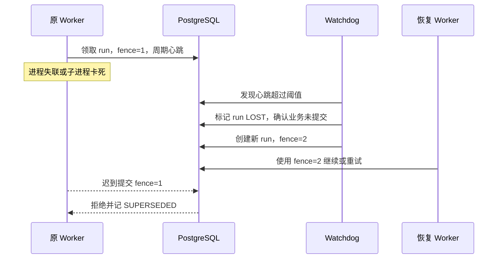
```mermaid
sequenceDiagram
    participant W1 as 原 Worker
    participant DB as PostgreSQL
    participant G as Watchdog
    participant W2 as 恢复 Worker
    W1->>DB: 领取 run，fence=1，周期心跳
    Note over W1: 进程失联或子进程卡死
    G->>DB: 发现心跳超过阈值
    G->>DB: 标记 run LOST，确认业务未提交
    G->>DB: 创建新 run，fence=2
    W2->>DB: 使用 fence=2 继续或重试
    W1-->>DB: 迟到提交 fence=1
    DB-->>W1: 拒绝并记 SUPERSEDED
```

#### 25.3.6 软硬超时

软超时发送协作取消，任务在安全点保存进度并退出。硬超时由 RQ/执行监督器终止任务子进程，Worker 父进程继续服务。建议默认：实时报价 60 秒、单次通知 30 秒、单股目标 30 秒、策略验证 30 秒、单股前复权 5 分钟、单股回测或历史项目 10 分钟、导出 30 分钟。

全市场父任务不使用一个覆盖全部股票的短硬超时，而是每个股票项目独立超时。

#### 25.3.7 暂停、取消和重试

- 暂停用于全市场回测、历史回填和大型导出；不再领取新项目，活动项目到安全点后进入 `PAUSED`。
- 取消待分发任务直接标记取消；已入队任务由 Worker 启动时检查；运行任务先协作取消，超过宽限期强制结束子进程。
- 已成功任务不能取消，反向业务需要新操作。
- 重试在同一逻辑任务下创建新 `job_run`，保留旧尝试。
- 参数或业务版本已经变化时应创建新任务，而不是重试旧快照。
- 旧目标、旧策略、旧订阅任务重试时必须重新验证版本，失效则 `REJECTED/SUPERSEDED`。

#### 25.3.8 自动重试边界

- 实时行情只在批次截止时间内执行有限 HTTP 重试，过期后不重跑。
- 通知由通知模块控制重试，任务层不叠加。
- 目标只对临时沙箱基础设施错误做一次受控重试；代码和输出错误不自动重试。
- 日线当天不无限重新创建业务批次。
- 回测和历史回填默认由用户重试失败项目；确认 Worker 未提交结果的失联项目可以自动恢复一次。

#### 25.3.9 API 与内部能力

```text
GET  /api/v1/jobs
GET  /api/v1/jobs/{job_id}
GET  /api/v1/jobs/{job_id}/runs
GET  /api/v1/jobs/{job_id}/items
GET  /api/v1/jobs/{job_id}/allowed-actions
POST /api/v1/jobs/{job_id}/cancel
POST /api/v1/jobs/{job_id}/pause
POST /api/v1/jobs/{job_id}/resume
POST /api/v1/jobs/{job_id}/retry
POST /api/v1/jobs/{job_id}/retry-failed-items
GET  /api/v1/workers
GET  /api/v1/queues
```

不提供通用 `POST /jobs`。内部统一使用 `JobService.submit/cancel/pause/resume/retry/report_progress/complete/fail`，业务 Worker 不直接更新任务表。

#### 25.3.10 保留和边界

- `job`、`job_run` 保留 180 天；普通 `job_item` 保留 30 天；回测、信号等正式业务结果不随任务清理。
- 重复 RQ 消息由数据库幂等约束处理。
- 父任务崩溃后进度从项目表重建，不能只存在内存。
- 队列过载时优先拒绝新批量任务，保留实时和通知容量。
- 一个 Worker、队列或股票失败不得阻塞其他队列。

---

### 25.4 日志、审计、健康检查和系统指标

#### 25.4.1 日志分类与结构

日志类别为 `application/access/worker/security/provider/scheduler/maintenance/frontend`。全部使用单行 JSON，并至少包含时间、级别、服务、事件名、消息、请求 ID；Worker 增加队列、任务、运行尝试和项目 ID；Provider 增加来源、能力、尝试和熔断状态。

访问日志记录方法、路由模板、状态码、响应大小、耗时、可信客户端 IP 和 User-Agent 摘要，不记录 Cookie、请求体、完整查询字符串和敏感 Header。

#### 25.4.2 保留和非阻塞

- 原始应用、访问、安全、Worker 日志保留 1～7 天，默认 7 天。
- 第三方失败样本、前端原始异常同样最多 7 天。
- 业务历史和审计不受该限制。
- 应用采用有界异步日志队列；队列满时优先丢弃 DEBUG 和重复 INFO，不能阻塞行情和任务。
- 日志丢弃数量进入指标并产生告警。
- 磁盘 85% 告警；95% 暂停新批量任务，实时服务继续。

#### 25.4.3 审计

`audit_event` 至少保存用户、Session、可信 IP、操作代码、业务对象、结果、前后安全摘要、原因、请求 ID、幂等键和风险等级。

必须审计：登录退出、改密、Session 撤销、持仓变化、订阅和调度修改、目标修改和复核、策略保存/发布/回滚、信号重置、通知和 Provider 配置、熔断操作、日历修改、回测和任务控制、系统配置和密钥修改、人工解决告警。

策略审计只存源码哈希；密钥审计只存版本和目标指纹；密码审计只存密码版本变化。高风险业务修改与审计必须同事务，审计失败则业务事务失败。

#### 25.4.4 健康接口

```text
GET /health/live
GET /health/ready
GET /api/v1/system/health
GET /api/v1/system/components
```

`live` 只检查进程和事件循环；`ready` 要求 PostgreSQL 可用和迁移兼容。Redis 不可用时返回可服务但降级，Provider 不参与 API 就绪判断。公网健康接口只返回最少状态，详细组件必须登录。

#### 25.4.5 指标

内部指标包含 HTTP 请求量和耗时、数据库连接池等待、Worker/队列、任务成功率和超时、Provider 成功率和熔断、行情批次缺失、目标失败、通知失败、磁盘、时钟和日历覆盖。指标标签不得使用任意错误全文或高基数用户输入。指标接口不面向公网。

#### 25.4.6 前端异常

`POST /api/v1/client-errors` 只接受页面路由、前端版本、错误类型、截断消息、浏览器摘要、请求 ID 和时间。禁止提交策略源码、表单内容、Cookie、CSRF、密钥和完整 API 响应。按错误指纹采样和聚合。

---

### 25.5 外部 HTTP 调用、超时、重试、限流和熔断

#### 25.5.1 公共客户端

每个进程为每类上游复用 HTTPX Client。配置连接、读取、写入、Pool 等待和总截止时间；默认不跟随重定向，强制 TLS 校验，限制响应大小和内容类型。任何 Provider 或通知适配器不得直接调用无超时的裸请求。

#### 25.5.2 重试

一次 Provider 操作最多 3 次 HTTP 请求，包括首次请求。只重试连接、临时 DNS、读取超时、429、502、503、504 和上游明确临时错误。参数错误、TLS 失败、Schema 不兼容、响应过大、永久鉴权错误不重试。

上层总截止时间优先于单次重试。例如实时报价批次剩余 2 秒时不能再启动一个可能耗时 10 秒的重试。

外部写操作需要区分：尚未发送、明确失败、明确成功、结果未知。POST 不允许因为读响应超时就无限重复。

#### 25.5.3 熔断

熔断维度为 `provider_or_channel + capability_or_instance`。状态 `CLOSED/OPEN/HALF_OPEN/DISABLED`。连续失败 3 次打开；冷却依次 60、180、300 秒。冷却后只允许少量半开探测，成功关闭，失败进入下一阶梯。

Redis 保存共享状态，数据库保存熔断历史。Redis 故障时每进程使用保守本地状态和低并发，避免放大请求。

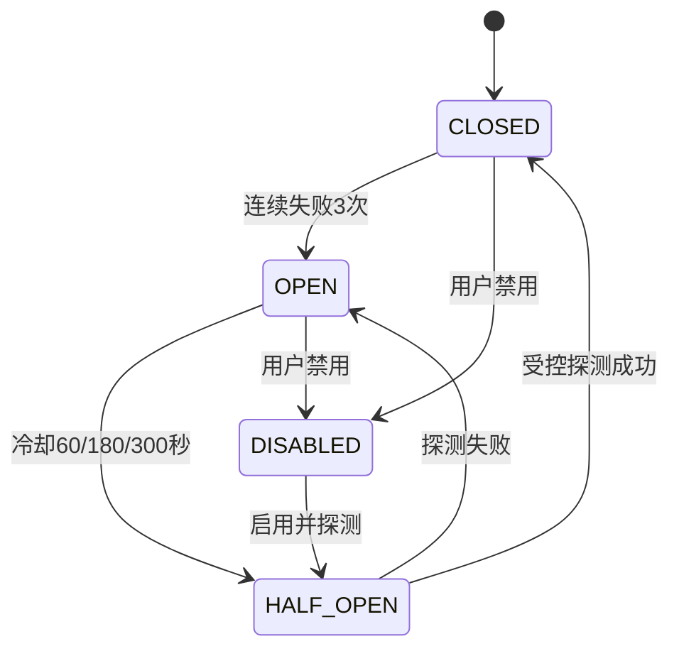
```mermaid
stateDiagram-v2
    [*] --> CLOSED
    CLOSED --> OPEN: 连续失败3次
    OPEN --> HALF_OPEN: 冷却60/180/300秒
    HALF_OPEN --> CLOSED: 受控探测成功
    HALF_OPEN --> OPEN: 探测失败
    CLOSED --> DISABLED: 用户禁用
    OPEN --> DISABLED: 用户禁用
    DISABLED --> HALF_OPEN: 启用并探测
```

#### 25.5.4 限流和优先级

使用共享令牌桶和并发信号量。Provider 至少有全局额度、能力额度和实时行情预留额度。批量回测不能耗尽实时请求额度。Redis 故障时退化为本地保守限速。

#### 25.5.5 SSRF 和响应保护

- Provider、企业微信和 SMTP 只允许代码或启动配置中定义的目标。
- 网页不得输入任意 URL、代理、Header、Cookie、DNS 和回调地址。
- 拒绝重定向到未授权目标。
- 限制响应头和响应体大小。
- 返回 HTML、验证码、登录页或非预期内容时视为契约错误，不能解析为行情。

---

### 25.6 Provider 注册、路由、自动切换和人工诊断

#### 25.6.1 Provider 接口

`MarketDataProvider` 提供 `capabilities`、股票主数据、批量实时行情、日线历史和能力探测。第一版实现 `EastmoneyProvider` 和 `SinaRealtimeProvider`，上层只依赖 `ProviderRouter`。

标准 DTO 使用内部代码、Decimal 和带时区时间。第三方字段名不得越过 Provider 层。Provider 返回的数据必须先经过契约校验和数据质量校验，才能进入正式表。

#### 25.6.2 能力路由

```text
REALTIME_QUOTE_BATCH: EASTMONEY → SINA
SECURITY_MASTER: EASTMONEY
DAILY_BAR_UNADJUSTED: EASTMONEY
HISTORICAL_DAILY_QFQ: EASTMONEY
```

实时主源整批失败时切换新浪；部分缺失时只对缺失股票尝试新浪。每条行情只使用一个来源，不允许东方财富取价格、Sina 取时间。

历史数据当前无备用源。未来增加时也必须对同一股票完整时间范围使用单一来源，整体校验和替换，不能按天拼接。

实时行情路由：

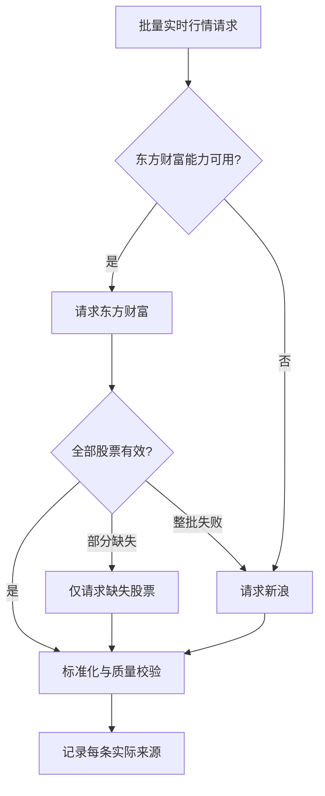
```mermaid
flowchart TD
    REQUEST["批量实时行情请求"] --> PRIMARY{"东方财富能力可用?"}
    PRIMARY -->|是| EAST["请求东方财富"]
    PRIMARY -->|否| SINA["请求新浪"]
    EAST --> CHECK{"全部股票有效?"}
    CHECK -->|是| NORMALIZE["标准化与质量校验"]
    CHECK -->|部分缺失| FALLBACK["仅请求缺失股票"]
    CHECK -->|整批失败| SINA
    FALLBACK --> NORMALIZE
    SINA --> NORMALIZE
    NORMALIZE --> RESULT["记录每条实际来源"]
```

#### 25.6.3 健康状态

按能力展示 `HEALTHY/DEGRADED/CIRCUIT_OPEN/HALF_OPEN/DISABLED/UNKNOWN`，并记录最近成功、失败、连续失败、冷却剩余、成功率、P95 耗时、限流等待、切换次数和 Schema 错误。

一只股票正常停牌、退市或偶发缺失不计为全局 Provider 失败；整批无法解析、核心字段大面积缺失、HTML/验证码、持续超时计入能力失败。

#### 25.6.4 探测与熔断操作

- 探测使用系统固定安全股票和小范围请求。
- 探测不写正式行情、不触发信号。
- 手工“重置”只能提前进入 HALF_OPEN 并执行探测，不能直接标记健康。
- 诊断模式允许对指定股票查看各来源标准化结果和字段差异，但不影响正式优先级。

#### 25.6.5 配置和 API

网页可配置 Provider/能力启停、优先级、自动切换、受限并发、速率和超时。配置版本化并在任务启动时冻结。

```text
GET   /api/v1/providers
GET   /api/v1/providers/{provider_code}
GET   /api/v1/providers/{provider_code}/capabilities
GET   /api/v1/providers/{provider_code}/health
PATCH /api/v1/providers/{provider_code}/settings
GET   /api/v1/providers/circuits
POST  /api/v1/providers/circuits/{circuit_id}/probe
POST  /api/v1/providers/circuits/{circuit_id}/reset
POST  /api/v1/providers/quote-diagnostics
```

内部事件包括 `provider.request_succeeded/failed/degraded/circuit_opened/half_opened/recovered/auto_switched/schema_changed/rate_limited/config_changed`。

#### 25.6.6 契约测试和边界

Provider 必须有离线样本测试：正常、空数据、缺字段、错误码、HTML、超大响应、时间异常和多市场代码。线上探测不能替代离线契约测试。

Schema 变化时拒绝正式写入、保存最多 7 天的脱敏失败样本、产生 `PROVIDER_SCHEMA_CHANGED` 告警并按阈值熔断。Provider 模块崩溃只使当前任务失败，不应终止 API 或其他 Worker。

---

### 25.7 股票主数据、实时行情、全市场日线与数据质量

#### 25.7.1 股票主数据

`security` 保存统一代码、交易所原始代码、名称、市场、证券类型、上市/退市日期、上市状态、ST 状态、停牌状态、东方财富/Sina 映射和最近更新时间。`security_revision` 保存名称、类型、状态等变化。

内部统一代码为 `600000.SH/000001.SZ/430047.BJ`。只有 SH/SZ/BJ A 股允许建立正式监控订阅；ETF、可转债、B 股、基金、指数、港美股应在添加阶段返回稳定拒绝码。

股票可以存在以下情况：上市、停牌、退市、数据暂缺。停牌不是数据源故障；退市股票保留历史但不能新建正式监控。

#### 25.7.2 范围快照

实时批次、日线批次、历史回填和全市场回测启动时创建股票范围快照，保存股票代码、当时状态、筛选条件、数量和主数据版本。执行过程中主数据变化不修改既有范围。

#### 25.7.3 实时批次表

`quote_cycle`：

```text
id
schedule_occurrence_id
scheduled_at
started_at
deadline_at
finalized_at
subscription_snapshot_version
expected_count
valid_count
missing_count
conflict_count
failed_count
status
```

状态：

```text
PENDING
FETCHING
FINALIZING
READY
PARTIAL
FAILED
MISSED
CANCELED
```

`quote_cycle_item` 每只股票一条，保存预期订阅版本、价格、开高低昨收、成交量额、行情时间、接收时间、Provider、质量状态、错误码和是否允许正式判断。

条目状态：

```text
VALID
MISSING
STALE
CONFLICT
INVALID
TIMEOUT
PROVIDER_FAILED
NOT_EXPECTED_TO_TRADE
```

#### 25.7.4 批次屏障

执行必须遵守：冻结全部约 20 只预期股票，批量请求东方财富，对失败项尝试 Sina，等待每只股票得到终态或整体超时，然后一次性 finalize，之后才分发信号判断。

禁止一边收到股票一边提前判断。19/20 成功时，19 只正常判断，1 只跳过并产生一个批次聚合告警。缺失股票当前信号状态保持不变，不能使用缓存旧价。

批次默认 30 秒硬截止，可配置 10～60 秒。达到截止时保存已成功项目，剩余标记超时。迟到响应可用于短期诊断，但不能改变批次终态或生成信号。

盘中批次时序：

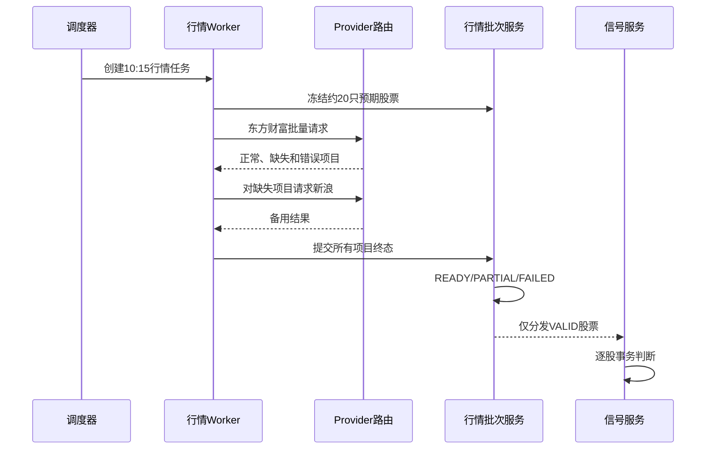
```mermaid
sequenceDiagram
    participant S as 调度器
    participant Q as 行情Worker
    participant P as Provider路由
    participant M as 行情批次服务
    participant G as 信号服务
    S->>Q: 创建10:15行情任务
    Q->>M: 冻结约20只预期股票
    Q->>P: 东方财富批量请求
    P-->>Q: 正常、缺失和错误项目
    Q->>P: 对缺失项目请求新浪
    P-->>Q: 备用结果
    Q->>M: 提交所有项目终态
    M->>M: READY/PARTIAL/FAILED
    M-->>G: 仅分发VALID股票
    G->>G: 逐股事务判断
```

这条时序体现了“先完成当前监控列表全部结果，再开始比较”的硬性规则。19 只有效时，信号服务只收到这 19 只；缺失股票由告警链处理。

#### 25.7.5 实时质量校验

正式行情至少满足：代码匹配、价格为正、时间存在、时间不明显未来、新鲜度不超过 3 分钟、high/low/current 关系合理、成交量额非负、字段类型和大小符合契约、无报价冲突。

报价冲突阈值为 `max(0.02 元, 0.2%)`。冲突保存两个标准 DTO，创建数据质量问题，状态 `WAITING_REVIEW`，本次跳过正式判断。过时的盘中冲突复核后默认不补发历史信号。

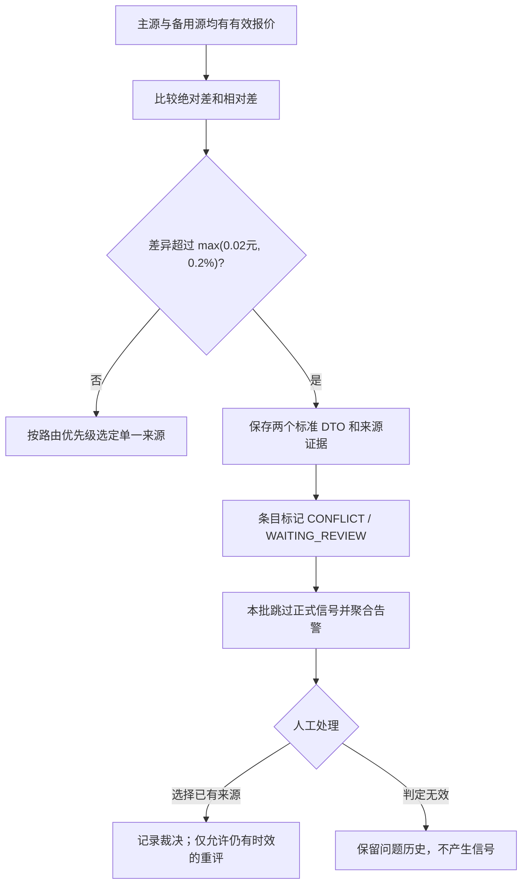
```mermaid
flowchart TD
    A["主源与备用源均有有效报价"] --> B["比较绝对差和相对差"]
    B --> C{"差异超过 max(0.02元, 0.2%)?"}
    C -- 否 --> D["按路由优先级选定单一来源"]
    C -- 是 --> E["保存两个标准 DTO 和来源证据"]
    E --> F["条目标记 CONFLICT / WAITING_REVIEW"]
    F --> G["本批跳过正式信号并聚合告警"]
    G --> H{"人工处理"}
    H -- 选择已有来源 --> I["记录裁决；仅允许仍有时效的重评"]
    H -- 判定无效 --> J["保留问题历史，不产生信号"]
```

网页不能输入任意价格“解决”冲突，只能在已有来源证据中选择或整体判定无效；对已经过时的盘中报价默认只修复数据质量记录，不补发历史提醒。

#### 25.7.6 全市场不复权日线

`daily_bar_unadjusted` 按年份原生分区，唯一键 `(security_id, trade_date)`，保存 OHLC、昨收、成交量、成交额、来源、数据版本和写入时间。全市场原始日线永久保存，不生成虚构停牌 K 线。

交易日 17:00 的 `daily_data_batch` 流程：冻结范围、抓取、写暂存区、逐项校验、解释合理无 K 线项目、提交有效行、记录缺失清单、触发监控股前复权。

批次状态：

```text
PENDING
FETCHING
VALIDATING
COMMITTING
SUCCEEDED
PARTIAL
FAILED
```

任何无法解释的缺失使批次为 PARTIAL，但有效股票仍提交。一只失败不能让整批回滚。HTTP 内部有限重试后，当晚不无限循环；允许手工重试，第二个交易日先处理历史缺失并继续提醒。

17:00 日线与目标链路：

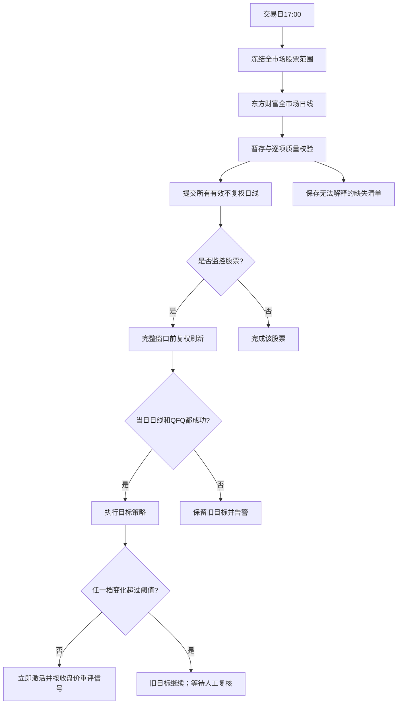
```mermaid
flowchart TD
    START["交易日17:00"] --> SNAPSHOT["冻结全市场股票范围"]
    SNAPSHOT --> FETCH["东方财富全市场日线"]
    FETCH --> STAGE["暂存与逐项质量校验"]
    STAGE --> COMMIT["提交所有有效不复权日线"]
    STAGE --> MISSING["保存无法解释的缺失清单"]
    COMMIT --> MONITOR{"是否监控股票?"}
    MONITOR -->|是| QFQ["完整窗口前复权刷新"]
    MONITOR -->|否| END["完成该股票"]
    QFQ --> GATE{"当日日线和QFQ都成功?"}
    GATE -->|是| TARGET["执行目标策略"]
    GATE -->|否| STALE["保留旧目标并告警"]
    TARGET --> REVIEW{"任一档变化超过阈值?"}
    REVIEW -->|否| ACTIVATE["立即激活并按收盘价重评信号"]
    REVIEW -->|是| WAIT["旧目标继续；等待人工复核"]
```

#### 25.7.7 日线质量规则

```text
open/high/low/close > 0
high >= max(open, close, low)
low <= min(open, close, high)
volume/amount >= 0
trade_date 与请求一致
代码与请求一致
同日无重复
```

还需检测相对前收盘异常跳变、数量级异常、字段突然缺失和 Schema 改变。新股、ST 和公司行为先标记上下文，不能简单按普通异常处理。

#### 25.7.8 监控股前复权

`qfq_refresh_run` 保存股票、策略窗口、来源、复权基准、行数、版本、校验和切换结果。刷新时先创建临时完整数据集，全部校验成功后原子切换当前有效集；失败时旧数据保持不动并标记 STALE。

目标计算按股票设置数据门槛：当日日线成功、该股前复权刷新成功、质量有效。全市场批次 PARTIAL 不阻止满足条件的监控股票计算目标。

全市场回测前复权不写长期表；按股票获取、校验、执行、释放。

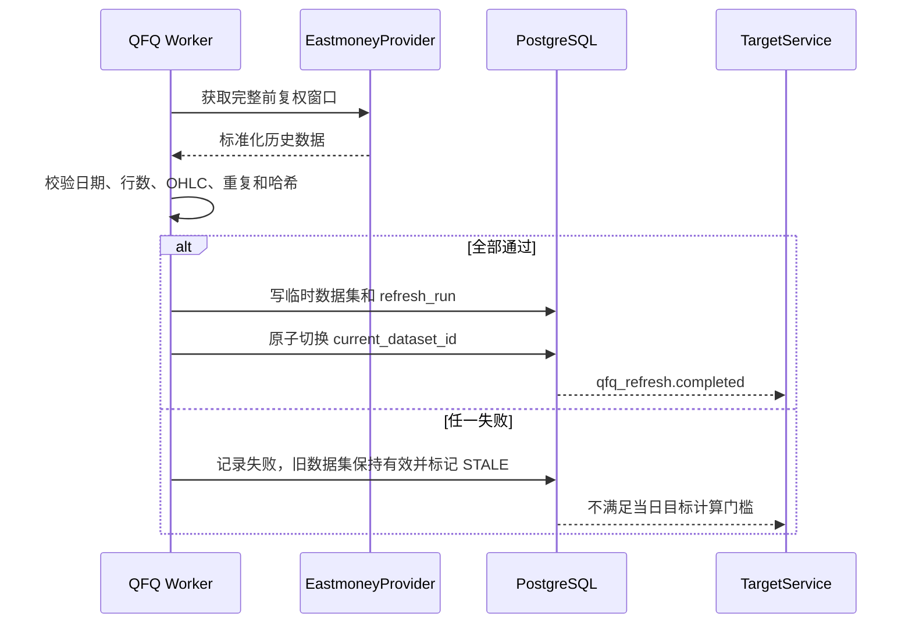
```mermaid
sequenceDiagram
    participant W as QFQ Worker
    participant P as EastmoneyProvider
    participant DB as PostgreSQL
    participant T as TargetService
    W->>P: 获取完整前复权窗口
    P-->>W: 标准化历史数据
    W->>W: 校验日期、行数、OHLC、重复和哈希
    alt 全部通过
        W->>DB: 写临时数据集和 refresh_run
        W->>DB: 原子切换 current_dataset_id
        DB-->>T: qfq_refresh.completed
    else 任一失败
        W->>DB: 记录失败，旧数据集保持有效并标记 STALE
        DB-->>T: 不满足当日目标计算门槛
    end
```

#### 25.7.9 修订和质量问题

同股同日数据变化时创建 `daily_bar_revision`，保存旧值、新值、字段差异、来源和原因，再更新当前正式行。监控股修订触发前复权刷新、目标重算和目标激活后的信号重评；不重写过去信号。

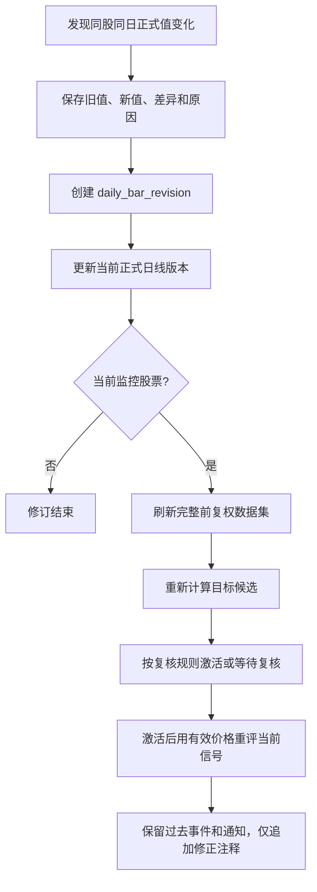
```mermaid
flowchart TD
    A["发现同股同日正式值变化"] --> B["保存旧值、新值、差异和原因"]
    B --> C["创建 daily_bar_revision"]
    C --> D["更新当前正式日线版本"]
    D --> E{"当前监控股票?"}
    E -- 否 --> F["修订结束"]
    E -- 是 --> G["刷新完整前复权数据集"]
    G --> H["重新计算目标候选"]
    H --> I["按复核规则激活或等待复核"]
    I --> J["激活后用有效价格重评当前信号"]
    J --> K["保留过去事件和通知，仅追加修正注释"]
```

`data_quality_issue` 状态：

```text
OPEN
REVIEW_REQUIRED
RESOLVED
INVALIDATED
```

第一版网页不提供任意日线价格编辑，只允许重抓、选择已有报价来源、判定无效或填写处理说明。

#### 25.7.10 API、事件和边界

```text
GET  /api/v1/securities
GET  /api/v1/securities/search
GET  /api/v1/securities/{symbol}
POST /api/v1/securities/refresh
GET  /api/v1/quote-cycles
GET  /api/v1/quote-cycles/{id}/items
POST /api/v1/quote-cycles/manual
POST /api/v1/quotes/diagnose
GET  /api/v1/daily-data/batches
GET  /api/v1/daily-data/batches/{id}/missing
POST /api/v1/daily-data/batches/{id}/retry
GET  /api/v1/daily-bars/{symbol}
GET  /api/v1/daily-bars/{symbol}/revisions
GET  /api/v1/qfq-data/{symbol}
POST /api/v1/qfq-data/{symbol}/refresh
GET  /api/v1/data-quality/issues
POST /api/v1/data-quality/issues/{id}/select-source
POST /api/v1/data-quality/issues/{id}/refetch
POST /api/v1/data-quality/issues/{id}/resolve
```

内部事件：`security_master.updated`、`quote_cycle.created/finalized`、`quote_item.missing`、`quote_conflict.detected`、`daily_batch.partial/completed`、`daily_bar.corrected`、`qfq_refresh.completed/failed`、`target_calculation.requested`。

Redis 故障时正式数据先提交 PostgreSQL，后续事件待分发；数据库故障时批次不能只存在 Worker 内存。磁盘达到 95% 时暂停全市场历史回填和批量任务，实时行情继续。

---

### 25.8 监控分组、订阅和明确时间调度

#### 25.8.1 分组与订阅分离

`watchlist` 和 `watchlist_item` 只负责组织。同一股票可属于多个分组。`monitor_subscription` 是真正业务订阅，每只股票最多一条未归档订阅，保存调度、目标模式、策略、滞回、通知策略和当前状态。

添加股票到多个分组不能产生重复行情、信号或通知。删除一个分组成员不影响其他分组；删除最后一个成员关系时默认提示同步暂停订阅。

#### 25.8.2 添加和批量添加

股票搜索只查询系统股票主数据。单只和批量添加都要验证证券范围。批量操作逐项返回 `CREATED/REUSED/REJECTED/FAILED`，一项失败不回滚其他项。

新订阅可先处于：

```text
订阅已创建
监控待配置
目标 MISSING
策略未绑定
调度未绑定
```

目标缺失时可以展示行情但不正式判断信号。

#### 25.8.3 调度定义和版本

`monitor_schedule` 保存当前指针，`monitor_schedule_revision` 保存不可变时间列表。时间精确到分钟，最多 20 个，自动排序，不能重复，只允许 09:30～11:30 和 13:00～15:00。

编辑创建新版本；已创建行情批次使用旧冻结版本；未来未创建批次使用新版本。恢复历史版本通过复制产生新版本。

`schedule_occurrence` 唯一键为调度类型、调度定义和计划 UTC 时间。调度器每 10 秒扫描，60 秒内领取；超过后 MISSED。停机恢复不补跑盘中批次。

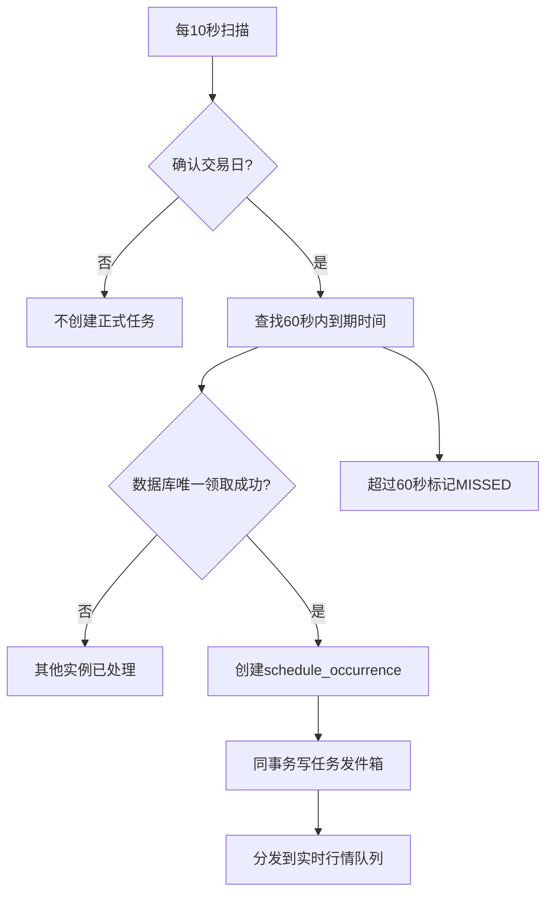
```mermaid
flowchart TD
    TICK["每10秒扫描"] --> DAY{"确认交易日?"}
    DAY -->|否| SKIP["不创建正式任务"]
    DAY -->|是| DUE["查找60秒内到期时间"]
    DUE --> CLAIM{"数据库唯一领取成功?"}
    CLAIM -->|否| DUP["其他实例已处理"]
    CLAIM -->|是| OCC["创建schedule_occurrence"]
    OCC --> OUTBOX["同事务写任务发件箱"]
    OUTBOX --> QUEUE["分发到实时行情队列"]
    DUE --> LATE["超过60秒标记MISSED"]
```

#### 25.8.4 批次合并和重叠

同一计划时间到期的所有启用订阅合并成一个预期股票集合。不同计划名称只要到期时间相同也可以合并。

如果前一批次尚未结束，新时间点不能复用前批次行情。新批次必须在自己的 60 秒宽限期内开始，否则 MISSED 并告警，不能排队很久后使用过期行情。

#### 25.8.5 订阅启停和修改

启用前验证调度、目标模式、策略版本、参数 Schema、股票状态和目标可用性。暂停立即生效：未来批次不包含；已排队未领取项取消；已取得行情可保存；信号提交前再次检查订阅，暂停则跳过信号和通知。

调度、策略和参数修改创建 `monitor_subscription_revision`。已开始批次继续使用冻结配置；新配置从后续批次生效。策略变更触发目标重算，新目标成功前旧目标继续且标记 STALE。

归档要求先暂停。归档后从默认列表隐藏，历史仍可查；恢复时复用原订阅。

#### 25.8.6 手工操作

“立即检查”在交易时段创建正式行情批次并可能产生信号；“测试行情”始终为 DIAGNOSTIC，不修改业务状态。非交易时段普通检查只展示最近收盘参考，不产生普通信号；目标变化重评仍按目标模块例外执行。

#### 25.8.7 API 和内部事件

```text
GET/POST/PATCH/DELETE /api/v1/watchlists
POST   /api/v1/watchlists/{id}/items
DELETE /api/v1/watchlists/{id}/items/{symbol}
POST   /api/v1/watchlists/{id}/items/batch
GET/POST/PATCH /api/v1/monitor-subscriptions
POST /api/v1/monitor-subscriptions/{id}/enable
POST /api/v1/monitor-subscriptions/{id}/disable
POST /api/v1/monitor-subscriptions/{id}/archive
POST /api/v1/monitor-subscriptions/{id}/restore
POST /api/v1/monitor-subscriptions/{id}/check-now
POST /api/v1/monitor-subscriptions/{id}/diagnose
GET/POST/PATCH/DELETE /api/v1/monitor-schedules
GET  /api/v1/monitor-schedules/{id}/versions
POST /api/v1/monitor-schedules/{id}/restore
GET  /api/v1/schedule-occurrences
```

内部事件：`watchlist.updated`、`monitor_subscription.created/enabled/disabled/changed/archived`、`monitor_schedule.changed`、`schedule_occurrence.created/missed`、`quote_cycle.requested`、`target_recalculation.requested`。

所有修改使用乐观锁。暂停属于即时安全门槛，即使批次快照仍启用，最终信号提交也必须以当前暂停状态为准。

---

### 25.9 持仓状态和独立历史

#### 25.9.1 模型和规则

`user_position` 每只股票一条当前记录，包含状态、版本、修改时间、来源和最新历史 ID。`user_position_history` 不可变保存前状态、后状态、生效时间、备注、来源、请求 ID 和版本。

状态只有 `HOLDING/NOT_HOLDING`。默认无记录视为 NOT_HOLDING。不保存数量、成本、成交和盈亏，不允许回填过去生效时间。备注可选，建议最多 500 字。

#### 25.9.2 幂等修改

相同状态重复提交返回 `POSITION_UNCHANGED`，不创建新历史、不触发复核，但保留轻量审计。真实变化在一个事务中更新当前表、插入历史、插入审计和发件箱。

#### 25.9.3 变为持仓

提交后异步高位复核：

- 交易时段优先使用 3 分钟内有效行情，否则创建立即行情任务。
- 非交易时段使用最近有效收盘价展示；如果当前已存在仍有效的 HIGH/STRONG_HIGH 状态，可以产生“新增持仓后的高位提醒”，并标明非实时价格日期。
- 当前不在高位时不因持仓变化发送普通通知。
- 目标缺失或复核失败不回滚持仓，而是告警。

如果未持仓时已经产生高位信号，新增持仓不能伪造新的区间转换。应新增复核记录，通知原因 `POSITION_BECAME_HOLDING`，引用现有信号状态、价格、目标和新持仓版本。

```mermaid
flowchart TD
    HOLD["用户标记HOLDING"] --> TX["当前表、历史、审计、发件箱同事务"]
    TX --> FRESH{"交易时段且有3分钟内行情?"}
    FRESH -->|是| REVIEW["复核当前目标和信号区间"]
    FRESH -->|否且交易时段| FETCH["立即获取行情"]
    FETCH --> REVIEW
    FRESH -->|非交易时段| CLOSE["使用最近有效收盘价并标注日期"]
    CLOSE --> REVIEW
    REVIEW --> HIGH{"当前仍是HIGH/STRONG_HIGH?"}
    HIGH -->|是| NOTICE["创建持仓触发的高位通知"]
    HIGH -->|否| DONE["只保存复核记录"]
```

#### 25.9.4 变为未持仓

- 不修改当前信号区间，不删除高位事件。
- 取消尚未发送的高位相关 `PENDING/RETRY_WAIT` 投递。
- 对 `SENDING` 只能在提交第三方前再次检查；已成功或结果未知的外部消息无法撤回。
- 位置变化与通知取消通过事务发件箱衔接。

```mermaid
sequenceDiagram
    participant U as 用户
    participant P as PositionService
    participant DB as PostgreSQL
    participant N as NotificationWorker
    U->>P: 标记 NOT_HOLDING
    P->>DB: 同事务更新当前、写历史/审计/取消事件
    DB-->>U: 清仓状态立即生效
    N->>DB: 领取或准备发送高位投递
    N->>DB: 再读最新持仓版本
    alt 尚未发送
        N->>DB: 标记高位投递 CANCELED/SKIPPED_INELIGIBLE
    else 已送达或结果未知
        N->>DB: 保留原事实，不能撤回
    end
```

#### 25.9.5 信号并发

高位信号与清仓并发时，信号事件可以保存，但通知发送前读最新持仓并取消。高位信号与新增持仓并发时，无论事务顺序都必须最终进行一次高位资格复核，数据库幂等去重重复通知。

持仓版本参与通知幂等键。用户清仓后再次持仓且仍高位，可以因新的持仓版本再次提醒。

#### 25.9.6 API、事件和边界

```text
GET  /api/v1/positions
GET  /api/v1/positions/{symbol}
GET  /api/v1/positions/{symbol}/history
GET  /api/v1/position-history
POST /api/v1/positions/{symbol}/hold
POST /api/v1/positions/{symbol}/clear
POST /api/v1/positions/batch
```

内部事件：`position.changed/became_holding/became_not_holding`、`position.high_review_requested/completed`、`high_notification_cancel_requested`。

股票可持仓但未监控，页面显示“已持仓·未监控”并提供加入监控入口，不自动创建订阅。停牌、退市不阻止用户修改持仓历史；退市股票不能新建正式监控。

---

### 25.10 策略编辑、验证、发布、Git 和强沙箱

#### 25.10.1 策略生命周期和表

```text
DRAFT
VALIDATING
VALIDATED
PUBLISHING
PUBLISHED
PUBLISH_FAILED
ARCHIVED
```

核心表：`strategy`、`strategy_draft`、`strategy_draft_revision`、`strategy_version`、`strategy_validation_run`、`strategy_run`。

当前工作草稿可修改；手工保存产生不可变草稿修订；发布版本不可修改和删除。源代码、元数据、参数 Schema、环境版本、镜像摘要、源码 SHA-256、Git Commit、验证记录和发布时间绑定在发布版本中。

```mermaid
stateDiagram-v2
    [*] --> DRAFT: 创建策略
    DRAFT --> VALIDATING: 发起验证
    VALIDATING --> DRAFT: 验证失败
    VALIDATING --> VALIDATED: 验证成功
    VALIDATED --> DRAFT: 源码或Schema变化
    VALIDATED --> PUBLISHING: 确认发布
    PUBLISHING --> PUBLISHED: Git与数据库都成功
    PUBLISHING --> PUBLISH_FAILED: 任一步失败
    PUBLISH_FAILED --> DRAFT: 修复或重试
    PUBLISHED --> ARCHIVED: 归档
```

#### 25.10.2 编辑器和并发

网页提供 Python 高亮、行号、搜索替换、括号、自动保存、手工版本、diff、恢复、验证、测试、回测、发布和回滚。第一版只有一个 Python 文件，默认最大 256 KB，不提供目录、Shell、Notebook、requirements.txt 和 pip。

草稿包含 `draft_version`。自动保存提交 `expected_version`；多标签页冲突返回 409，停止自动保存，显示本地和服务器 diff，由用户复制、放弃或合并。策略源码不写 localStorage/sessionStorage。

```mermaid
flowchart TD
    A["网页编辑内存草稿"] --> B["30 秒自动保存或手工保存"]
    B --> C{"expected_version 一致?"}
    C -- 否 --> D["409；停止自动保存并展示 diff"]
    C -- 是 --> E["服务器保存新 draft_version"]
    E --> F["手工保存时创建不可变草稿修订"]
    E --> G["发起语法、契约和固定样本验证"]
    G --> H{"验证及完整单股回测均绑定当前哈希?"}
    H -- 否 --> I["禁止发布并列出缺失门槛"]
    H -- 是 --> J["允许确认发布"]
```

#### 25.10.3 输入输出契约

固定入口 `calculate_targets(history, params, context)`。`history` 是只含目标日期及以前数据的前复权 DataFrame。`params` 通过发布版本 JSON Schema。`context` 只含股票、交易所、名称、as_of_date、策略版本、数据版本和计算原因。

输出四档必须全部存在、有限、正数、顺序正确、可转 Decimal，保存到 0.01 元。可选 diagnostics 只允许 JSON 基本类型，最多 64 KB，不允许返回完整日线、DataFrame、自定义对象、NaN 或 Infinity。

#### 25.10.4 静态检查和允许库

检查语法、入口、元数据、Schema、导入白名单、危险内置、明显文件/网络/进程操作和超大常量。禁止或限制 `open/eval/exec/compile/input/breakpoint/__import__/subprocess/socket/requests/httpx/urllib/os/pathlib/multiprocessing/threading/ctypes/pickle/importlib` 等。

第一版允许 pandas、NumPy、math、statistics、decimal、datetime、collections、itertools、functools、operator、typing。版本固定在策略镜像中，用户不能网页增加。

静态检查不是安全边界，真正边界是强隔离运行环境。

#### 25.10.5 沙箱

每次执行使用一次性强隔离环境：无网络、DB、Redis、环境密钥、宿主挂载和 Socket；只读、非 root、cap-drop、no-new-privileges、seccomp；CPU 1、内存 512 MB、pids 32、tmpfs 64 MB；stdout/stderr 和输出受限。默认目标计算 10 秒硬超时。

超时、内存超限、进程异常或策略退出只影响当前股票。Worker 必须在子执行结束后继续服务。错误摘要脱敏返回，完整堆栈仅短期日志。

```mermaid
flowchart TD
    A["Strategy Worker 冻结可信输入"] --> B["启动一次性强隔离 Runner"]
    B --> C["只读源码、历史切片、参数和 context"]
    C --> D["无网络、DB、Redis、密钥、宿主挂载和 Socket"]
    D --> E["CPU/内存/PID/tmpfs/时间/输出上限"]
    E --> F{"执行结果"}
    F -- 合法四档与诊断 --> G["Runner 返回受限 JSON"]
    F -- 超时或越界 --> H["终止子进程并返回稳定错误"]
    G --> I["Worker 再做输出校验和落库"]
    H --> J["仅当前股票失败，Worker 父进程继续"]
```

#### 25.10.6 验证和发布

四级验证：语法/契约、固定样本、用户指定股票试算、完整单股样本外回测。发布验证绑定精确源码哈希、参数、训练期、测试期和数据哈希；代码、元数据或参数 Schema 变化后失效。完整回测可以没有交易或盈利，但不能有未处理执行、数据或隔离错误。

发布异步流程：创建 PUBLISHING、冻结快照、写策略 Git、取得 Commit、核对哈希、数据库标记 PUBLISHED、写审计和事件。Git 或数据库任一步失败都不能产生可绑定的半发布版本。

```mermaid
sequenceDiagram
    participant U as 管理员
    participant A as 策略服务
    participant W as 策略Worker
    participant X as 强沙箱
    participant G as 策略Git
    U->>A: 发布当前草稿
    A->>A: 校验源码哈希和单股回测
    A-->>W: 创建PUBLISHING任务
    W->>X: 固定样本最终执行
    X-->>W: 目标与资源结果
    W->>G: 写不可变版本并提交
    G-->>W: Git Commit ID
    W->>A: 固化发布版本、哈希和Commit
    A-->>U: PUBLISHED
```

草稿不写 Git；发布版本写独立策略仓库。正式执行以数据库不可变快照为准并验证哈希。网页不能输入 Git 命令、远程地址或触发应用部署。

#### 25.10.7 应用和回滚

发布新版本只成为可选/推荐版本，不自动改变既有订阅。用户可对选定股票或全部相关股票批量应用，逐只创建订阅修订和目标计算任务。

回滚不是修改版本或重写 Git，而是将选定订阅重新绑定到历史版本并重新计算目标。成功前旧目标继续；失败股票不影响其他股票。

已发布策略只能归档。归档后新订阅默认不显示，但既有订阅继续运行。空白、从未发布且无绑定的策略可删除，仍保留审计。

#### 25.10.8 API 和事件

```text
GET/POST/PATCH /api/v1/strategies
POST /api/v1/strategies/{id}/archive
POST /api/v1/strategies/{id}/restore
GET/PUT /api/v1/strategies/{id}/draft
POST /api/v1/strategies/{id}/draft/revisions
GET  /api/v1/strategies/{id}/draft/revisions
POST /api/v1/strategies/{id}/draft/revisions/{revision_id}/restore
GET  /api/v1/strategies/{id}/diff
POST /api/v1/strategies/{id}/validate
POST /api/v1/strategies/{id}/test
POST /api/v1/strategies/{id}/publish
GET  /api/v1/strategies/{id}/versions
POST /api/v1/strategies/{id}/versions/{version_id}/apply
POST /api/v1/strategies/{id}/versions/{version_id}/rollback
```

事件：`strategy.created/draft_saved/draft_revision_created`、`validation_requested/completed/failed`、`publish_requested/published/publish_failed`、`archived`、`version_apply_requested/version_rollback_requested`、`target_recalculation.requested`。

---

### 25.11 四档目标、候选复核、激活和立即重评

#### 25.11.1 数据表和不可变内容

`target_revision` 保存四档、来源、订阅、策略版本、参数快照、数据版本、目标日期、源码哈希、原因、任务和内容哈希。有效内容创建后不可修改。

`subscription_target_binding` 保存当前目标指针、绑定版本、激活时间、状态和过期原因。

`target_calculation_run` 保存每次计算，包括失败、资源使用和错误摘要；失败不需要创建伪目标版本。

`target_review` 保存候选、基准版本、每档变化、原因、审批状态和意见。目标内容和复核状态分离。

#### 25.11.2 目标校验和状态

四档必须一次满足 `0 < low_strong < low_watch < high_watch < high_strong`，使用 Decimal，正式保存到 0.01 元。禁止自动换序、部分保存、NaN 和 Infinity。

订阅目标状态：

```text
READY
STALE
CALCULATING
REVIEW_REQUIRED
ACTIVATING
FAILED
MISSING
```

有旧目标而新计算失败时必须是 STALE，不应显示为完全不可用 FAILED。

#### 25.11.3 手工目标

手工页面显示新旧值、绝对变化、百分比、最近价格可能区间和说明。策略模式下手工保存必须明确切换订阅到 MANUAL 并创建订阅修订。

任一手工目标变化超过配置阈值时显示强警告和二次确认，但用户确认后直接激活，不进入额外 REVIEW_REQUIRED，因为手工确认本身就是复核。

#### 25.11.4 策略计算门槛

必须同时满足：订阅 STRATEGY、发布版本有效、参数 Schema 有效、目标日线存在、前复权刷新成功、质量通过、无待复核数据冲突、沙箱可用。

```mermaid
flowchart TD
    A["请求计算目标"] --> B{"订阅为 STRATEGY?"}
    B -- 否 --> X["拒绝并记录跳过原因"]
    B -- 是 --> C{"发布版本和参数有效?"}
    C -- 否 --> F["标记失败或 STALE 并告警"]
    C -- 是 --> D{"当日线及前复权质量通过?"}
    D -- 否 --> F
    D -- 是 --> E{"冲突已解决且沙箱可用?"}
    E -- 否 --> F
    E -- 是 --> G["冻结源码、参数和数据快照"]
    G --> H["沙箱计算四档目标"]
    H --> I{"结果合法?"}
    I -- 否 --> F
    I -- 是 --> J{"与当前内容相同?"}
    J -- 是 --> K["记录成功并清除 STALE"]
    J -- 否 --> L["创建不可变候选版本"]
```

策略计算成功后校验、建立候选、对比当前。四档内容完全相同则只记录成功运行并清除 STALE，不创建重复版本、不重评信号。初始目标无基准，校验后直接激活。

#### 25.11.5 大幅变化复核

系统计算任一档变化 `abs(new-old)/max(abs(old),0.01)` 超过默认 30% 时进入 REVIEW_REQUIRED，阈值配置范围 10%～100%。旧目标继续服务，候选不得用于信号。

复核页面必须显示新旧四档、变化比例、策略版本、源码哈希、参数、数据版本、诊断和价格。通过前重新检查基准目标、策略和数据仍一致；失效返回 409 要求重算。驳回必须填写原因，旧目标保持 STALE；重算创建新任务和新候选，不修改旧候选。

```mermaid
sequenceDiagram
    participant U as 用户
    participant R as ReviewService
    participant DB as PostgreSQL
    participant T as TargetService
    U->>R: 批准候选 + expected_review_version
    R->>DB: 锁定复核、绑定和当前基准
    R->>DB: 核对策略、参数、数据和候选哈希
    alt 任一基准已变化
        R-->>U: 409 REVIEW_STALE，要求重新计算
    else 快照仍一致
        R->>DB: 标记 APPROVED 并写审计/激活发件箱
        R-->>U: 接受批准
        T->>DB: 激活候选并触发信号重评
    end
```

```mermaid
stateDiagram-v2
    [*] --> MISSING
    MISSING --> CALCULATING: 首次计算
    READY --> CALCULATING: 新日线或手工重算
    STALE --> CALCULATING: 补偿或重试
    CALCULATING --> READY: 首次有效目标
    CALCULATING --> REVIEW_REQUIRED: 系统变化超阈值
    CALCULATING --> READY: 变化未超阈值
    CALCULATING --> STALE: 有旧目标且失败
    CALCULATING --> FAILED: 无旧目标且失败
    REVIEW_REQUIRED --> ACTIVATING: 批准且快照仍一致
    REVIEW_REQUIRED --> STALE: 驳回
    ACTIVATING --> READY: 指针提交成功
    FAILED --> CALCULATING: 重试
```

#### 25.11.6 激活事务和重评

激活事务锁定当前绑定、验证候选、更新指针和版本、状态 ACTIVING、写审计和发件箱。提交后立即对外可见，并异步重评信号。

交易时段使用 3 分钟内行情，否则立即获取；非交易时段使用最近有效收盘价。目标变化明确允许在非交易时段产生正式区间变化，通知必须标注“目标变化触发”和价格日期。

信号重评失败不回滚目标，状态保持已激活但告警并重试。后续行情使用新目标。

```mermaid
sequenceDiagram
    participant U as 用户或计算任务
    participant T as TargetService
    participant DB as PostgreSQL
    participant O as Outbox
    participant S as SignalWorker
    U->>T: 激活候选或提交手工目标
    T->>DB: 锁定绑定并校验基准/候选/版本
    T->>DB: 写新绑定、审计、目标状态
    T->>O: 同事务写 target.activated
    DB-->>T: 提交成功
    T-->>U: 返回新目标版本
    O->>S: signal.reevaluation_requested
    S->>DB: 读取新目标和合格价格
    S->>DB: 原子写判断、状态、事件和通知发件箱
    alt 重评失败
        S->>DB: 记录失败与系统告警
        Note over T,S: 已激活目标不回滚，后续任务重试
    end
```

#### 25.11.7 17:00、失败和恢复

当日监控股日线、前复权、策略目标成功后立即激活并用当日收盘价重评，不等待第二天。失败时旧目标继续且 STALE；当天提醒，第二个交易日仍未恢复继续提醒并优先补齐。

恢复历史目标通过复制四档创建来源 RESTORED 的新版本，记录原版本并激活；建议同时切换 MANUAL，避免下一次策略计算立即覆盖。恢复历史算法应走策略版本回滚。

#### 25.11.8 并发、API 和事件

重复相同计算用幂等键合并。旧计算晚到时检查策略、参数、数据、订阅和当前目标版本，不允许覆盖。批量计算逐只处理。

```text
GET  /api/v1/targets
GET  /api/v1/targets/{subscription_id}
GET  /api/v1/targets/{subscription_id}/history
POST /api/v1/targets/{subscription_id}/manual
POST /api/v1/targets/{subscription_id}/calculate
POST /api/v1/targets/{subscription_id}/retry
POST /api/v1/targets/{subscription_id}/restore
POST /api/v1/targets/calculate-batch
GET  /api/v1/target-calculation-runs
GET  /api/v1/target-reviews
POST /api/v1/target-reviews/{id}/approve
POST /api/v1/target-reviews/{id}/reject
POST /api/v1/target-reviews/{id}/recalculate
```

事件：`target.calculation_requested/started/succeeded/failed`、`review_required/approved/rejected`、`target.activated/marked_stale/restored`、`signal.reevaluation_requested`。

---

### 25.12 信号状态、滞回、事件、通知资格和乱序保护

#### 25.12.1 状态和边界

当前状态：`UNKNOWN/STRONG_LOW/LOW/NORMAL/HIGH/STRONG_HIGH`。基础区间：

```text
price <= LS                 STRONG_LOW
LS < price <= LW            LOW
LW < price < HW             NORMAL
HW <= price < HS            HIGH
price >= HS                 STRONG_HIGH
```

等于边界明确进入低位或高位。全部使用 Decimal。

#### 25.12.2 初始与正式判断

UNKNOWN 首次判断为 NORMAL 时只建立 `signal_state` 和 `signal_evaluation`，不产生信号事件。首次为非 NORMAL 时创建 `UNKNOWN → zone` 事件，并按通知资格处理。

正式判断原因：

```text
SCHEDULED_QUOTE
MANUAL_CHECK
TARGET_ACTIVATED
POSITION_BECAME_HOLDING
DATA_CORRECTION
STATE_RESET
RECOVERY_REEVALUATION
```

普通 DIAGNOSTIC 不进入正式状态链。

#### 25.12.3 滞回算法

每个边界缓冲 `max(target * ratio, min_abs)`，默认 ratio 2%、min 0.02 元。

```text
NORMAL -> LOW              price <= LW
LOW -> NORMAL              price > LW + buffer(LW)
LOW -> STRONG_LOW          price <= LS
STRONG_LOW -> LOW          price > LS + buffer(LS)

NORMAL -> HIGH             price >= HW
HIGH -> NORMAL             price < HW - buffer(HW)
HIGH -> STRONG_HIGH        price >= HS
STRONG_HIGH -> HIGH        price < HS - buffer(HS)
```

一次跨越多档直接进入最终区间，只创建一个事件。目标变化重评绕过旧状态退出滞回，按新目标基础区间直接计算；后续行情恢复滞回。

```mermaid
stateDiagram-v2
    [*] --> UNKNOWN
    UNKNOWN --> STRONG_LOW: p <= LS
    UNKNOWN --> LOW: LS < p <= LW
    UNKNOWN --> NORMAL: LW < p < HW
    UNKNOWN --> HIGH: HW <= p < HS
    UNKNOWN --> STRONG_HIGH: p >= HS
    NORMAL --> LOW: p <= LW
    LOW --> NORMAL: p > LW + buffer
    LOW --> STRONG_LOW: p <= LS
    STRONG_LOW --> LOW: p > LS + buffer
    NORMAL --> HIGH: p >= HW
    HIGH --> NORMAL: p < HW - buffer
    HIGH --> STRONG_HIGH: p >= HS
    STRONG_HIGH --> HIGH: p < HS - buffer
```

目标激活重评是上述状态机的显式例外：它以新目标做一次“原始区间归类”，不要求先跨越旧目标的退出缓冲；该次提交后再按新目标恢复滞回。跨多档时状态直接跳到最终区间，事件中同时保留前后状态。

#### 25.12.4 三类表

`signal_state` 保存当前区间、版本、最近价格/行情/目标/持仓版本、最近判断和事件。

`signal_evaluation` 保存每次正式比较，即使状态不变或跳过：原因、前后状态、价格、行情批次/条目、目标快照、持仓版本、是否滞回、是否使用 STALE 目标、跳过码和任务。

`signal_event` 只保存真实转换：前后状态、价格时间、目标、持仓、状态版本、原因、通知资格和抑制原因。三者均为业务数据；事件和状态历史永久保存。

#### 25.12.5 通知分类和持仓限制

到达 LOW/STRONG_LOW 为低位类；低位回 NORMAL 为低位解除类；到达 HIGH/STRONG_HIGH 为高位类；高位回 NORMAL 为高位解除类；直接高低跨越以到达区间为主。

低位类及低位解除不依赖持仓。高位类及高位解除只有当前持仓时允许外部通知。`HIGH → LOW` 未持仓仍按低位到达提醒；`LOW → HIGH` 未持仓按高位规则抑制。持仓时直接跨越只发一条完整转换消息。

```mermaid
flowchart TD
    A["正式信号状态发生变化"] --> B{"目标区间属于哪一类?"}
    B -- 低位或低位解除 --> C["不检查持仓"]
    B -- 高位或高位解除 --> D{"当前持仓?"}
    D -- 否 --> E["记录 SUPPRESSED：NOT_HOLDING"]
    D -- 是 --> F["具备业务通知资格"]
    C --> F
    F --> G["按订阅/类型/全局策略冻结渠道"]
    G --> H{"存在外部渠道?"}
    H -- 否 --> I["仅网页留痕"]
    H -- 是 --> J["创建通知事件与各渠道投递"]
```

#### 25.12.6 事务和幂等

正式判断锁定 `signal_state`，检查订阅启用、当前目标、行情版本和顺序，读取持仓，在同一事务写 evaluation、必要 event、更新 state、写通知发件箱。

```mermaid
sequenceDiagram
    participant W as SignalWorker
    participant DB as PostgreSQL
    participant O as Outbox
    W->>DB: BEGIN 并锁定 signal_state
    W->>DB: 校验订阅、目标、行情、顺序和持仓版本
    alt 任务过期或版本落后
        W->>DB: 写 evaluation=SUPERSEDED/SKIPPED
        W->>DB: COMMIT，不改当前状态
    else 输入有效
        W->>DB: 写 signal_evaluation
        W->>DB: 状态变化时写 signal_event
        W->>DB: 更新 signal_state 与版本
        W->>O: 有资格时同事务写通知请求
        W->>DB: COMMIT
    end
```

普通行情幂等键含订阅、行情条目、目标版本和原因。目标重评含目标激活版本和价格版本。持仓高位复核含持仓版本和信号状态版本。

#### 25.12.7 乱序保护

- 普通行情按行情时间和计划批次排序。
- 迟到旧行情保存为 SUPERSEDED，不更新状态。
- 旧目标或旧订阅快照任务不能在新版本后提交。
- 目标激活重评优先于使用旧目标的迟到批次。
- Worker 重试前重新检查所有版本条件。

#### 25.12.8 无效输入和修正

行情缺失、过期、冲突时跳过且当前状态不变。目标 STALE 但有效时继续判断并标记；MISSING/FAILED 且无目标时跳过，不能把状态设 NORMAL。

已经发生的信号事件不物理修改。如果行情后来被判定错误，创建数据质量记录和事件注释，保留原通知事实，再用有效数据重新判断。

#### 25.12.9 重置、API 和事件

用户只能受控重置为 UNKNOWN，填写原因、确认和审计，并立即重评。重评为 NORMAL 静默；非 NORMAL 可能产生新的首次提醒。不能网页手工指定状态或创建/删除事件。

```text
GET  /api/v1/signals/states
GET  /api/v1/signals/states/{subscription_id}
GET  /api/v1/signal-events
GET  /api/v1/signal-events/{id}
GET  /api/v1/signal-evaluations
GET  /api/v1/signal-evaluations/{id}
POST /api/v1/signals/states/{subscription_id}/reset
POST /api/v1/signals/states/{subscription_id}/reevaluate
```

内部事件：`signal.evaluation_requested/completed/skipped`、`signal.transitioned`、`signal.notification_requested/suppressed`、`signal.state_reset`、`signal.correction_recorded`。

---

### 25.13 通知策略、模板、企业微信、邮件和投递状态

#### 25.13.1 数据分层

`notification_event` 表示一次有业务含义的通知请求，保存类型、业务事件、对象、严重度、模板变量、资格、抑制原因、有效渠道快照、模板版本和幂等键。

`notification_delivery` 表示某渠道的一次投递代数，保存渠道、配置版本、目标指纹、状态、尝试次数、下次重试、成功时间、错误码和确定性消息标识。

`notification_delivery_attempt` 保存每次实际 HTTP/SMTP 尝试、阶段、耗时、结果、是否可能送达、请求 ID 和脱敏摘要。

事件状态：`ELIGIBLE/SUPPRESSED/DISPATCHED/PARTIAL/DELIVERED/FAILED/CANCELED`。

投递状态：

```text
PENDING
SENDING
SENT
RETRY_WAIT
OUTCOME_UNKNOWN
FAILED
CANCELED
SKIPPED_DISABLED
SKIPPED_INELIGIBLE
```

```mermaid
flowchart TD
    A["业务事件或系统告警"] --> B["冻结资格、渠道和模板"]
    B --> C["notification_event"]
    C --> D["每个渠道创建 delivery"]
    D --> E["企业微信独立队列和 Worker"]
    D --> F["邮件独立队列和 Worker"]
    E --> G["delivery_attempt"]
    F --> G
    G --> H["汇总 DELIVERED / PARTIAL / FAILED"]
```

事件是业务事实，delivery 是渠道事实，attempt 是一次外部调用事实。三层不能合并，否则无法同时表达“一个信号、多个渠道、每个渠道多次尝试”和不确定送达。

#### 25.13.2 通知策略层级

股票信号有效渠道按：

```text
订阅 CUSTOM
> 信号类型策略
> 全局默认策略
```

每层可选企业微信、邮箱、两个渠道或仅网页。订阅配置为 INHERIT 时继续向下查找。系统初始化必须由用户明确选择全局默认，不能硬编码两个渠道。

信号类型分别配置：进入低位、进入强低位、离开低位、进入高位、进入强高位、离开高位。系统告警另行按 WARNING、ERROR、CRITICAL、恢复、每日未恢复提醒配置，不继承股票订阅。

通知事件创建时计算并冻结有效渠道。后续修改只影响新事件；既有待投递可由用户取消，不自动改写渠道。

#### 25.13.3 渠道接口和隔离

统一 `NotificationChannel.validate_config/render/send/test`。实现 `WeComRobotChannel` 和 `EmailChannel`。业务模块只能调用 `NotificationService.publish` 或写发件箱，不能直接调用适配器。

企业微信和邮件使用独立队列、Worker、连接池、限速和熔断器。一个渠道超时、鉴权失败或卡住不能占用另一渠道 Worker。事件在一个成功一个失败时为 PARTIAL，重试只针对失败渠道。

#### 25.13.4 企业微信

- 构造受控文本/Markdown，处理特殊字符和长度。
- 同时检查 HTTP 状态和响应中的业务结果。
- 禁止重定向，验证 TLS，限制响应大小。
- Webhook 加密保存、只写不读、日志中只显示指纹。
- 服务器只允许预定义企业微信目标，不能把本模块当任意 Webhook 工具。
- 每条消息包含通知事件 ID，帮助识别极少量重复。

#### 25.13.5 邮件

- 支持 SMTP SSL 和 STARTTLS，强制证书验证。
- 使用 UTF-8、纯文本和 HTML 双版本。
- 防止主题、地址和 Header 换行注入。
- 连接、认证、MAIL/RCPT/DATA 阶段分别处理错误。
- 使用确定性 Message-ID；同一 OUTCOME_UNKNOWN 补偿保持相同 ID。
- 第一版默认一个收件人，可配置最多 5 个固定收件地址，不支持动态表达式。
- SMTP 主机必须在启动配置允许范围内，不能网页访问任意内网服务。

#### 25.13.6 模板

模板类型至少：`signal.low/low_cleared/high/high_cleared`、`system.error/critical/recovered`、`daily_data.incomplete`、`target.review_required`、`notification.test`。

模板由应用 Git 维护并同步为数据库不可变版本。严格变量模式，不能调用函数、访问任意对象属性或执行代码。邮件 HTML 使用系统固定安全结构。网页可查看、预览、试渲染、激活和恢复版本，第一版不自由编辑模板源码。

股票消息包含代码名称、前后状态、价格、行情时间、四档目标、目标版本/日期、是否 STALE、持仓、触发原因和事件 ID。目标变化的非交易时段消息必须标明“非实时收盘价”。

#### 25.13.7 重试和熔断

首次加最多 5 次重试，总请求最多 6 次，时间为立即、5 秒、30 秒、2 分钟、10 分钟、30 分钟。网络、超时、429、HTTP 5xx、SMTP 临时 4xx 重试；配置、鉴权、模板、地址和永久 SMTP 错误不重试。

连续失败 3 次熔断，冷却 60/180/300 秒。熔断期间新投递进入 RETRY_WAIT，另一渠道继续。

如果 HTTP 已发出但读响应超时、SMTP DATA 后连接中断、Worker 发送后保存前崩溃，状态 OUTCOME_UNKNOWN。自动补偿最多一次并提示可能重复。手工重发 OUTCOME_UNKNOWN 或 SENT 需要明确确认，创建新的 delivery generation，不修改原投递事实。

```mermaid
stateDiagram-v2
    [*] --> PENDING
    PENDING --> SENDING: Worker 取得租约
    SENDING --> SENT: 明确成功
    SENDING --> RETRY_WAIT: 可重试且仍有次数
    RETRY_WAIT --> SENDING: 到达重试时间
    SENDING --> OUTCOME_UNKNOWN: 可能送达但结果未知
    OUTCOME_UNKNOWN --> RETRY_WAIT: 唯一一次自动补偿
    SENDING --> FAILED: 永久错误或次数耗尽
    PENDING --> CANCELED: 用户取消
    RETRY_WAIT --> CANCELED: 用户取消
    PENDING --> SKIPPED_DISABLED: 渠道禁用
    PENDING --> SKIPPED_INELIGIBLE: 资格失效
```

#### 25.13.8 发送前资格复核

```mermaid
sequenceDiagram
    participant W as 渠道 Worker
    participant DB as PostgreSQL
    participant C as 外部渠道
    W->>DB: 锁定待投递并取得租约
    W->>DB: 复核未取消、订阅启用、渠道有效
    alt 高位类
        W->>DB: 复核当前仍持仓及持仓版本
    end
    alt 资格失效
        W->>DB: 标记 SKIPPED_INELIGIBLE 并审计
    else 可发送
        W->>C: 使用冻结模板和确定性标识发送
        C-->>W: 成功、失败或结果未知
        W->>DB: 写 attempt 并推进投递状态
    end
```

高位类发送前检查当前持仓、持仓版本、订阅是否紧急暂停、事件是否取消。已清仓则 SKIPPED_INELIGIBLE。系统告警发送前检查是否已解决、当日是否已经提醒和严重度是否变化。

企业微信故障告警不再尝试用故障中的企业微信通知，而由网页和邮件承接；邮件故障反之。两渠道都失败时只保留网页严重告警，避免递归风暴。

#### 25.13.9 API、事件和边界

```text
GET /api/v1/notification-events
GET /api/v1/notification-events/{id}
GET /api/v1/notification-deliveries
GET /api/v1/notification-deliveries/{id}/attempts
POST /api/v1/notification-deliveries/{id}/retry
POST /api/v1/notification-deliveries/{id}/cancel
POST /api/v1/notification-deliveries/retry-batch
GET/PATCH /api/v1/notification-policies/global
GET/PATCH /api/v1/notification-policies/signals
GET/PATCH /api/v1/notification-policies/system-alerts
GET/PATCH /api/v1/monitor-subscriptions/{id}/notification-policy
GET/PATCH /api/v1/notification-channels/{channel}
POST /api/v1/notification-channels/{channel}/test
POST /api/v1/notification-channels/{channel}/probe
POST /api/v1/notification-channels/{channel}/reset-circuit
GET /api/v1/notification-templates
POST /api/v1/notification-templates/{type}/preview
POST /api/v1/notification-templates/{type}/activate
```

事件：`notification.requested/suppressed`、`delivery_created/started/succeeded/failed/unknown/canceled`、`channel_degraded/recovered`。

Redis 故障时事件保留待分发；通知失败永远不能回滚信号、目标或告警。事件、投递和尝试永久保存，第三方原始失败样本最多 7 天。

---

### 25.14 单股、监控列表和全市场回测

#### 25.14.1 任务模式和范围

`SINGLE` 一只股票；`WATCHLIST` 冻结一个分组股票；`MARKET` 冻结当前 A 股范围。相同股票在监控列表快照只出现一次。全市场使用任务开始时主数据，可纳入主数据完整的退市股票，结果必须披露幸存者偏差。

用户为每次任务手工选择 `training_start_date/training_end_date/test_start_date/test_end_date`。训练期和测试期不得重叠，`training_end_date < test_start_date`；两段之间允许存在未参与计算的日期。系统不得自动按比例替用户切分日期。

回测任务冻结模式、范围、四个日期、初始资金、策略源码和哈希、参数、API 版本、运行环境、滞回、规则版本、数据源和价格口径。草稿任务复制源码，不引用持续变化的当前草稿。

#### 25.14.2 数据和预热

统一使用东方财富日线和可核查的复权信息。监控股可复用已验证数据，全市场按股票临时获取。必须分别冻结训练数据和测试数据的获取时间、范围、行数、内容哈希和价格口径，但不承诺未来第三方历史完全复现。

训练期必须满足策略 `min_bars/max_bars`。训练期只计算一次目标，不产生交易。测试期至少包含一个能够形成收盘判断的有效交易日；历史不足项目 `INSUFFICIENT_HISTORY`。

#### 25.14.3 防未来函数

策略沙箱只执行一次，只接收训练期数据。它返回四档目标和受限诊断后立即结束；四档目标在整个测试期冻结。测试期原始数据、测试期统计和测试结果均不得进入策略沙箱。

可信回测引擎随后按日期逐日读取测试期数据。对每个模拟日 D，使用冻结目标和 D 收盘价进入与生产相同的区间及滞回逻辑；收盘后产生订单，D+1 下一个有效开盘执行。测试期间不得重新运行策略或根据测试表现修改目标。

```mermaid
sequenceDiagram
    participant R as 可信回测 Runner
    participant S as 策略沙箱
    participant E as 可信交易引擎
    R->>S: 仅传入完整训练期数据
    S-->>R: 返回一次四档目标
    R->>R: 冻结目标和训练快照
    loop 每个有效交易日 D
        R->>E: 用冻结目标与 D 收盘价判断
        E->>E: 收盘后创建待成交订单
        Note over E: D+1 的下一个有效开盘成交
    end
    E-->>R: 订单、成交、权益和指标
```

```mermaid
flowchart LR
    A["训练期数据"] --> B["计算并冻结一次四档目标"]
    B --> C["测试日 D 收盘判断"]
    C --> D["收盘后生成订单"]
    D --> E["D+1 有效开盘成交"]
    E --> F["更新现金、持仓和权益"]
```

#### 25.14.4 仓位和成交

每股只有 FLAT/HOLDING。FLAT 到 LOW/STRONG_LOW 产生全仓买单；HOLDING 到 HIGH/STRONG_HIGH 产生全卖单。允许小数股，不加仓、不减仓、不开空、不加杠杆。

同一测试期内允许使用同一组冻结目标完成多轮买入和卖出。目标数值不能因测试期价格表现、交易结果或累计收益而变化。

测试期发生分红、送股、配股、拆股或合股时，可信引擎按该事件在当时已经公开的复权信息等比例调整四档目标，使目标和当日价格保持同一口径。调整必须保存事件日期、调整前后目标、调整因子和数据来源；这不属于重新预测，也不得再次调用策略。禁止使用测试结束后才发生的公司行动反向修正训练输入。

默认初始资金 100000 元。买入数量为现金/执行开盘价；卖出现金为数量×执行开盘价。忽略 T+1、整数手、涨跌停、停牌成交限制、佣金、最低佣金、印花税、滑点和单独分红现金流。

下一交易日开盘无效时，订单保持并在下一个有效开盘执行。即使期间状态改变，已生成订单仍按既定规则等待；回测结束仍无法执行则 UNFILLED_AT_END。

#### 25.14.5 期末和指标

期末不强平。报告已实现收益和 `cash + quantity * last_close` 市值权益，标记 `open_position_at_end`。

每股保存订单、成交和交易轮次，字段包括信号日期、执行日期、价格、数量、目标、区间、持有交易日、收益金额和收益率。

指标至少：期末权益、总/已实现/年化收益、最大回撤、波动、Sharpe（rf=0）、完整交易数、盈亏次数、胜率、平均/最大单笔、平均/最长持有、资金暴露、期末持仓和未成交订单。无交易任务成功，收益 0，胜率为无数据。

WATCHLIST/MARKET 可汇总成功率、正收益比例、收益分位、中位回撤、交易数分布和最高最低股票，但不得显示组合总收益、组合净值或组合回撤。

#### 25.14.6 数据表和状态

```text
backtest_task
backtest_universe_snapshot
backtest_item
backtest_forecast_snapshot
backtest_target_adjustment
backtest_order
backtest_trade
backtest_metric
backtest_daily_result
```

父状态 `PENDING/RUNNING/PAUSING/PAUSED/SUCCEEDED/PARTIAL/FAILED/CANCELING/CANCELED`。子项状态细分 `PENDING/FETCHING_DATA/VALIDATING_DATA/FORECASTING/FROZEN/SIMULATING/SAVING/SUCCEEDED/FAILED/SKIPPED/CANCELED`。

`backtest_forecast_snapshot` 保存训练范围和哈希、策略及参数哈希、一次性四档目标、诊断摘要、执行环境和冻结时间。`backtest_target_adjustment` 保存测试期公司行动导致的目标口径调整。SINGLE 保存每日有效目标、状态和权益；WATCHLIST/MARKET 只保存每股预测快照、调整、指标和交易，不保存所有每日曲线。

#### 25.14.7 并发、暂停和重试

同一时间只运行一个 MARKET 父任务，默认并发 4、范围 1～8，使用独立 bulk Worker。暂停不领取新股票；继续只处理未完成；取消协作结束活动项目并保留成功结果。

默认只重试失败股票，复用原任务快照。重新运行全部建议创建新任务或新项目代数。一个股票数据、策略、超时或保存失败不影响其他股票。

```mermaid
flowchart TD
    A["冻结模式、股票范围与任务快照"] --> B["创建父任务和每股 item"]
    B --> C{"父任务允许领取?"}
    C -- 暂停中 --> D["停止领取，活动项安全结束"]
    C -- 运行中 --> E["bulk Worker 按并发 1-8 领取"]
    E --> F["取前复权数据并逐日运行"]
    F --> G{"该股票结果"}
    G -- 成功 --> H["原子保存指标、订单和交易"]
    G -- 失败 --> I["仅标记该 item 失败"]
    H --> J["更新父任务进度"]
    I --> J
    J --> K{"仍有未完成项?"}
    K -- 是 --> C
    K -- 否 --> L["汇总成功、部分成功或失败"]
```

#### 25.14.8 发布门槛和失败规则

策略发布所需单股回测必须由用户手工选择训练期和测试期，绑定当前源码哈希、参数、两段数据哈希和预测快照，满足最小历史、完整完成且无未处理错误。不要求有交易或盈利。

价格口径无法统一、关键数据缺失、OHLC 无效、策略预测超时、目标无效、测试数据进入策略沙箱、测试期间重新预测、历史不足或结果保存失败使该股票失败。合理非交易日、已知停牌、无交易、期末持仓和末日未成交不使任务失败。

#### 25.14.9 API 和事件

```text
POST /api/v1/backtests
GET  /api/v1/backtests
GET  /api/v1/backtests/{id}
POST /api/v1/backtests/{id}/pause
POST /api/v1/backtests/{id}/resume
POST /api/v1/backtests/{id}/cancel
POST /api/v1/backtests/{id}/retry-failed
POST /api/v1/backtests/{id}/rerun
GET  /api/v1/backtests/{id}/summary
GET  /api/v1/backtests/{id}/items
GET  /api/v1/backtests/{id}/items/{item_id}/trades
GET  /api/v1/backtests/{id}/items/{item_id}/daily-results
POST /api/v1/backtests/{id}/exports
```

事件：`backtest.created/started/progressed/paused/resumed`、`item_succeeded/item_failed`、`completed/canceled/export_ready`、`strategy.publish_requirement_satisfied`。回测事件不得进入生产信号和通知链。

---

### 25.15 动态配置、不可变历史和密钥引用

#### 25.15.1 配置层级和表

`system_setting` 保存当前动态值、Schema、版本和更新时间；`system_setting_history` 保存不可变历史；`secret_value` 保存加密密钥和版本。

代码默认值、启动环境、数据库动态配置、实体/任务快照逐层覆盖。数据库连接、Redis、主密钥、调试、安全沙箱、文件路径等静态基础配置不开放网页修改。

#### 25.15.2 可动态配置内容

包括：Provider 能力优先级和受限并发/速率/超时、熔断阈值、报价冲突阈值、实时新鲜度、目标变化阈值、通知策略、通知逻辑限速、日志业务样本保留天数、回测逻辑并发和部分告警阈值。

所有设置必须有：键、类型、默认、范围、说明、是否敏感、是否需要新任务生效、是否允许回滚。网页不能提交任意 JSON 键。

#### 25.15.3 修改和传播

修改使用乐观锁，在一个事务中更新当前值、写历史、审计和配置变更发件箱。回滚是复制旧值创建新版本，不修改历史。

PostgreSQL 为真实来源，Redis Pub/Sub 只做即时提示；每个进程每 30 秒轮询配置版本作为兜底。Redis 故障不能导致进程永久使用未知旧配置。

任务创建时冻结配置快照。修改只影响新任务，运行中行情、回测和通知继续使用既有快照，除紧急禁用等明确安全门槛外。

```mermaid
sequenceDiagram
    participant U as 管理网页
    participant API as Settings API
    participant DB as PostgreSQL
    participant O as Outbox/PubSub
    participant P as 各应用进程
    U->>API: PATCH 值、预期版本和 CSRF
    API->>API: 按 Schema、范围和依赖校验
    API->>DB: 乐观锁更新当前值
    API->>DB: 同事务写历史、审计和发件箱
    DB-->>U: 返回新配置版本
    O-->>P: 配置版本变化提示
    P->>DB: 拉取并原子替换内存快照
    loop 每 30 秒兜底
        P->>DB: 对比数据库配置版本
    end
```

```mermaid
flowchart TD
    A["代码默认值"] --> B["启动环境覆盖"]
    B --> C["数据库动态配置覆盖"]
    C --> D["创建实体或任务时冻结快照"]
    D --> E["运行全程使用同一快照"]
    C --> F["新任务使用最新版本"]
```

#### 25.15.4 密钥

Webhook、SMTP 密码等使用数据库加密，主密钥只存在服务器环境。读取接口只返回 `configured=true`、掩码、版本、更新时间和指纹。留空修改表示保留原值，明确 `clear_secret=true` 才清除。

密钥导入导出默认排除。轮换主密钥和紧急恢复通过 CLI，不在网页完成。所有密钥修改只要求有效 Session，不重验密码，但需确认和审计。

#### 25.15.5 API 和边界

```text
GET   /api/v1/settings
GET   /api/v1/settings/{key}
PATCH /api/v1/settings/{key}
GET   /api/v1/settings/{key}/history
POST  /api/v1/settings/{key}/rollback
GET   /api/v1/secrets/status
PATCH /api/v1/secrets/{key}
```

非法范围返回 422；版本冲突返回 409；某进程应用配置失败时其他进程继续，产生 `CONFIG_RELOAD_FAILED` 告警。配置历史永久保存，原始敏感值不进入历史差异。

---

### 25.16 React 前端公共模块和页面边界

#### 25.16.1 工程结构和依赖方向

`app` 负责路由、Provider、布局和错误边界；`shared` 负责 API、认证、Query、错误、表单、表格、状态、时间、编辑器、图表和 SSE；`features` 按业务模块；`pages` 只组合。

`shared` 不引用 features；一个业务模块不能引用另一个模块内部文件，只能使用公开接口或共享类型。禁止每页自建请求封装、状态颜色、时间转换和错误展示。

```mermaid
flowchart TD
    A["pages：路由页面组合"] --> B["features：业务功能公开接口"]
    A --> C["shared：API、Query、表单、表格、SSE"]
    B --> C
    D["app：路由、布局、Provider、错误边界"] --> A
    C --> E["生成的 OpenAPI 类型与统一客户端"]
    E --> F["FastAPI"]
```

#### 25.16.2 服务端状态和 API

TanStack Query 管理后端状态，URL 保存筛选/分页/排序，组件 state 保存临时交互，Auth Context 只保存当前用户。无必要不引入 Redux/Zustand。

FastAPI OpenAPI 自动生成 TypeScript 类型并由 CI 检查。`shared/api` 统一携带 Cookie、CSRF、幂等键和请求 ID，解析标准包络、映射字段错误、处理 401 和清理缓存。页面禁止裸 fetch。

查询默认 15 秒，慢统计 30 秒；只对网络和可重试 5xx 最多重试 1 次。写请求和创建任务不自动重试。组件卸载通过 AbortController 取消。

#### 25.16.3 登录启动

应用先请求 `/auth/me`，有效进入业务；401 进入登录；503 显示认证后端不可用，不能误判退出。并发 401 只触发一次退出。退出清 Query 缓存和内存认证状态。

Session/CSRF/密码/密钥/策略源码禁止 localStorage/sessionStorage。只有主题和表格密度等无敏感偏好允许 localStorage。策略草稿由服务器自动保存，离开未保存页面时提醒。

#### 25.16.4 页面状态和错误边界

所有页面支持首次加载、内容、空数据、部分成功、STALE、后台计算、超时、网络断开、后端不可用、Session 失效、409 冲突和未知异常。不能无限 spinner。

错误显示中文、稳定 code、request_id、重试和复制诊断。路由和组件使用 Error Boundary；未知堆栈不展示。

#### 25.16.5 SSE

全站共享一条同源 SSE，接收任务、行情批次、信号、通知、Provider、告警和配置变化。事件只表示“哪个资源变化”，前端再 Query API。支持 Last-Event-ID、指数重连和轮询降级；页面后台时降低轮询。重复事件必须安全，不能重复弹业务通知。

```mermaid
sequenceDiagram
    participant UI as React 页面
    participant SSE as 共享 SSE 客户端
    participant API as FastAPI
    participant Q as TanStack Query
    UI->>SSE: 应用启动时建立唯一连接
    API-->>SSE: resource.changed + id/version
    SSE->>Q: 失效对应 query key
    Q->>API: GET 最新资源
    API-->>Q: 标准响应和版本
    Q-->>UI: 局部刷新
    alt SSE 断开
        SSE->>SSE: Last-Event-ID 指数重连
        Q->>API: 降级轮询关键资源
    end
```

#### 25.16.6 表格和表单

任务、审计、信号和全市场结果使用服务端分页、筛选、排序，条件同步 URL，支持列配置、批量选择、逐项结果和大列表虚拟滚动。不能一次抓取全部大表。

React Hook Form + Zod 做即时体验，后端为最终校验。表单支持后端字段错误、保存防重、脏数据提醒、乐观锁、409 diff、危险确认和自动保存状态。多个标签页冲突不能静默覆盖。

#### 25.16.7 编辑器和图表

CodeMirror 提供 Python 高亮、搜索、版本 diff；浏览器只编辑，不执行。ECharts 封装 K 线、四目标线、信号、交易、权益和回撤，负责 resize、dispose、空数据、抽样、Decimal 展示和上海时区。图表不能在浏览器重新计算正式信号和收益。

#### 25.16.8 页面和响应式

一级页面：仪表盘、监控、持仓、策略、目标、信号、行情、回测、通知、任务、Provider、告警、日历、审计、设置。

桌面优先；手机支持查看、持仓切换和简单重试。策略编辑、版本 diff、批量回测分析提示桌面端。键盘、焦点、ARIA、对比度和不只依赖颜色是验收要求。

#### 25.16.9 前端安全和测试

前端不得直接访问 Provider、SMTP、Webhook、DB、Redis、Git、策略容器和文件系统。禁止未清理 HTML，生产不接第三方分析脚本。

Vitest/Testing Library/MSW 覆盖 Session、CSRF、超时、部分成功、409、SSE 降级和表单；Playwright 覆盖登录、添加股票、持仓、策略发布、目标信号、单股回测、任务重试和审计。

---

### 25.17 仪表盘和系统告警中心

#### 25.17.1 仪表盘聚合

`GET /api/v1/dashboard/summary` 从数据库和内部状态聚合，不同步调用外部 Provider。总超时建议 3 秒，单 section 1 秒；各 section 独立返回 `status/updated_at/data/error`。短缓存 5～10 秒，SSE 到达使对应 section 失效。

内容：系统总状态、今日监控批次、监控股票、持仓和高位持仓、今日信号、日线、目标、任务、通知渠道、Provider、Worker/磁盘/时钟/日历和未解决告警。每个数字可跳到带筛选的详情页，必须显示数据时间，过期不能保持绿色。

```mermaid
flowchart TD
    A["请求 dashboard/summary"] --> B["并行读取各数据库聚合 section"]
    B --> C["行情/信号"]
    B --> D["日线/目标/任务"]
    B --> E["Provider/通知/Worker"]
    B --> F["磁盘/时钟/日历/告警"]
    C --> G["单 section 1 秒截止"]
    D --> G
    E --> G
    F --> G
    G --> H["总请求 3 秒内组合结果"]
    H --> I["成功 section 返回 data；失败 section 返回独立 error"]
    I --> J["前端局部展示，禁止整体卡死或缓存假绿"]
```

#### 25.17.2 告警数据和状态

`system_alert` 保存当前聚合状态，`system_alert_occurrence` 保存每次发生，`system_alert_action` 保存确认、解决、重试和恢复历史。

严重度 `INFO/WARNING/ERROR/CRITICAL`。状态：

```text
OPEN -> ACKNOWLEDGED -> RESOLVED
OPEN -> RESOLVED
RESOLVED -> OPEN（再次发生）
```

ACK 只表示用户已看到，不代表恢复，也不停止日线/前复权/目标失败的第二日提醒。

```mermaid
stateDiagram-v2
    [*] --> OPEN: 首次发生
    OPEN --> ACKNOWLEDGED: 用户确认已知
    OPEN --> RESOLVED: 自动恢复或人工解决
    ACKNOWLEDGED --> RESOLVED: 自动恢复或人工解决
    ACKNOWLEDGED --> ACKNOWLEDGED: 再次发生并累计
    RESOLVED --> OPEN: 同聚合键再次发生
```

#### 25.17.3 聚合和通知

告警唯一键由类型、对象、交易日或任务构成。同一行情批次一个聚合告警，详情列缺失股票，不为每股重复发邮件。持续发生更新次数和最近错误；严重度升级立即通知。

ERROR/CRITICAL 默认由告警通知策略决定渠道，不硬编码两个渠道。INFO 默认网页。渠道故障告警不递归通过故障渠道发送。

```mermaid
flowchart TD
    A["模块报告异常 occurrence"] --> B["按类型、对象、交易日或任务生成聚合键"]
    B --> C{"已有未解决告警?"}
    C -- 否 --> D["创建 OPEN 告警和首次 occurrence"]
    C -- 是 --> E["累计次数、更新时间和最近错误"]
    D --> F{"首次、升级或每日未恢复提醒?"}
    E --> F
    F -- 是 --> G["按系统告警策略创建通知事件"]
    F -- 否 --> H["仅更新网页告警"]
    G --> I["渠道发送并防止递归告警"]
```

#### 25.17.4 自动解决

Provider 探测恢复、缺失行情后续成功、日线补齐、前复权成功、目标成功、Worker 恢复、磁盘下降、通知渠道发送成功可自动解决。报价冲突、目标大幅变化和策略人工判断不能自动解决。

人工解决必须填写处理说明。重试操作只创建后台任务并返回 job_id，不能在 HTTP 请求中执行长任务。

#### 25.17.5 API、事件和边界

```text
GET  /api/v1/dashboard/summary
GET  /api/v1/dashboard/timeline
GET  /api/v1/alerts
GET  /api/v1/alerts/{id}
GET  /api/v1/alerts/{id}/occurrences
GET  /api/v1/alerts/{id}/actions
POST /api/v1/alerts/{id}/acknowledge
POST /api/v1/alerts/{id}/resolve
POST /api/v1/alerts/{id}/retry
```

事件：`alert.opened/updated/acknowledged/resolved/escalated`、`dashboard.section_invalidated`。

非交易日无批次显示“非交易日”而非异常；开盘前显示等待首个时间；Redis 故障仪表盘轮询 DB 并显示实时降级；数据库故障不能展示缓存绿色状态。告警和处理历史永久保存。

---

### 25.18 交易日历、统一调度器和时钟异常

#### 25.18.1 正式日历

`trading_calendar_day` 保存市场、日期、是否交易、状态、来源、版本、说明和人工覆盖；`trading_session` 保存当日交易时段。运行时 PostgreSQL 日历为唯一依据，所有业务通过 `TradingCalendarService`，禁止自行 `weekday()`。

状态 `CONFIRMED/PROVISIONAL/OVERRIDDEN/MISSING`。只有 CONFIRMED/OVERRIDDEN 自动执行。日历来自 Git 年度数据、历史行情校验和人工覆盖，不依赖付费服务。未来确认覆盖低于 60 天 WARNING，低于 30 天 ERROR，当天缺失阻止正式调度。

#### 25.18.2 调度器

独立轻量调度器每 10 秒用数据库时间扫描。只创建 `schedule_occurrence`、业务任务和发件箱，不执行行情、日线或计算。多实例通过数据库唯一约束防重复。

`schedule_occurrence` 保存类型、定义、计划交易日、北京时间、UTC、日历版本、配置版本、创建时间、状态、任务和错过原因。类型含 REALTIME_QUOTE、DAILY_MARKET_DATA、UNRESOLVED_DATA_RETRY、MAINTENANCE。

```mermaid
sequenceDiagram
    participant S as Scheduler
    participant DB as PostgreSQL
    participant O as Outbox
    participant W as Worker
    S->>DB: 读取数据库时间、正式日历和启用计划
    S->>DB: 检查时钟偏差、交易日、时段和 60 秒宽限
    alt 条件满足
        S->>DB: 唯一键创建 occurrence 和 job
        S->>O: 同事务写分发事件
        O->>W: 投递到对应隔离队列
    else 超过宽限
        S->>DB: 记录 MISSED，不补跑
    else 日历或时钟不可信
        S->>DB: 阻止正式任务并创建系统告警
    end
```

#### 25.18.3 宽限和 17:00

实时计划从 `HH:mm:00` 起 60 秒内可创建，之后 MISSED，不补跑。用户手工检查不能把 MISSED 改成功。17:00 日线每个确认交易日最多一个自动批次；失败由数据模块处理，不由调度器无限重建。

新交易日优先创建过去日线、前复权、目标未恢复补偿任务，但不能阻止当天实时行情和当前 17:00 任务。

#### 25.18.4 日历修改

网页可查看年度日历、单日覆盖、特殊时段、原因、导入和恢复版本。修改使用乐观锁、确认、审计和不可变历史。

非交易日改交易日：未来时间正常执行，已过去不补跑并告警。交易日改非交易日：未分发取消，已排队取消，运行中的行情可保留诊断但不能提交新信号。历史已发生事件不删除，可加日历修正注释。

```mermaid
flowchart TD
    A["提交日历导入或单日覆盖"] --> B["完整校验日期、状态、时段和重叠"]
    B --> C{"全部通过?"}
    C -- 否 --> D["整个版本拒绝并返回逐项错误"]
    C -- 是 --> E["创建不可变日历版本"]
    E --> F["原子切换当前版本并写审计"]
    F --> G{"修改影响已创建 occurrence?"}
    G -- 未来未分发 --> H["按新日历取消或保留"]
    G -- 已运行 --> I["保留历史事实并追加修正注释"]
    G -- 已错过 --> J["不补跑并告警"]
```

#### 25.18.5 时钟

比较应用、数据库、Worker 和行情时间。与数据库差 >5 秒 WARNING，>30 秒 ERROR 并暂停新正式自动调度；已运行任务继续。恢复时间后自动解除，错过批次仍 MISSED。

#### 25.18.6 API 和事件

```text
GET /api/v1/trading-calendar
GET /api/v1/trading-calendar/{date}
GET /api/v1/trading-calendar/coverage
GET /api/v1/trading-calendar/next-trading-day
GET /api/v1/trading-calendar/previous-trading-day
PATCH /api/v1/trading-calendar/{date}
POST /api/v1/trading-calendar/import
GET /api/v1/trading-calendar/versions
POST /api/v1/trading-calendar/versions/{id}/restore
GET /api/v1/schedule-occurrences
GET /api/v1/scheduler/status
GET /api/v1/system-clock/status
```

事件：`trading_calendar.updated/coverage_low/missing`、`scheduler.occurrence_created/missed/dispatch_pending`、`scheduler.clock_skew_detected/recovered`、`daily_market_data.requested`、`quote_cycle.requested`。

Redis 故障时 occurrence 和任务留 DB 待分发；数据库故障时不单独向 Redis 推消息。日历导入一项错误则整个版本不生效并返回逐项校验。

---

### 25.19 全市场历史回填、数据修复和批量边界

#### 25.19.1 回填范围和模型

全市场不复权历史回填是独立任务，支持单股、选择股票、监控列表和全市场时间范围。任务启动冻结股票范围和日期，父任务下每股一个 `job_item`，每股独立获取、校验和提交。

默认并发 4，可配置 1～8。使用 `bulk-history` 队列，与实时、日线和回测 Worker 隔离。回填不是全市场回测前置条件，因为回测仍按股票获取前复权。

```mermaid
flowchart TD
    A["冻结股票与日期范围"] --> B["父 job + 每股 job_item"]
    B --> C["bulk-history Worker 领取一只股票"]
    C --> D["按受限 Provider 获取分页历史"]
    D --> E["校验代码、日期、OHLC、重复和覆盖率"]
    E --> F{"校验结果"}
    F -- 有效 --> G["按股票事务 UPSERT 年度分区"]
    F -- 冲突 --> H["建立数据修订/待复核记录"]
    F -- 失败 --> I["仅该 item 失败，可重试"]
    G --> J["更新游标、计数和父任务进度"]
    H --> J
    I --> J
```

#### 25.19.2 暂停、继续和重试

- 暂停停止领取新股票，活动项目完成安全步骤后退出。
- 继续只领取 PENDING 项目，不重复成功股票。
- 取消保留已提交日线。
- 默认重试失败或未完成项；重跑全部应显式选择并保留原尝试。
- 每股 UPSERT 幂等，同日存在不同值走数据修订流程。

```mermaid
stateDiagram-v2
    [*] --> RUNNING
    RUNNING --> PAUSING: 用户暂停或磁盘达到 95%
    PAUSING --> PAUSED: 活动项到安全点
    PAUSED --> RUNNING: 用户继续且安全门槛恢复
    RUNNING --> CANCELING: 用户取消
    PAUSED --> CANCELING: 用户取消
    CANCELING --> CANCELED: 活动项退出
    RUNNING --> SUCCEEDED: 全部成功
    RUNNING --> PARTIAL: 完成且部分失败
    PARTIAL --> RUNNING: 只重试失败项
```

#### 25.19.3 当日数据和历史补齐关系

17:00 当日更新优先级高于大规模历史回填。历史任务不得占用实时预留请求和 Worker。新交易日处理旧缺失时按日期从旧到新，但当前日线仍按时创建，不因历史补齐无限等待。

#### 25.19.4 API 和边界

```text
POST /api/v1/market-history/backfills
GET  /api/v1/market-history/backfills
GET  /api/v1/market-history/backfills/{job_id}
POST /api/v1/market-history/backfills/{job_id}/pause
POST /api/v1/market-history/backfills/{job_id}/resume
POST /api/v1/market-history/backfills/{job_id}/cancel
POST /api/v1/market-history/backfills/{job_id}/retry-failed
```

磁盘 95% 暂停回填；Provider 熔断时项目等待或失败，不占死 Worker；单股数据错误不影响其他股票；服务器重启从数据库状态恢复；临时前复权和原始响应不能无限积累。

---

### 25.20 页面级基础功能和操作边界清单

#### 25.20.1 仪表盘

只读聚合为主。允许跳转详情、确认告警和发起后端安全重试，不允许直接编辑业务值。所有卡片显示更新时间和状态来源。

#### 25.20.2 监控列表

展示代码、名称、分组、持仓、启停、调度、目标模式、策略版本、价格时间、当前区间、目标状态、最近批次、下次时间和告警。支持分组/持仓/启停/模式/区间/异常筛选。启停、归档、立即检查和测试行情均调用后端 allowed-actions。

#### 25.20.3 持仓

当前和历史两个标签。当前可逐只或批量切换；历史只读分页。页面明确“无数量、成本和真实交易”。已持仓未监控显示快捷入口，不自动操作。

#### 25.20.4 策略

概览、编辑器、草稿历史、发布版本、验证、回测、使用情况和运行错误。发布按钮仅在后端返回允许时启用；源码变化后旧验证立即显示失效。

#### 25.20.5 目标

总览、股票详情、版本历史、计算运行和待复核。手工编辑展示变化预览；复核不提供不看差异的一键全通过；恢复明确模式变化。

#### 25.20.6 信号

当前状态、事件和判断记录分开。事件显示前后状态、价格、行情时间、原因、目标、持仓、通知资格和投递结果；判断记录用于查看同区间、跳过、过期和 SUPERSEDED。

#### 25.20.7 行情数据

实时批次、日线批次、前复权、质量问题、主数据和历史回填。可以诊断、重抓、选择冲突来源和重试，不允许直接输入正式行情价格。

#### 25.20.8 通知

事件、投递、尝试、渠道、策略和模板版本。失败渠道可单独重试；SENT 重发和 OUTCOME_UNKNOWN 需要重复风险确认；密钥永远不回显。

#### 25.20.9 回测

创建页必须显示全部忽略规则；任务页显示快照和进度；单股显示曲线、目标、信号和交易；全市场显示分布和股票表，不展示组合收益。

#### 25.20.10 任务、Provider、告警、日历、审计、设置

任务页不能执行 Shell 和查看原始日志；Provider 页不能输入 URL；告警确认不等于解决；日历改动显示影响；审计只读；设置只展示 Schema 允许项和掩码密钥。

所有页面都必须由后端返回 allowed-actions，前端按钮禁用不能替代后端授权和状态校验。

---

文档结束。
