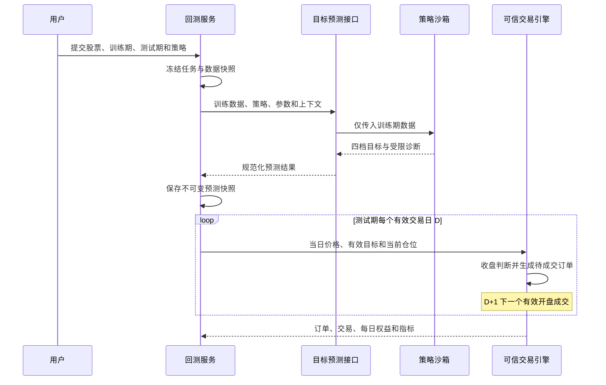

# 固定目标样本外回测设计

## 1. 目标与范围

本设计落实 V3.2 的策略预测和回测规则。用户手工选择训练期与测试期；策略只读取训练期数据并计算一次四档目标；可信回测引擎在策略不可见的测试期使用冻结目标反复模拟低买高卖。

阶段 4 交付共享目标预测能力和策略发布门槛所需的单股回测。阶段 6 复用同一引擎扩展监控列表、全市场、暂停、继续、失败重试、比较和导出。

本批不实现组合资金分配、组合净值、动态仓位、滚动重算目标、自动日期切分、参数搜索或根据测试收益优化策略。

## 2. 方案决定

采用共享目标预测能力，不建立独立持久化的预测业务模块。

- `strategies` 拥有策略、草稿、发布版本、验证记录和受控执行入口。
- 共享预测接口接收冻结的策略版本、参数和训练数据，返回一次四档目标及受限诊断。
- `targets` 调用该接口生成正式候选目标，拥有正式目标计算、复核和激活记录。
- `backtests` 调用同一接口生成回测预测快照，拥有测试期模拟、调整、订单、交易和指标。
- 回测预测快照不得成为正式目标，不得产生生产信号或通知。

这样可以保证正式计算与回测使用同一套策略契约，同时避免目标模块和回测模块共享可变数据。

## 3. 用户输入和冻结快照

用户创建回测时明确提供：

- 股票或范围；
- `training_start_date`、`training_end_date`；
- `test_start_date`、`test_end_date`；
- 策略发布版本或草稿快照；
- 参数；
- 初始资金。

必须满足 `training_start_date <= training_end_date < test_start_date <= test_end_date`。训练期与测试期之间允许留空，但系统不自动改变用户选择。

任务创建时冻结股票范围、四个日期、源码与哈希、参数与哈希、执行镜像、规则版本、滞回配置、初始资金、数据来源和价格口径。草稿后续变化不影响已创建任务。

## 4. 执行流程



预测只执行一次。测试期价格、统计结果、交易结果和收益不得进入策略沙箱。测试期间不得重新运行策略或修改原始预测目标。

## 5. 价格口径与公司行动

训练数据必须使用截至训练结束日可成立的价格口径。测试期间发生分红、送股、配股、拆股或合股时，可信引擎在事件生效日按当时已经公开且可核查的信息调整四档目标，使目标与测试价格保持同一口径。

每次调整保存事件日期、来源、调整因子、调整前后四档目标和数据哈希。调整不调用策略，不改变原始预测快照。测试结束后才发生的公司行动不得反向改变训练数据或已完成结果。

市场数据边界提供只读的逐日调整时间线。若数据源不能证明调整生效日和因子，当前股票以 `ADJUSTMENT_DATA_UNAVAILABLE` 失败，不能静默使用今天看到的完整前复权序列替代历史时点数据。

## 6. 交易规则

- 每股只有 `FLAT` 和 `HOLDING`。
- 空仓进入 `LOW/STRONG_LOW` 时全仓买入。
- 持仓进入 `HIGH/STRONG_HIGH` 时全部卖出。
- 同一组冻结目标可以在测试期产生多轮完整交易。
- 不加仓、不减仓、不开空、不加杠杆。
- D 日收盘后形成订单，D+1 下一个有效开盘执行。
- 无有效开盘时订单顺延；测试结束仍无法执行则 `UNFILLED_AT_END`。
- 期末不强平，使用最后有效收盘价计算持仓市值。

信号区间和滞回调用生产信号模块的公开纯规则契约，不复制另一套判断逻辑。

## 7. 数据所有权

`backtests` 新增或扩展以下数据：

- `backtest_task`：任务范围、四个日期和冻结配置；
- `backtest_item`：每只股票的执行状态和失败原因；
- `backtest_forecast_snapshot`：训练数据哈希、策略与参数哈希、原始四档目标、诊断、环境和冻结时间；
- `backtest_target_adjustment`：测试期公司行动导致的目标口径调整；
- `backtest_order`、`backtest_trade`、`backtest_metric`、`backtest_daily_result`：模拟结果。

预测快照和调整记录不可修改。重跑创建新任务或新项目代数，不覆盖旧结果。

## 8. 公开接口与事件

创建回测接口增加四个必填日期，不接受自动切分比例。查询详情需要返回训练/测试快照、原始预测目标、当前有效目标和调整历史。

阶段 4 至少开放单股创建、详情、摘要、交易和每日结果；阶段 6 再开放批量暂停、继续、取消、失败重试和导出。

内部事件保持 `backtest.created/started/item_succeeded/item_failed/completed/canceled`，新增 `backtest.forecast_frozen` 和 `backtest.target_adjusted`。满足发布门槛时发布 `strategy.publish_requirement_satisfied`。所有回测事件与生产信号、目标激活和通知链隔离。

## 9. 状态和错误码

单股执行状态：

```text
PENDING
FETCHING_DATA
VALIDATING_DATA
FORECASTING
FROZEN
SIMULATING
SAVING
SUCCEEDED
FAILED
CANCELED
```

稳定错误至少包括：

- `BACKTEST_DATE_RANGE_INVALID`
- `INSUFFICIENT_HISTORY`
- `TRAINING_DATA_INVALID`
- `TEST_DATA_INVALID`
- `STRATEGY_FORECAST_TIMEOUT`
- `STRATEGY_TARGET_INVALID`
- `TEST_DATA_EXPOSED_TO_STRATEGY`
- `TARGET_REFORECAST_FORBIDDEN`
- `ADJUSTMENT_DATA_UNAVAILABLE`
- `PRICE_BASIS_MISMATCH`
- `BACKTEST_RESULT_SAVE_FAILED`

一个股票失败不影响同批其他股票。失败记录保留冻结输入摘要和脱敏原因。

## 10. 安全和防泄漏

- 策略沙箱输入对象没有测试期字段、测试数据句柄或可回调的数据访问能力。
- 沙箱无网络、数据库、Redis、环境密钥、宿主挂载和容器控制接口。
- 训练数据在调用前按日期再次截断，边界层验证最大日期不超过训练结束日。
- 预测完成后销毁沙箱，再由可信引擎加载测试数据。
- 回测引擎不执行用户代码；策略不能决定成交、收益或指标。
- 日志、任务参数和错误响应不保存完整策略输出或敏感运行环境。

## 11. 阶段施工边界

阶段 4 先串行冻结预测契约、数据模型、迁移和单股回测接口。边界稳定后最多并行三个子项：

1. 策略生命周期、草稿和版本管理；
2. 静态检查、强沙箱和共享目标预测执行；
3. 策略编辑器、自动保存、版本差异和单股回测页面。

主流程随后串行接入策略发布、单股样本外回测、正式目标计算、大幅变化复核、OpenAPI、任务注册和 Compose。阶段 6 才扩展监控列表与全市场并发回测。

## 12. 验收标准

- 用户手工日期能够完整冻结和重放；非法、重叠或倒置范围被拒绝。
- 策略输入中不存在任何测试期记录；故意注入测试数据时任务明确失败。
- 训练期只执行一次策略，测试期不发生重新预测。
- 同一组目标能完成多轮买卖，D 日信号只能在 D+1 或更晚成交。
- 公司行动只调整价格口径，调整前后经济边界连续且记录可核查。
- 相同快照重复执行产生相同预测、订单、交易和指标。
- 数据不足、策略超时、目标非法、调整缺失和保存失败均隔离到单只股票。
- 回测不修改正式目标、生产信号、持仓和通知。
- 策略发布门槛绑定精确源码、参数、训练数据、测试数据和预测快照。

开发期执行模块级最小验证；阶段 4 集成完成后在服务器隔离 Docker 环境执行一次全量后端、前端、迁移、沙箱和容器验收。
