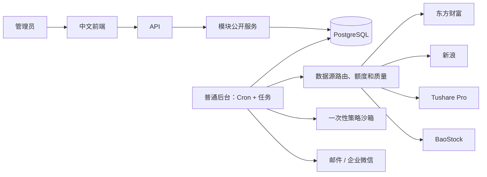
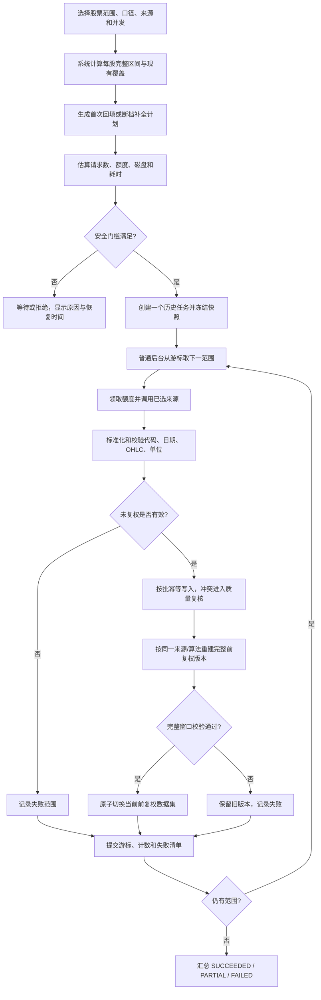
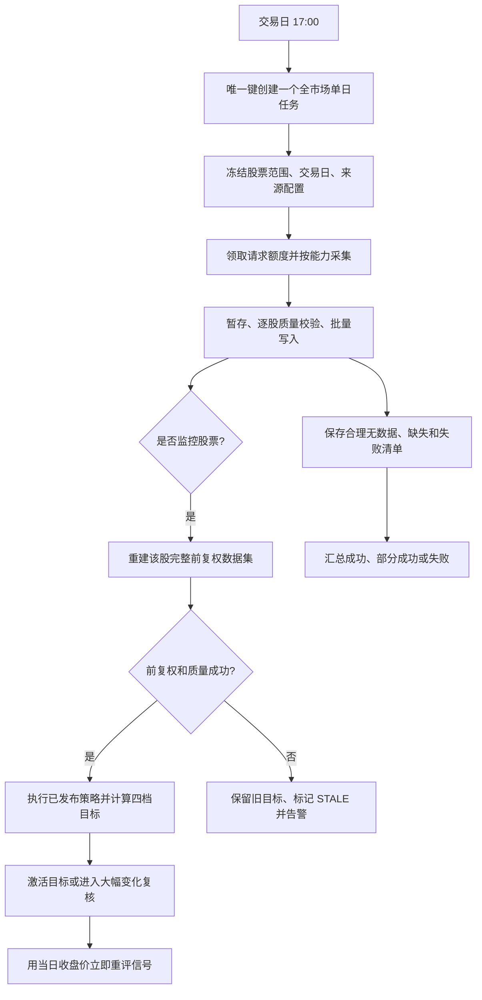
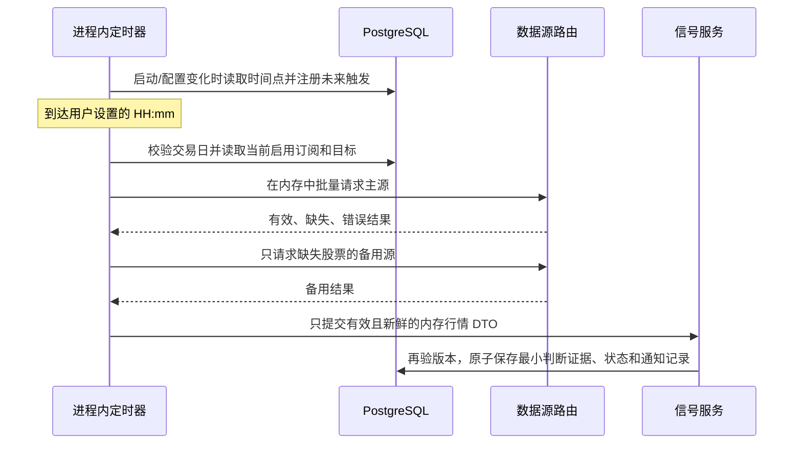
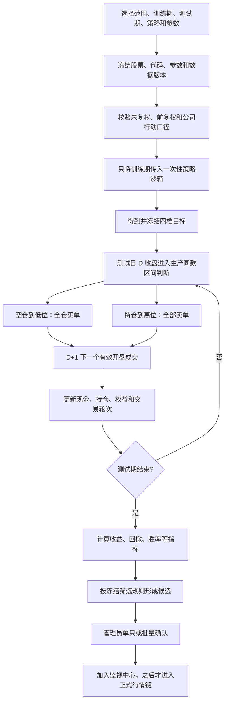
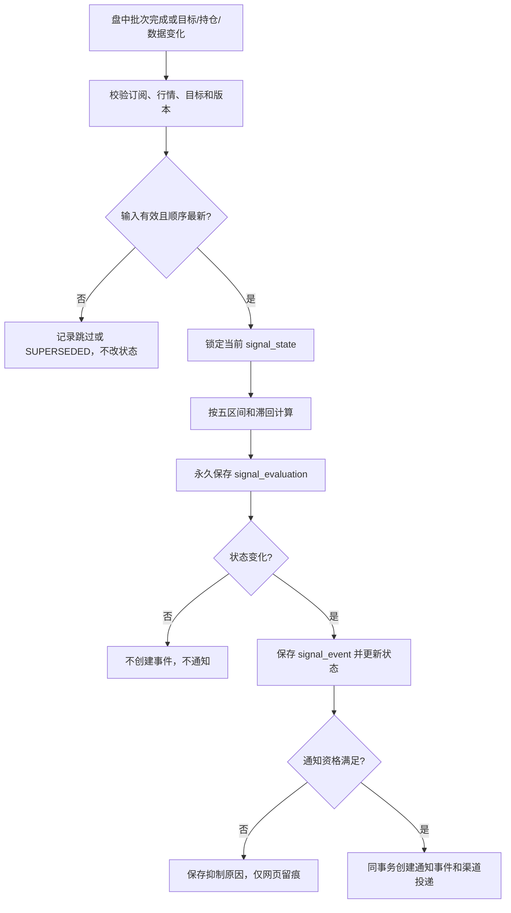
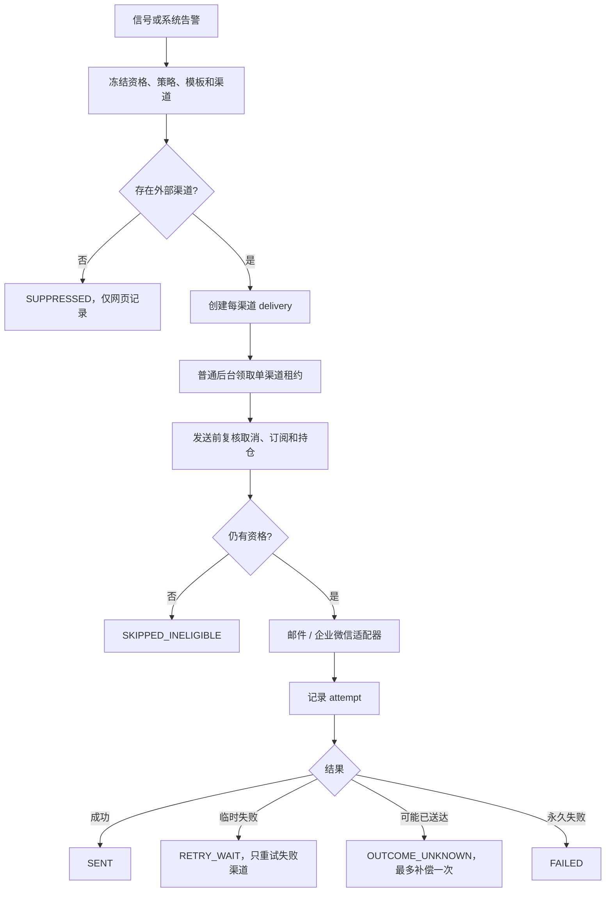
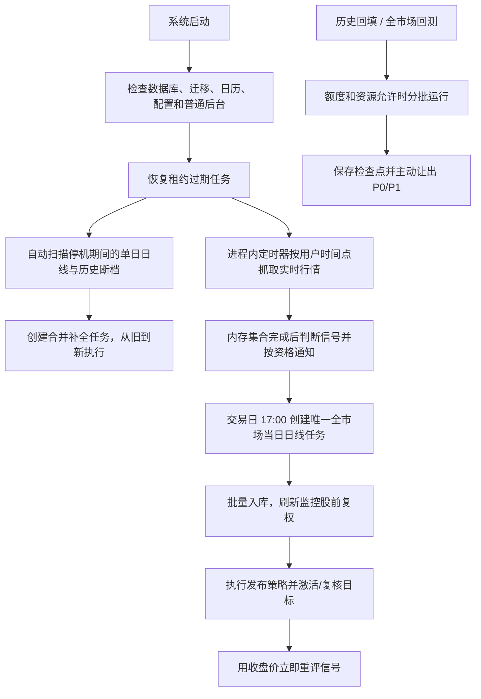

# LongInvest 完整功能与运行流程确认稿 V2

> 状态：已于 2026-07-29 经用户确认，并纳入 V4.1 生效规格。通知范围、回测候选和
> 前复权保存范围按 `1B、2A、3A` 执行。
>
> 本稿整合了用户对多数据源、历史自动补全和盘中定时行情的补充。原确认稿保留不动。

## 1. 产品目标

LongInvest 面向一个管理员，持续维护沪深北 A 股日线和监控股票行情，使用策略计算四档
目标价格，以真实行情判断价格区间，在有效状态变化时通知用户，并用训练期和测试期验证
策略效果。系统只辅助观察和决策，不连接券商，不自动交易。

常驻组件只有前端、API、普通后台、PostgreSQL。普通后台内置 Cron 并执行可信任务；
不使用 Redis、RQ、多队列、多常驻 Worker、分发器、看门狗和监督进程。不可信策略代码
只在需要时进入一次性隔离沙箱。

## 2. 完整功能清单

| 模块 | 功能 |
|---|---|
| 基础模块 | 配置、日志、审计、统一错误、健康检查、Cron、任务租约和恢复 |
| 数据库基础层 | SQLAlchemy 连接、事务、迁移、分页、批量写入和冲突更新 |
| 用户中心 | 单管理员登录、退出、改密、Session 查看与撤销 |
| 数据源中心 | 来源注册、能力探测、主备路由、请求预算、限速、熔断、密钥引用 |
| 股票主数据 | A 股清单、统一代码、市场、名称、状态、代码映射和修订 |
| 历史采集 | 自动确定完整区间、未复权/前复权回填、断档扫描、失败补全 |
| 单日采集 | 17:00 全市场当日日线、停机日期补齐、监控股后续处理 |
| 盘中行情 | 用户时间点、全监控批次、主备补缺、新鲜度和冲突校验 |
| 策略管理 | 多策略、草稿、版本、参数、验证、发布、回滚和隔离执行 |
| 目标价格 | 手工/策略四档目标、不可变版本、大幅变化复核、激活和过期 |
| 回测 | 训练期预测、测试期模拟、指标、候选筛选和人工确认 |
| 监视中心 | 分组、唯一订阅、调度、持仓标记、目标和当前信号状态 |
| 信号管控 | 五区间、滞回、乱序保护、立即重评、抑制和永久事件 |
| 通知 | 统一入口、邮件、企业微信、模板、重试、幂等和投递历史；飞书后续扩展 |
| 管理页面 | 仪表盘、股票、采集、策略、回测、信号、通知、任务、告警和设置 |

## 3. 总体运行架构



API 只处理身份、输入和模块调用。耗时操作在同一事务中创建业务记录、任务和审计，普通
后台按优先级领取。网络请求不占领取事务；进度、游标、租约和结果都保存在 PostgreSQL。

持久任务优先级：P0 通知和紧急恢复；P1 当日日线、目标和信号；P2 股票清单、前复权和
手工操作；P3 完整历史回填和全市场回测。盘中行情不进入任务队列，但独立保留请求额度
和轻量执行资源；P3 必须给盘中行情及 P0/P1 让出额度、连接和执行槽。

## 4. 多数据源中心

### 4.1 “AKShare”不是一个数据源

AKShare 是 Python 数据接口库，同一个库封装了多个实际上游。系统必须同时记录：

```text
adapter = AKSHARE
upstream = EASTMONEY 或 SINA
interface = stock_zh_a_hist 等具体函数
capability = 历史未复权、历史前复权、实时行情等
algorithm_version = 复权算法或上游版本
```

不能只保存 `provider=AKSHARE`，否则无法解释数据来自东方财富还是新浪，也无法判断两个
前复权序列为何不同。

用户提供的 `GetRealTimeDatas.py` 没有调用 AKShare，它直接通过 `requests` 请求新浪行情
中心和资金流接口；`CalAllIndexDatasStock.py` 只读取本地 CSV 并用 TA-Lib 计算技术指标，
也没有下载行情。

### 4.2 来源能力初步对比

| 接入 | 实际来源和能力 | 复权特点 | 初步定位 |
|---|---|---|---|
| AKShare `stock_zh_a_hist` | 东方财富；沪深京历史日线，支持未复权/qfq/hfq | 由东财接口给出对应口径 | 历史主源候选，必须服务器实测稳定性 |
| AKShare `stock_zh_a_daily` | 新浪；历史日线，支持未复权/qfq/hfq/因子 | 文档提示多次获取可能封 IP，并建议优先东财接口 | 备用或交叉校验，不作为高并发默认 |
| Tushare Pro | `daily` 未复权、`adj_factor` 因子、`pro_bar` 复权 | qfq 以请求 `end_date` 对应因子为锚，采用分红再投口径 | 有凭据和权限时适合正式备选及因子校验 |
| BaoStock | 历史 K 线和复权数据 | 官方说明采用涨跌幅复权法，与 Tushare 经济含义不同 | 免费备选和质量对照，先做能力实测 |
| 新浪直连脚本 | 分页实时行情和资金流 | 不负责完整历史复权标准化 | 可转为新浪实时适配器参考，不直接进业务层 |

参考资料：

- [AKShare 股票数据文档](https://akshare.akfamily.xyz/data/stock/stock.html)
- [Tushare A 股复权行情](https://tushare.pro/document/2?doc_id=146)
- [Tushare 复权因子](https://tushare.pro/document/2?doc_id=28)
- [BaoStock 复权因子说明](https://www.baostock.com/helpdocs/pdf/BaoStock%E5%A4%8D%E6%9D%83%E5%9B%A0%E5%AD%90%E7%AE%80%E4%BB%8B.pdf)

### 4.3 复权口径规则

不同来源的前复权值不能直接拼接。一个正式前复权数据集必须冻结实际来源、接口、完整
日期窗口、锚点日期、算法说明、因子/内容哈希和获取时间。同一任务切换到复权算法不同的
备用源时，必须重新获取并校验完整窗口，不能只用备用源补几天到原序列中。

未复权数据允许按缺失日期补齐，但每行记录真实来源；同股同日不同来源值不一致时进入
质量复核，不静默覆盖。系统后续可以选择“未复权 + 因子”统一计算前复权，但必须先通过
来源对照测试，不在本轮需求确认中假定算法等价。

### 4.4 能力探测和路由

每个来源按能力单独配置：股票清单、盘中批量行情、全市场单日日线、单股历史未复权、
历史前复权、复权因子和公司行动。启用前在服务器验证：市场覆盖、最早日期、字段单位、
单次行数、耗时、频率限制、账号权限、空值、停牌、新股和复权锚点。

路由支持主源、备用源、自动切换或人工固定。主源整体失败、熔断或额度耗尽时按配置切换；
部分缺失只补缺失范围。人工固定来源也不能绕过请求预算和质量校验。

### 4.5 凭据安全

Tushare Token、BaoStock 凭据和通知密钥只能保存在服务器环境或数据库加密密钥表。文档、
Git、日志、任务参数和 API 返回不得出现明文；页面只显示是否配置、更新时间和脱敏指纹。

本稿不保存用户粘贴的明文凭据。由于凭据已经出现在明文文件和对话中，应在正式接入前
轮换，并只通过服务器安全配置重新录入。

## 5. 历史采集与自动补全

### 5.1 用户操作

普通“完整历史”模式不要求用户填写开始和结束日期。用户只选择股票范围、数据口径、
数据源模式和并发；系统自动确定每只股票应有的完整区间并补到最近一个已完成交易日。

系统仍保留高级“指定区间重抓”能力，仅用于数据修复和诊断，不作为普通入口。

### 5.2 自动确定完整区间

```text
结束日 = 交易日历中最近一个已经收盘并允许入库的交易日
开始日 = 可信上市日期；若上市日期缺失，则使用市场安全起点请求并接受上游实际首条日线
```

上市日期不是请求成功的前置条件，也不能用上游返回的首条 K 线反向修改股票上市日期。
退市股票结束于可信退市范围；停牌日不生成虚构 K 线。

### 5.3 两种补全类型

- 首次完整回填：从自动开始日到结束日建立未复权和前复权完整覆盖。
- 断档补全：根据交易日历、已有日线、上市/退市/停牌事实自动计算缺失日期，将连续缺口
  合并成最少请求范围，只补缺失未复权；前复权在补齐后按完整窗口重建新版本。

服务器停机几天后，普通后台启动即扫描最后成功交易日到当前的缺口，创建一个恢复任务，
不要求用户填写停了几天，也不为每个日期或股票创建独立通用任务。管理员可在页面查看、
暂停、继续或手工触发重新扫描。

### 5.4 历史采集流程



### 5.5 任务控制和页面

- 启动前显示股票数、请求数、预计耗时、剩余额度和磁盘估算。
- 运行时显示当前来源/接口、当前股票、覆盖日期、未复权/前复权进度和速度。
- 支持暂停、继续、取消、只重试失败范围、重新扫描断档和显式全部重跑。
- 暂停和重启从安全检查点继续，不重复已提交数据。
- 单股失败不终止整体；额度耗尽、熔断或磁盘告警时释放执行槽，不忙等。

## 6. 全市场单日采集与停机恢复

单日采集是交易日 17:00 获取全市场当天未复权日线，不是分钟线。每个交易日只有一个
业务任务和一个日线批次，不拆成数千个单股任务。Provider 根据真实能力执行全市场一次、
分页、分组或任务内部逐股采集。



启动恢复扫描同时检查所有已确认交易日是否存在成功/部分批次。停机错过的日期合并为一个
单日缺口恢复任务，按日期从旧到新补齐；它优先于长周期历史回填，但不能阻止当前交易日
17:00 任务。有效股票先提交，无法解释的缺失使批次 PARTIAL，并允许只重试缺失范围。

## 7. 盘中定时实时行情

### 7.1 调度功能

管理员设置若干明确的 `HH:mm` 时间点，最多 20 个，只允许 A 股连续交易时段。普通后台
启动或配置变化时读取时间点，向进程内成熟定时器注册下一次触发，不每 10 秒轮询数据库。

到达时间点后，定时器先用交易日历和北京时间确认当前可执行，再读取当下启用的监控股票
和目标，立即抓取实时行情。盘中停机错过的时间点不补跑，不使用过时行情补造历史信号；
下次启动只注册未来时间点。管理员还可以随时执行“立即检查”。

定时设置和监控订阅保存在数据库，实时行情抓取过程、预期股票集合和原始响应只在内存中
存在，不创建 `job`、`schedule_occurrence`、`quote_cycle` 或实时行情明细表，也不冻结一份
数据库快照。配置在执行过程中变化时，信号提交前再次检查订阅和目标版本，已暂停或过期
输入直接跳过。

### 7.2 批次屏障

同一时间点在内存中把所有启用订阅合并为一个预期股票集合，先批量请求主源，再对缺失项
请求备用源，等待全部股票成功、失败或 30 秒整体截止，最后统一进入比较。不能第一只返回
就判断，也不能用上一轮缓存价格替代缺失行情。



20 只中 19 只成功时，19 只正常判断，缺失 1 只跳过并写结构化告警日志；绝不用上一批
旧价代替。行情必须代码匹配、价格为正、时间存在、新鲜度不超过 3 分钟且无来源冲突。

系统不保存完整实时行情。为了让信号和通知可以解释，正式判断只保存最小业务证据：股票、
触发原因、比较价格、行情时间、实际来源、目标版本、前后状态、是否滞回和通知资格。
状态未变化也可更新当前状态的最后检查时间，但不建立完整行情历史库。

## 8. 策略、目标和回测

### 8.1 策略和目标

- 多策略支持草稿、自动保存、历史、差异、验证、发布、使用情况和回滚。
- 参数按 Schema 校验并随任务冻结；发布版本不可修改。
- 策略只接收前复权训练数据、参数和安全上下文，只输出四档有序目标及受限诊断。
- 策略沙箱无网络、数据库、密钥和宿主文件权限，完成或超时后销毁。
- 四档满足 `0 < 强低位 < 低位观察 < 高位观察 < 强高位`。
- 系统目标任一档相对旧目标变化超过默认 30% 时人工复核；旧目标继续生效。
- 激活目标后立即用新目标重评当前信号；失败时旧目标标记 STALE。

### 8.2 回测流程

回测支持单股、监控列表和全市场。用户选择训练期和测试期；训练期只进入策略一次并冻结
目标，测试期绝不进入策略。可信引擎按 D 日收盘判断、D+1 下一个有效开盘成交，测试中
不重新预测。



默认忽略 T+1、整手、涨跌停、费用、税和滑点；不加仓、不减仓、不开空、不加杠杆，期末
不强平。结果包括总/年化收益、最大回撤、波动率、Sharpe、交易次数、胜率、单笔盈亏、
持有天数、资金暴露、期末持仓和未成交订单。全市场按股票独立模拟，不算组合收益。

MARKET 同时只运行一个任务，默认并发 4，可暂停、继续、取消和只重试失败股票。回测不
修改正式目标、信号、持仓和通知；候选必须人工确认后才能进入监视中心。

## 9. 信号监听与管控

同一股票可属于多个分组，但只有一条有效监控订阅。订阅绑定调度、目标、策略、滞回、
通知和启停状态。持仓由管理员手工标记，只表达是否持有；高位通知受持仓限制，信号本身
始终计算和保存。

| 价格条件 | 状态 |
|---|---|
| `price <= LS` | STRONG_LOW |
| `LS < price <= LW` | LOW |
| `LW < price < HW` | NORMAL |
| `HW <= price < HS` | HIGH |
| `price >= HS` | STRONG_HIGH |

UNKNOWN 首次为 NORMAL 时静默建立基线，首次为其他区间时产生正式事件。进入按目标线，
离开需跨过默认 2%、至少 0.02 元的滞回带。一次跨多档只生成最终转换事件；同一区间重复
判断只留判断记录，不重复通知。



触发来源包括计划行情、立即检查、目标激活、变为持仓、数据修正、状态重置和恢复重评。
目标激活重评直接按新目标定区间，之后再使用新目标滞回。迟到行情、旧目标和旧订阅快照
不得覆盖新状态。管理员只能重置为 UNKNOWN，不能指定结果，历史事件不删除。

低位和低位解除不依赖持仓；高位、强高位和高位解除只有当前持仓才发送外部通知。未持仓
高位仍保存事件，只标记 NOT_HOLDING。

## 10. 消息通知

业务模块不直接调用外部渠道。合格信号或系统告警在原业务事务中创建持久
`notification_event` 和各渠道 `notification_delivery`，普通后台领取后调用适配器；每次
真实请求保存 `notification_delivery_attempt`。



股票通知按“单股自定义 > 信号类型 > 全局默认”选择渠道；系统告警使用独立策略。第一版
邮件、企业微信可任意组合或仅网页。一个渠道失败不影响其他渠道，也不回滚业务事实。

默认首次加最多 5 次重试，只重试网络、超时、429、5xx 和临时 SMTP 错误。鉴权、模板和
永久配置错误不重试。相同幂等键不重复创建事件；成功渠道不因另一个渠道失败而重发。

## 11. 系统每日运行流程



## 12. 主要页面

| 优先级 | 页面 | 主要能力 |
|---|---|---|
| P0 | 登录与账号 | 登录、改密、Session 撤销 |
| P0 | 仪表盘 | 行情、日线、信号、通知、任务、来源和告警摘要 |
| P0 | 股票列表/详情 | 全市场搜索、日线图、日期范围、开收盘、支撑/压力线 |
| P0 | 历史采集 | 完整回填、自动区间、断档扫描、进度和任务控制 |
| P0 | 监视中心 | 分组、订阅、持仓、行情时间点、目标和区间 |
| P0 | 策略与目标 | 草稿、验证、发布、版本、目标计算和复核 |
| P0 | 回测 | 创建、进度、交易、指标、候选和人工加入监视中心 |
| P0 | 信号 | 当前状态、事件、判断、抑制、重置和重评 |
| P0 | 通知 | 渠道、策略、模板、投递、尝试和失败重试 |
| P1 | 数据源 | 能力、实际上游、额度、路由、探测、熔断和密钥状态 |
| P1 | 数据质量 | 缺失、冲突、来源比较、修订、重抓和处理 |
| P1 | 任务/告警/审计 | 进度、恢复、异常、人工操作和处理历史 |
| P1 | 日历/设置 | A 股日历、动态配置和版本历史 |

## 13. 明确不做

- 自动交易、券商连接、真实持仓数量和成本。
- 多用户、角色、租户和公开注册。
- 分钟线和逐笔数据的长期存储。
- 组合资金分配、组合净值和组合回测。
- 代理轮换、验证码规避、伪造身份或绕过来源限制。
- 回测自动修改正式业务或自动发送股票信号。
- 微服务、Redis/RQ、Kafka、通用消息总线和多常驻 Worker。
- 在文档、Git、日志、任务参数或页面中保存/回显明文密钥。

## 14. 本轮已整合的用户补充

- 增加 Tushare Pro 和 BaoStock 候选来源，并按实际能力验证后配置路由。
- 明确 AKShare 是多上游 SDK；东财与新浪接口必须分别记录和管理。
- 普通历史回填不要求用户填写日期，系统自动从完整起点补到最新交易日。
- 服务器停机后自动按交易日历和数据库断点补齐，不要求用户填写停机天数。
- 盘中行情由进程内定时器按用户时间点直接触发，不轮询数据库，不创建实时行情任务、
  批次表或冻结快照；行情在内存完成集合后进入信号判断。
- 实时行情本身不入库，只为正式信号保存可解释的最小价格、来源和版本证据。
- 明文数据源凭据不进入整合稿，正式接入前必须轮换并安全录入。

## 15. 已确认决定

### 15.1 通知范围：1B

第一版正式完成邮件和企业微信。统一通知接口保留扩展边界，但飞书适配器后续施工，
不作为第一版完成门槛。

### 15.2 回测候选筛选：2A

支持保存多套筛选方案。创建回测时选择方案并允许覆盖本次阈值，最终规则和阈值冻结到
任务快照；回测完成后按冻结规则标记候选，仍需管理员单只或批量确认才能加入监视中心。

### 15.3 全市场前复权保存范围：3A

全市场永久保存未复权日线、当前有效前复权数据集及版本历史。前复权来源、接口、算法、
锚点、窗口和哈希必须随版本保存；不同复权算法的数据不得拼接为同一数据集。

## 16. 确认结论

本稿已经用户确认。其规则已发布到 V4.1 唯一生效规格，并据此重新整理后续施工事项；
V4.0 保留为不可修改的历史版本。
